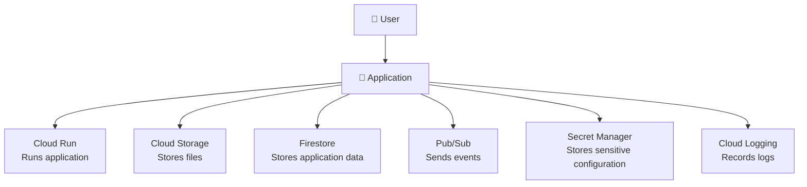

# 1. What is Google Cloud? ☁️

## 🎯 Learning Objective

By the end of this topic, you should be able to explain what Google Cloud is, why organizations use cloud platforms, and where GCP fits into a modern application architecture.

## ☁️ What is Google Cloud?

Google Cloud, commonly called **GCP (Google Cloud Platform)**, is Google's cloud computing platform.

Instead of buying and maintaining all the servers, storage, databases, networking equipment, and supporting infrastructure needed to run an application, an organization can use services provided by Google over the internet.

At a high level, GCP provides building blocks for:

- 🚀 Running applications
- 📦 Storing files and data
- 🗄️ Running databases
- 📊 Processing large amounts of data
- 🔗 Connecting services and applications
- 👤 Managing identities and permissions
- 📈 Monitoring and logging systems
- 🔐 Encrypting and protecting data
- 📦 Running containers and Kubernetes workloads

## 🤔 Why Cloud?

Consider a company building an online food-ordering application.

Without a cloud platform, the company would need to think about:

- 🖥️ Buying servers
- ⚙️ Installing operating systems
- 💾 Providing storage
- 🌐 Setting up networking
- 💿 Managing backups
- 🔧 Handling hardware failures
- 📈 Increasing capacity when traffic grows
- 📋 Monitoring infrastructure
- 🔒 Securing access

Cloud platforms move much of this infrastructure responsibility to the provider and allow the development team to consume infrastructure through managed services and APIs.

The important idea is not simply **"someone else's server."** Cloud platforms provide programmable infrastructure and managed services that can be provisioned, configured, connected, monitored, and scaled through software and configuration.

## 🧰 GCP as a Collection of Services

GCP is not one single product. It is a collection of services that solve different infrastructure and application problems.

For example:

| Problem | Example GCP Service |
|---|---|
| 📦 Store files | Cloud Storage |
| 🗄️ Store application documents | Firestore |
| 🗄️ Run SQL databases | Cloud SQL |
| 🚀 Run containers | Cloud Run |
| ☸️ Run Kubernetes workloads | Google Kubernetes Engine (GKE) |
| 📨 Send asynchronous messages | Pub/Sub |
| 📊 Run analytics queries | BigQuery |
| 🔐 Manage secrets | Secret Manager |
| 👤 Manage permissions | IAM |
| 📝 Collect logs | Cloud Logging |
| 📈 Monitor applications | Cloud Monitoring |

A real application normally uses several of these services together.

## 🧠 The Mental Model

Think of GCP as a **toolbox 🧰**.

You do not use every tool for every project. You choose services based on the problem you need to solve.

For example:

Understanding this service-oriented model is more important than memorizing a list of GCP products.

## ✅ What You Should Remember

1. ✅ GCP is Google's cloud computing platform.
2. ✅ GCP provides many specialized services rather than one monolithic platform.
3. ✅ Applications commonly combine multiple GCP services.
4. ✅ Cloud services reduce the need to manage physical infrastructure directly.
5. ✅ The goal of this tutorial is to understand **why a service exists, what problem it solves, and how services communicate with each other**.

## 🧪 Checkpoint

Before moving on, try answering this in your own words:

> If someone asks you **"What is GCP?"**, can you explain it without simply saying **"Google's cloud"**?

A good answer should mention cloud infrastructure, managed services, and the ability to build and operate applications using those services.
