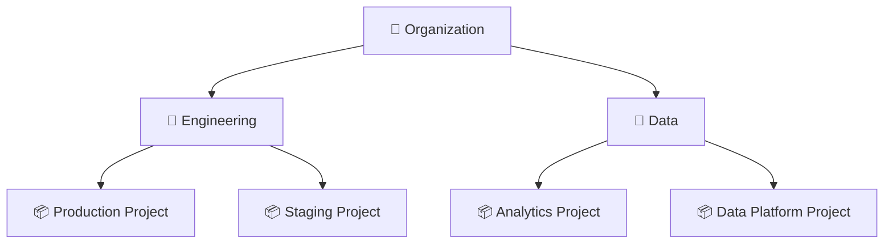
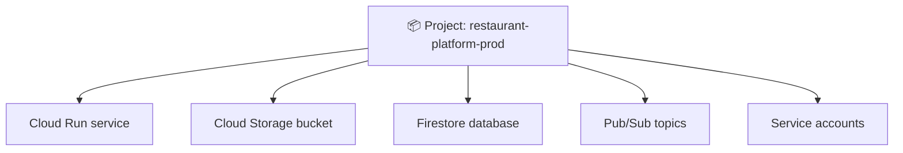
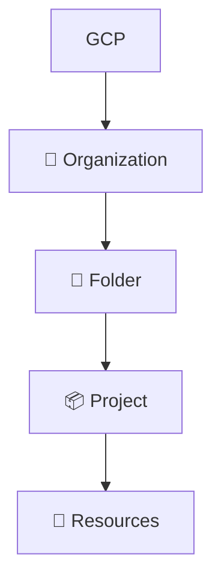
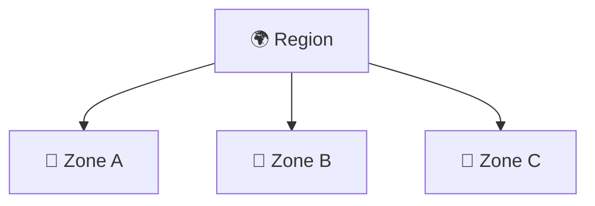
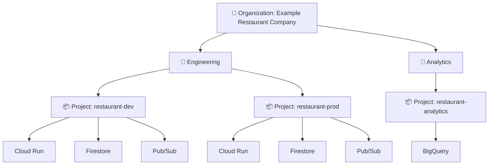
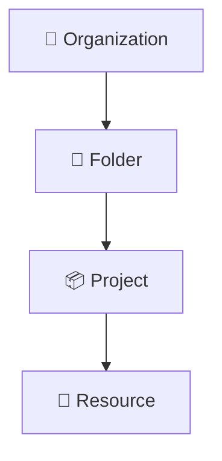

# 2. GCP Core Concepts 🧠

Before using individual GCP services, it is important to understand the basic structure in which those services live.

The key concepts for this tutorial are:

- 🏢 Organization
- 📁 Folder
- 📦 Project
- 🧩 Resources
- 🌍 Regions
- 📍 Zones
- 🔌 APIs
- 💳 Billing
- 🚦 Quotas

> 💡 **Learning approach:** You do not need to memorize every detail yet. The goal is to build the mental model that we will use throughout the remaining chapters.

## 1. 🏢 Organization

An **organization** represents the top-level container for a Google Cloud environment.

Organizations are commonly associated with a company or other managed entity. They provide a place above projects and folders where policies and administration can be managed.

- ❌ For this local tutorial, you do not need a real Google Cloud organization.
- ✅ You will work with the local Floci environment instead.

## 2. 📁 Folder

Folders provide an additional level of organization below an organization and above projects.

A company might organize projects like this:



Folders are useful when an organization has many projects and wants to group them logically.

## 3. 📦 Project

A **project** is one of the most important concepts in GCP.

A project provides a boundary for resources, configuration, APIs, permissions, and billing relationships.

For example:



Throughout this tutorial, you will see a local project named:

```text
floci-local
```

> 🏠 **Important:** This is an emulator-side project used for local learning. It is **not** the same thing as creating a real GCP project in Google's cloud.

## 4. 🧩 Resources

A **resource** is an individual cloud object that you create or use.

Examples include:

- 🪣 A Cloud Storage bucket
- 📨 A Pub/Sub topic
- 🚀 A Cloud Run service
- 🗄️ A Cloud SQL instance
- 👤 A service account

A useful mental model is:



> ℹ️ Not every environment will use every level, but projects are central to the way many GCP services are organized.

## 5. 🌍 Region

A **region** is a geographic area where Google Cloud resources can be hosted.

Examples include regions in locations such as Mumbai, Singapore, Frankfurt, and other parts of the world.

Choosing a region can affect:

- ⚡ Latency
- 🗺️ Data residency considerations
- 🛡️ Availability characteristics
- ✅ Service availability
- 💰 Cost

The exact regions available depend on the service.

## 6. 📍 Zone

A **zone** is a deployment area within a region.

A simplified model is:



Some GCP resources are regional, while others are zonal. This distinction becomes more important when we study compute, networking, and Kubernetes.

## 7. 🔌 APIs

GCP services are heavily API-driven.

When you use commands such as:

```bash
gcloud storage buckets list
```

you are using Google's command-line tooling to interact with cloud service APIs.

This matters because the same underlying services can be accessed through different interfaces, such as:

- 🖥️ Google Cloud Console
- 💻 `gcloud` CLI
- 📚 Client libraries
- 🌐 REST APIs
- ⚙️ Infrastructure-as-code tools

In this tutorial, we will primarily use the CLI and application code so that you understand what is happening rather than relying only on the web console.

## 8. 💳 Billing

Real GCP resources can incur charges depending on the service, usage, and pricing model.

Billing is intentionally separated from this local learning environment.

- ✅ With Floci, the goal is to practice service concepts locally.
- ❌ These exercises do not require creating a real GCP billing relationship.

When you later move to real GCP, billing becomes an important operational concern.

## 9. 🚦 Quotas

Cloud platforms place limits on many resources and operations. These limits are commonly called **quotas**.

Examples can include limits on:

- 🔢 Number of resources
- 🔌 API requests
- 🖥️ Compute capacity
- 💾 Storage-related operations
- 🔄 Concurrent workloads

> ⚠️ Local emulators may not reproduce real GCP quotas exactly. Therefore, quota behavior should be learned separately when you begin working with real GCP.

## 🔗 Putting the Concepts Together

Imagine a restaurant company with separate environments:



This structure lets teams separate environments and workloads while still managing them within a broader organization.

## ✅ What You Should Remember

- 🏢 **Organization**: top-level organizational boundary.
- 📁 **Folder**: groups projects and helps organize resources and policies.
- 📦 **Project**: a central boundary for many GCP resources and configuration.
- 🧩 **Resource**: an individual service object such as a bucket or Cloud Run service.
- 🌍 **Region**: geographic area used for regional resources.
- 📍 **Zone**: deployment area within a region.
- 🔌 **API**: programmatic interface through which services can be used.
- 💳 **Billing**: tracks charges for real GCP usage.
- 🚦 **Quota**: limits on resources or operations.

## 🧪 Checkpoint

Draw the following hierarchy on paper without looking back:



Then explain why a company might have separate `dev`, `staging`, and `production` projects.
