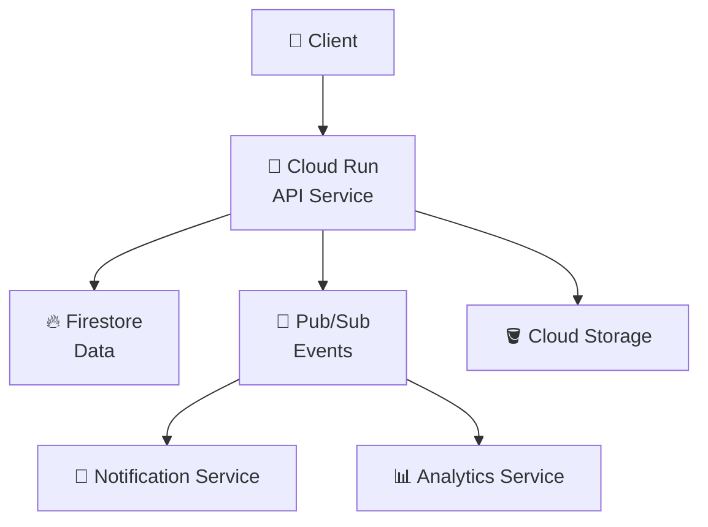
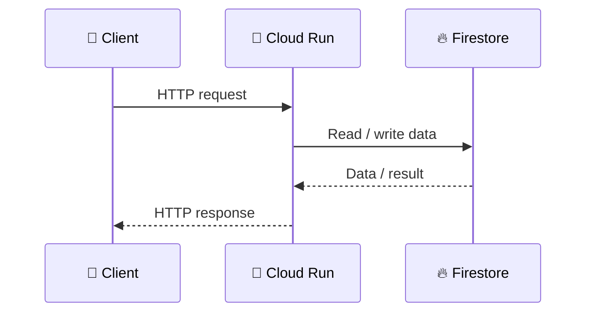
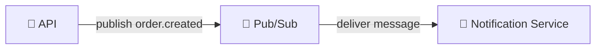
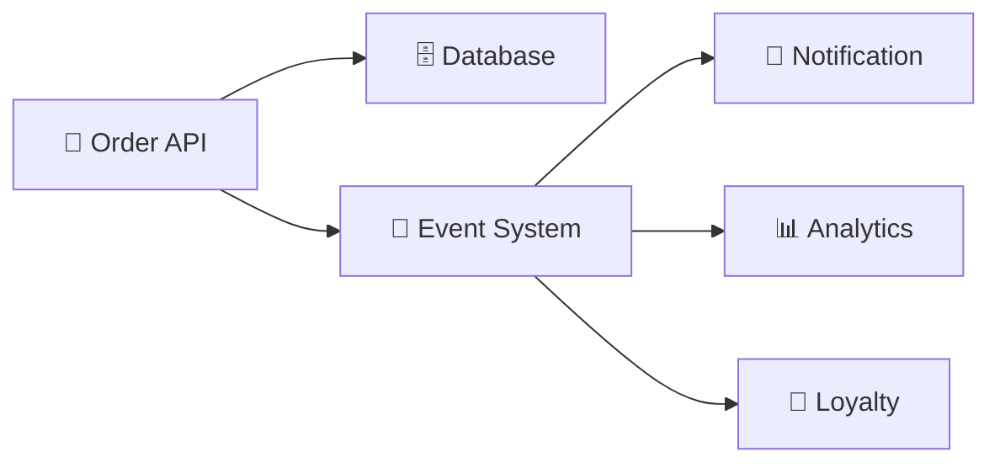
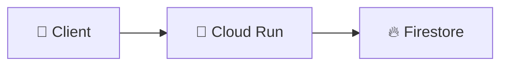
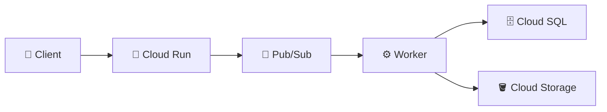
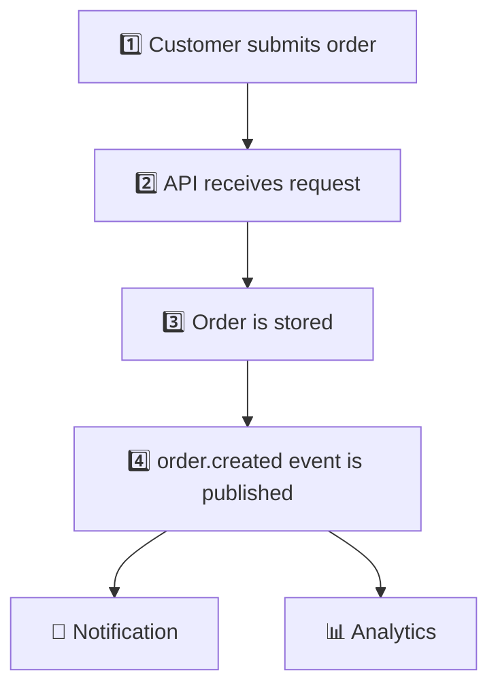

# 4. How GCP Services Work Together 🔗

Learning individual services is useful, but real applications rarely use only one cloud service.

The more important skill is understanding **how services communicate and work together**.

## 🏗️ A Simple Application

Imagine a restaurant ordering platform.

A simplified architecture might look like this:

The diagram is intentionally simplified. Its purpose is to demonstrate a common cloud architecture pattern: **one service does not need to own every responsibility**.

## 🔄 Request-Response Communication

A client may make a request to an application running on Cloud Run:

The client waits for a response.

This is a **synchronous** interaction.

## 📨 Asynchronous Communication

Now consider sending an email after an order is created.

The API does not necessarily need to wait for the email to be delivered.

Instead:

The API can finish the order request while another service handles the notification work.

This is an example of **asynchronous communication**.

## 🧩 Why This Separation Helps

Separating responsibilities can make systems easier to evolve.

For example:

The order service does not need to contain all notification, analytics, and loyalty logic itself.

## ⚠️ A Service Is Not an Architecture

Knowing that an application uses Cloud Run does not tell us much about the complete architecture.

For example, these are both Cloud Run applications:

and:

The important architectural question is not simply:

> ❌ **Which GCP service are you using?**

It is:

> ✅ **Why is this service being used here, and how does it interact with the rest of the system?**

## 🔀 Data Flow Matters

For every application architecture, try to trace the data.

For an order workflow:

This data-flow perspective will become increasingly important when we study event-driven systems.

## 🏠 Where Floci Fits

In this tutorial, Floci provides a local environment in which supported GCP-like services can be exercised without requiring the corresponding real GCP infrastructure.

For example, instead of immediately deploying an application to real Cloud Run, you can first learn the service interaction patterns locally where supported.

> ⚠️ **Important:** An emulator should not be treated as proof that a production architecture will behave identically on GCP. Real GCP introduces additional concerns such as authentication, networking, regional placement, quotas, managed infrastructure, reliability, scaling, billing, and production operations.

## ✅ What You Should Remember

- ✅ Real applications combine multiple services.
- 🔄 Some communication is synchronous and some is asynchronous.
- 🔗 Architecture is about relationships and data flow, not just a list of products.
- 🧩 Each service should have a reason for being part of the design.
- ⚠️ Local emulation helps you learn concepts, but real GCP behavior must eventually be validated in the real platform.

## 🧪 Checkpoint

For this requirement:

> **"When a customer places an order, save the order and notify several independent services that an order was created."**

Think about:

1. 🤔 Which component receives the request?
2. 🤔 Where should the order data be stored?
3. 🤔 How could multiple services receive the event without the API directly calling each one?

Do not worry about choosing the exact services yet. The goal is to identify the architectural problems first.
