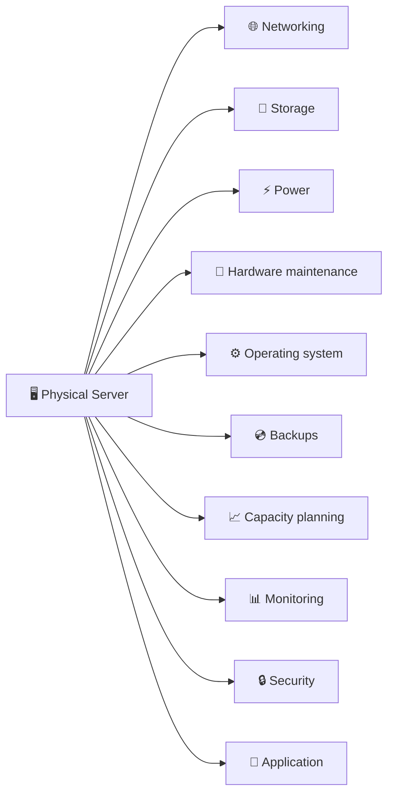
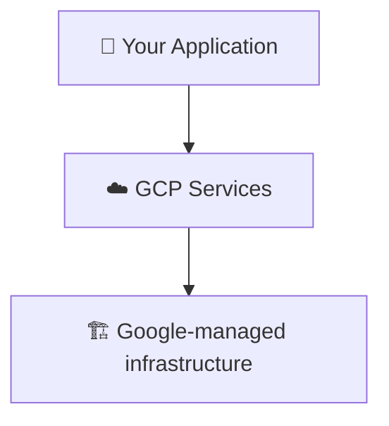
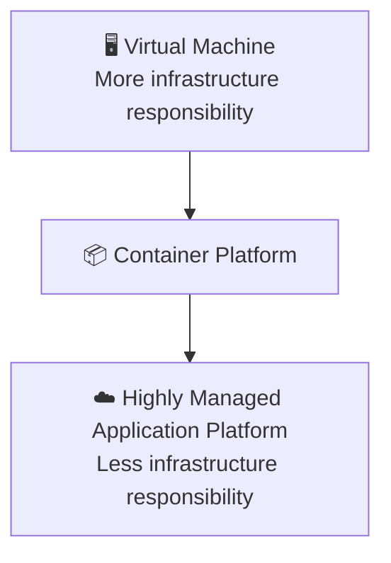
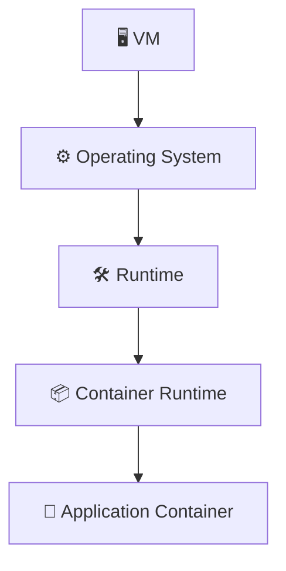
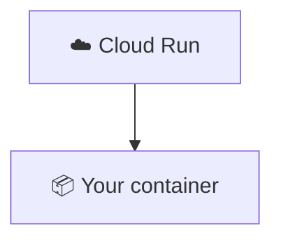
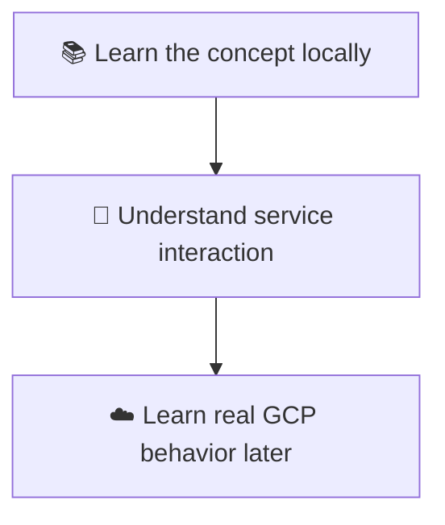

# 5. GCP vs Traditional Server Infrastructure ☁️ vs 🖥️

Cloud computing becomes easier to understand when you compare it with the traditional way of operating infrastructure.

> 💡 The goal is **not** to say that one approach is always better. The goal is to understand the difference in responsibilities.

## 🖥️ Traditional Infrastructure

Suppose a company wants to run an application using its own physical infrastructure.

The company may need to manage several areas around a physical server:

The organization owns or directly controls much of the infrastructure.

## ☁️ Cloud Infrastructure

With a cloud platform, the organization can consume infrastructure and managed services from the provider.

A simplified model is:

The amount of infrastructure you manage depends on the service you choose.

For example, a virtual-machine-based approach generally leaves you responsible for more operating-system and machine-level work than a highly managed platform such as Cloud Run.

## 🤝 The Shared Responsibility Idea

Moving to the cloud does **not** mean that the provider is responsible for everything.

Responsibilities are distributed between the cloud provider and the customer.

A simplified example:

| Area | Customer | Provider |
|---|---:|---:|
| 🚀 Application code | ✅ | ❌ |
| ⚙️ Application configuration | ✅ | ❌ |
| 👤 IAM configuration | ✅ | Provides IAM platform |
| 💾 Data management | ✅ | Provides underlying service |
| 🏢 Physical data centers | ❌ | ✅ |
| 🖥️ Physical servers | ❌ | ✅ |
| 🏗️ Underlying managed infrastructure | Depends on service | Depends on service |

> ⚠️ The exact responsibility boundary changes depending on the GCP service.

## 🧱 Infrastructure Abstraction

One of the most important ideas in cloud computing is **abstraction**.

Consider three levels:

At a lower level, you have more control and more infrastructure responsibilities.

At a higher level, the provider manages more of the underlying infrastructure for you.

> ℹ️ Neither is universally correct. The appropriate choice depends on the workload and the requirements.

## 🚀 Example: Running an API

Imagine you have a REST API packaged as a container.

One approach could involve managing a virtual machine yourself:

A managed container platform can abstract much of that infrastructure:

The second model does not eliminate all operational concerns, but it changes what your team needs to manage directly.

## 👨‍💻 Why Developers Should Care

As a developer, you should understand where your responsibility starts and ends.

For example, if an application cannot connect to a database, useful questions include:

- ❓ Is the application configured correctly?
- ❓ Is the identity allowed to access the database?
- ❓ Is the network path available?
- ❓ Is the database service running?
- ❓ Is the application using the correct endpoint?
- ❓ Is the issue specific to the local emulator or real GCP?

Cloud development requires understanding both application behavior and the platform that supports it.

## 🏠 Local Learning vs Real GCP

Floci is useful for learning service concepts locally, but it does not replace learning real infrastructure operations.

This tutorial therefore uses a two-stage mindset:

The local environment helps you practice without requiring a real cloud billing setup for these exercises.

## ✅ What You Should Remember

- 🖥️ Traditional infrastructure usually requires direct management of more physical and machine-level infrastructure.
- ☁️ Cloud platforms provide infrastructure and managed services through APIs and other interfaces.
- 🧱 Different cloud services provide different levels of abstraction.
- 🤝 Cloud adoption changes responsibilities; it does not remove responsibility entirely.
- 🔍 Understanding the responsibility boundary is important when troubleshooting real applications.

## 🧪 Checkpoint

Explain the difference between these two statements:

> **"Google manages the infrastructure."**

and

> **"Google manages my application."**

They are not the same.

- ❌ Google managing infrastructure does not mean Google manages your application code.
- ✅ Your application code, configuration, data decisions, permissions, and application behavior remain important responsibilities even when the underlying infrastructure is managed for you.
