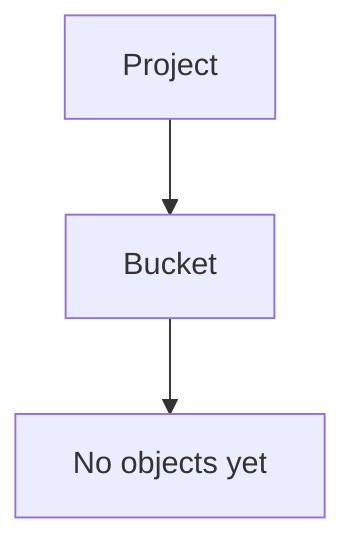
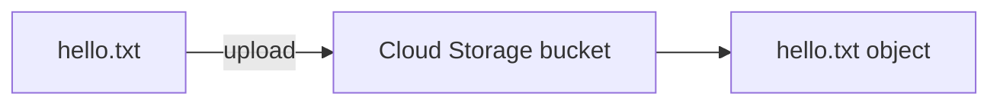
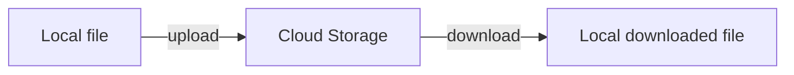
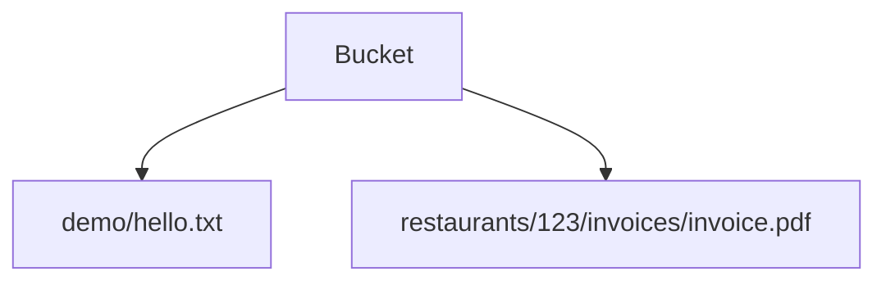
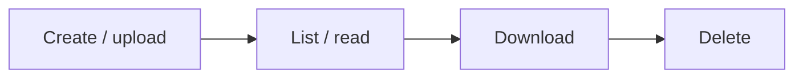
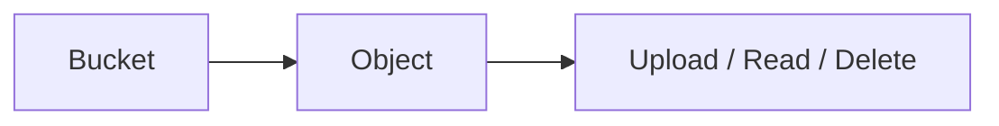

# 4. Hands-On: File Storage Workflow 🧪

## 🎯 Objective

Build a small end-to-end Cloud Storage workflow using the local GCP lab.

You will:

1. Create a local file.
2. Create a bucket.
3. Upload the file.
4. List the object.
5. Download the object.
6. Verify the downloaded content.
7. Delete the object.
8. Confirm the object is gone.

The purpose is to connect the concepts from the previous topics with actual commands.

## 🔎 Before You Start

Make sure your local GCP lab is working and that the `gcloud` CLI is available.

Check:

```bash
gcloud --version
```

Confirm that your local project/configuration is the one used by your Floci setup.

## 1. Create a Local File

Create a simple text file:

```bash
echo "Hello Cloud Storage" > hello.txt
```

Verify it:

```bash
cat hello.txt
```

Expected content:

```text
Hello Cloud Storage
```

## 2. Create a Bucket

Choose a bucket name appropriate for your local lab and create it:

```bash
gcloud storage buckets create gs://YOUR-BUCKET-NAME
```

For example:

```bash
gcloud storage buckets create gs://floci-storage-demo
```

If your local emulator/setup has specific naming requirements, follow those requirements.

## 3. Confirm the Bucket

List buckets:

```bash
gcloud storage buckets list
```

Find your bucket in the output.

At this point:



## 4. Upload the File

Upload the local file:

```bash
gcloud storage cp hello.txt gs://YOUR-BUCKET-NAME/
```

Conceptually:



## 5. List the Object

Run:

```bash
gcloud storage ls gs://YOUR-BUCKET-NAME/
```

You should see the uploaded object.

This verifies that the bucket now contains an object.

## 6. Upload Using an Object Name

Try uploading the file to a folder-like object name:

```bash
gcloud storage cp hello.txt gs://YOUR-BUCKET-NAME/demo/hello.txt
```

Then list:

```bash
gcloud storage ls gs://YOUR-BUCKET-NAME/demo/
```

Notice that:

```text
demo/hello.txt
```

is an object name/prefix representation, not evidence that a traditional filesystem directory was created.

## 7. Download the Object

Download it to a different local filename:

```bash
gcloud storage cp gs://YOUR-BUCKET-NAME/demo/hello.txt downloaded.txt
```

Verify:

```bash
cat downloaded.txt
```

Expected:

```text
Hello Cloud Storage
```

Now you have completed the round trip:



## 8. Compare the Files

You can compare the original and downloaded files using your operating system's normal file comparison tools.

For example, on Linux/macOS:

```bash
cmp hello.txt downloaded.txt
```

On PowerShell, you can use:

```powershell
Compare-Object (Get-Content hello.txt) (Get-Content downloaded.txt)
```

An empty comparison indicates that the text content matches.

## 9. Delete the Object

Delete the uploaded object:

```bash
gcloud storage rm gs://YOUR-BUCKET-NAME/demo/hello.txt
```

List the prefix again:

```bash
gcloud storage ls gs://YOUR-BUCKET-NAME/demo/
```

The object should no longer appear.

## 10. Repeat With a Realistic File

Create a second example using a file that resembles an application upload:

```text
invoice.pdf
```

Upload it using an application-style object name:

```text
restaurants/123/invoices/invoice.pdf
```

For example:

```bash
gcloud storage cp invoice.pdf gs://YOUR-BUCKET-NAME/restaurants/123/invoices/invoice.pdf
```

List it:

```bash
gcloud storage ls gs://YOUR-BUCKET-NAME/restaurants/123/invoices/
```

This demonstrates how applications can establish logical object-naming conventions.

## 🧠 What You Just Practiced

You created and interacted with:



You performed the basic object lifecycle:



## 🧪 Challenge

Without copying the commands from above, complete this workflow yourself:

1. Create `restaurant.txt`.
2. Create a bucket.
3. Upload it as `restaurants/999/profile.txt`.
4. List the relevant object.
5. Download it as `profile-copy.txt`.
6. Verify the contents.
7. Delete the Cloud Storage object.
8. Verify that it is gone.

Then explain each command in your own words.

## ❗ Troubleshooting Questions

If the upload fails, ask:

1. Is `gcloud` installed and available?
2. Is the correct GCP/Floci configuration active?
3. Does the bucket exist?
4. Is the bucket name correct?
5. Is the destination URI correct?
6. Is the local file path correct?
7. Is the failure caused by authentication, authorization, connectivity, or an emulator limitation?

Do not immediately change random configuration values. First identify which resource and operation failed.

## 🔄 Floci vs Real GCP

This exercise is intended to teach the Cloud Storage resource model and basic workflow locally.

When moving to real GCP, the same conceptual workflow remains:



But production environments add concerns such as authentication, IAM, billing, bucket location, data protection, lifecycle management, retention, monitoring, and application integration.

## ✅ Completion Checklist

- [ ] Created a local file
- [ ] Created a bucket
- [ ] Uploaded an object
- [ ] Listed the object
- [ ] Used a folder-like object name
- [ ] Downloaded an object
- [ ] Verified downloaded content
- [ ] Deleted an object
- [ ] Explained bucket vs object
- [ ] Explained object names vs traditional filesystem directories
- [ ] Can explain the source and destination of `gcloud storage cp`
