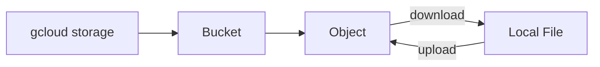
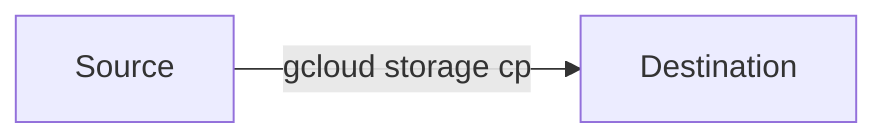
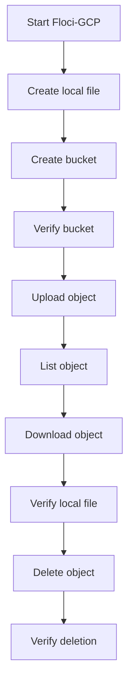

# 98. Cloud Storage Commands — Last-Minute Revision ⚡

Use this page for a quick revision of the most commonly used **Cloud Storage commands** before an interview or hands-on session.

> **Floci-GCP note:** These commands are written for the Cloud Storage workflow used throughout this chapter. Run them against your Floci-GCP environment while learning. Some behavior, authentication, permissions, and configuration details may differ from real GCP.

---

## 🧠 Resource Mental Model



The most important thing to remember:

- **Bucket** = container
- **Object** = stored data
- **Object name** = name/path-like identifier inside the bucket
- `gs://bucket-name` = bucket
- `gs://bucket-name/object-name` = object

---

## 🪣 Bucket Commands

| Purpose | Command | What it does |
|---|---|---|
| List buckets | `gcloud storage buckets list` | Lists buckets visible to the current configuration |
| Create bucket | `gcloud storage buckets create gs://BUCKET_NAME` | Creates a new bucket |
| Create regional bucket | `gcloud storage buckets create gs://BUCKET_NAME --location=REGION` | Creates a bucket in a specified location |
| Get bucket details | `gcloud storage buckets describe gs://BUCKET_NAME` | Displays bucket configuration and metadata |
| Delete bucket | `gcloud storage buckets delete gs://BUCKET_NAME` | Deletes an empty bucket |

> ⚠️ A bucket must generally be empty before it can be deleted. Be careful with destructive commands.

---

## 📦 Object Commands

| Purpose | Command | What it does |
|---|---|---|
| List objects | `gcloud storage ls gs://BUCKET_NAME/` | Lists objects/prefixes in a bucket |
| List recursively | `gcloud storage ls --recursive gs://BUCKET_NAME/` | Lists objects recursively under a bucket/prefix |
| Upload file | `gcloud storage cp FILE gs://BUCKET_NAME/` | Copies a local file into Cloud Storage |
| Upload to object name | `gcloud storage cp FILE gs://BUCKET_NAME/path/file.txt` | Uploads using a specific object name |
| Download file | `gcloud storage cp gs://BUCKET_NAME/path/file.txt ./file.txt` | Copies an object to the local machine |
| Copy object | `gcloud storage cp gs://BUCKET_NAME/source.txt gs://BUCKET_NAME/destination.txt` | Copies an object within Cloud Storage |
| Delete object | `gcloud storage rm gs://BUCKET_NAME/path/file.txt` | Deletes a specific object |
| Delete recursively | `gcloud storage rm --recursive gs://BUCKET_NAME/path/` | Deletes objects under a prefix |

---

## 🔄 Common Upload / Download Patterns

| Operation | Source | Destination | Command pattern |
|---|---|---|---|
| Upload | Local machine | Cloud Storage | `gcloud storage cp ./file.txt gs://BUCKET/` |
| Download | Cloud Storage | Local machine | `gcloud storage cp gs://BUCKET/file.txt ./file.txt` |
| Cloud-to-cloud copy | Cloud Storage | Cloud Storage | `gcloud storage cp gs://BUCKET/source gs://BUCKET/destination` |

Think about `cp` as:



Always identify the **source first** and the **destination second**.

---

## 📁 Object Names / Prefixes

| Purpose | Example | Meaning |
|---|---|---|
| Root-level object | `gs://my-bucket/menu.pdf` | Object name is `menu.pdf` |
| Folder-like object name | `gs://my-bucket/images/logo.png` | Object name is `images/logo.png` |
| Application-style path | `gs://my-bucket/restaurants/123/menu.pdf` | Object name is `restaurants/123/menu.pdf` |
| List a prefix | `gcloud storage ls gs://my-bucket/restaurants/123/` | Lists objects/prefixes under that prefix |

Remember: `/` in an object name provides **folder-like organization**. It should not automatically be interpreted as a traditional filesystem directory.

---

## 🔍 Useful Inspection Commands

| Purpose | Command | Why you use it |
|---|---|---|
| List buckets | `gcloud storage buckets list` | Check whether the bucket exists |
| Describe bucket | `gcloud storage buckets describe gs://BUCKET` | Inspect bucket-level configuration |
| List objects | `gcloud storage ls gs://BUCKET/` | Check what objects are present |
| List a prefix | `gcloud storage ls gs://BUCKET/prefix/` | Inspect a logical object group |
| List recursively | `gcloud storage ls --recursive gs://BUCKET/` | Inspect all objects below a bucket/prefix |

---

## 🧪 Typical Floci-GCP Workflow

For a basic Chapter 3 lab, remember this sequence:



### Minimal command sequence

```bash
# 1. Create a local file
echo "Hello Cloud Storage" > hello.txt

# 2. Create a bucket
gcloud storage buckets create gs://BUCKET_NAME

# 3. Verify the bucket
gcloud storage buckets list

# 4. Upload
gcloud storage cp hello.txt gs://BUCKET_NAME/

# 5. List objects
gcloud storage ls gs://BUCKET_NAME/

# 6. Download
gcloud storage cp gs://BUCKET_NAME/hello.txt downloaded.txt

# 7. Delete
gcloud storage rm gs://BUCKET_NAME/hello.txt

# 8. Verify
gcloud storage ls gs://BUCKET_NAME/
```

---

## 🎯 Interview Quick Recall

| Question | Remember |
|---|---|
| How do I list buckets? | `gcloud storage buckets list` |
| How do I create a bucket? | `gcloud storage buckets create gs://BUCKET` |
| How do I inspect a bucket? | `gcloud storage buckets describe gs://BUCKET` |
| How do I list objects? | `gcloud storage ls gs://BUCKET/` |
| How do I upload? | `gcloud storage cp LOCAL_FILE gs://BUCKET/` |
| How do I download? | `gcloud storage cp gs://BUCKET/OBJECT LOCAL_FILE` |
| How do I copy an object? | `gcloud storage cp gs://SOURCE gs://DESTINATION` |
| How do I delete an object? | `gcloud storage rm gs://BUCKET/OBJECT` |
| How do I delete objects under a prefix? | `gcloud storage rm --recursive gs://BUCKET/PREFIX/` |
| What does `gs://BUCKET` mean? | A Cloud Storage bucket URI |
| What does `gs://BUCKET/OBJECT` mean? | A specific object in a bucket |
| What does `/` inside an object name mean? | Folder-like organization/prefix, not necessarily a traditional directory |

---

## ⚠️ Commands to Treat Carefully

These can affect multiple resources or delete data:

```bash
gcloud storage rm --recursive gs://BUCKET/PREFIX/
```

and:

```bash
gcloud storage buckets delete gs://BUCKET
```

Before running a destructive command, verify:

1. The bucket name.
2. The object/prefix.
3. The command's source and destination, if applicable.
4. Whether the operation is recursive.
5. Whether you are operating against your **Floci-GCP lab** or real GCP.

---

## 🧠 30-Second Revision

```text
Bucket
  ↓
Container for objects

Object
  ↓
Actual stored data

Object name
  ↓
Identifier inside the bucket

gs://bucket/object
  ↓
Cloud Storage resource

Buckets list
  ↓
See buckets

storage ls
  ↓
See objects/prefixes

storage cp
  ↓
Upload / download / copy

storage rm
  ↓
Delete objects
```

If you can explain this flow and write the commands without looking them up, you have the **Chapter 3 command basics** covered.
