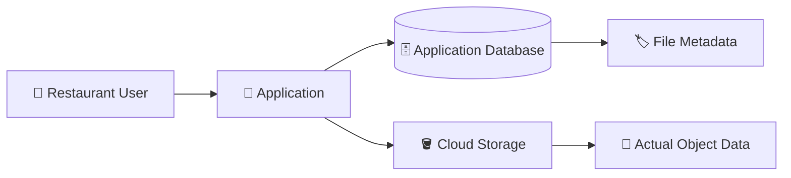
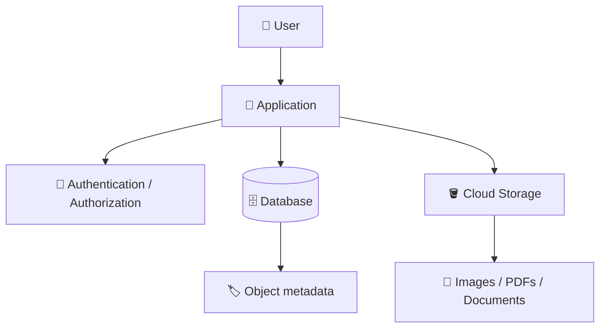
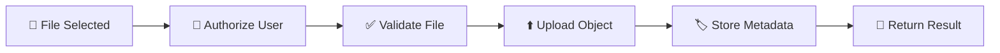
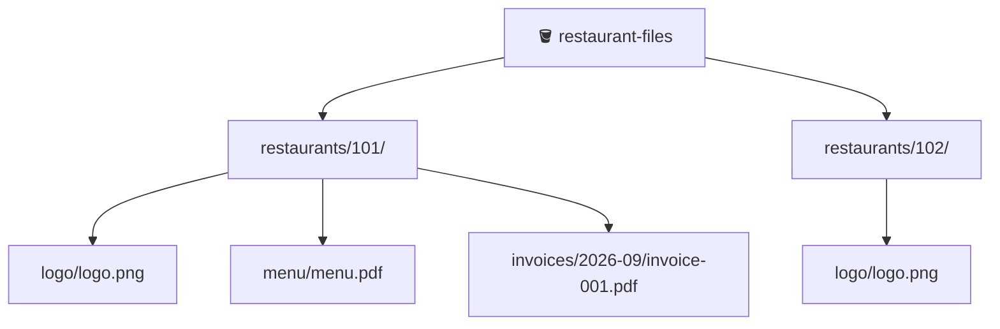
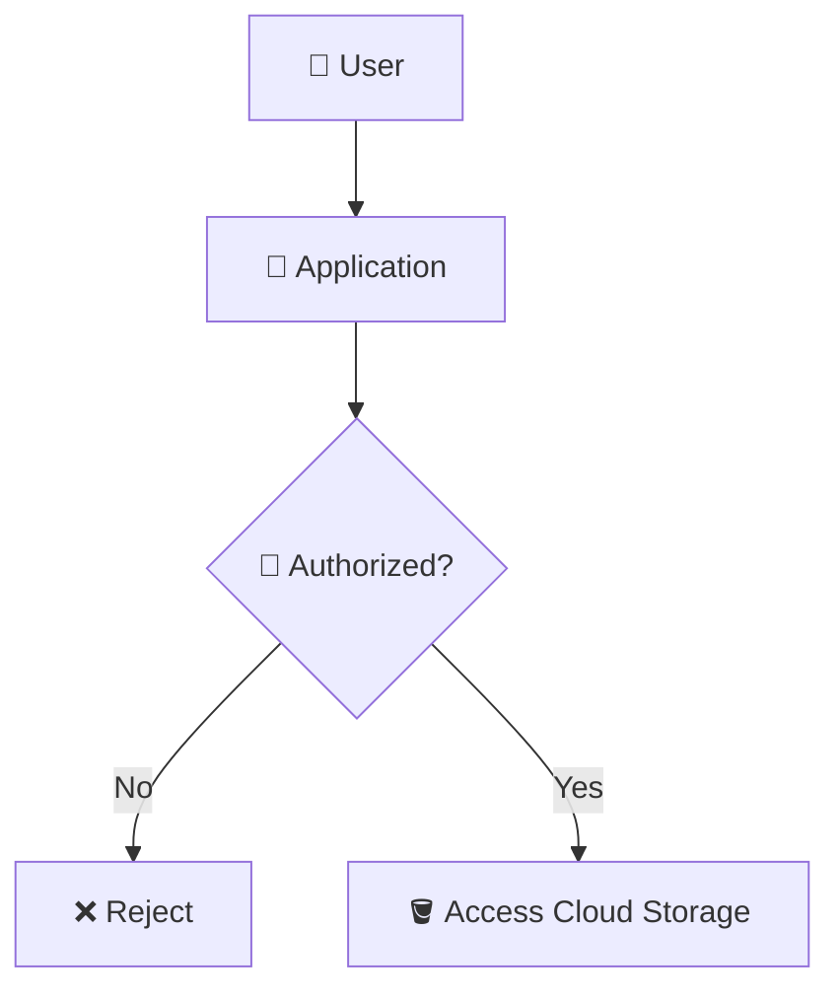
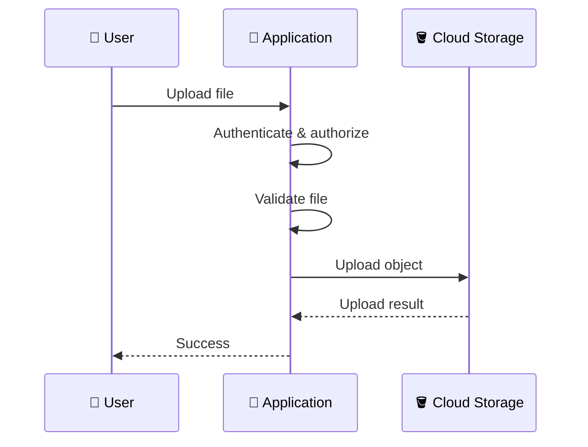
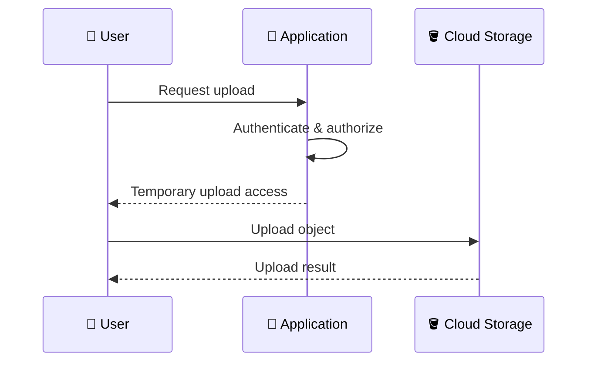
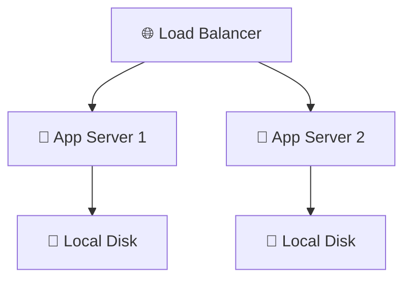
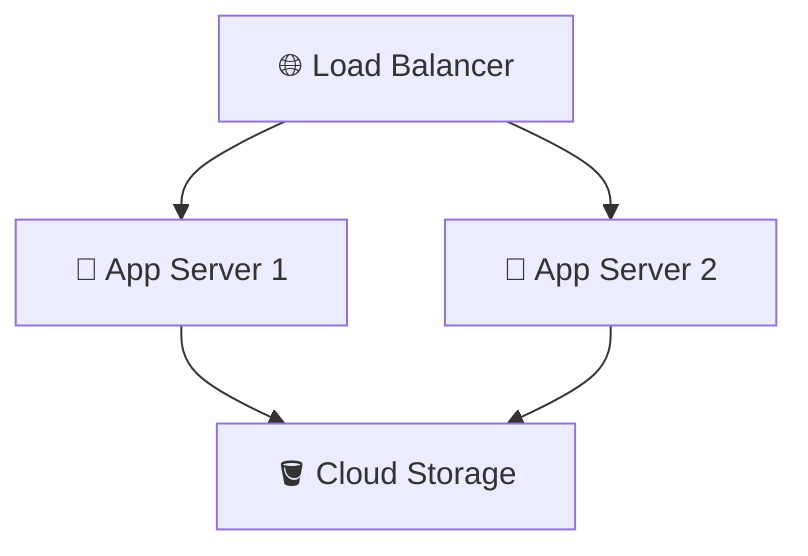
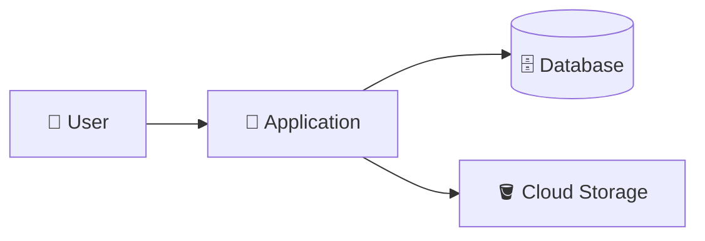

# 1. Storage in an Application 🚀🪣

## 🎯 Learning Objective

By the end of this topic, you should be able to explain how an application uses Cloud Storage, why file data and application metadata are usually separated, and where Cloud Storage fits in an application architecture.

This chapter builds on Chapter 3. Chapter 3 taught the **Cloud Storage resource model** and basic operations. This chapter focuses on what happens when an **application** uses Cloud Storage as part of a real workflow.

---

## 🧠 The Big Picture

A typical application does not treat Cloud Storage as its entire database.

Instead, it commonly separates:

```text
Application Database
└── Business metadata

Cloud Storage
└── Actual file/object data
```

For a restaurant SaaS application, imagine a restaurant uploads:

- 🖼️ Logo
- 📄 Menu PDF
- 🧾 Invoice
- 🍔 Food images
- 🎥 Promotional video

The application may store the actual bytes in Cloud Storage while keeping information about those files in a database.



> 💡 **Interview mental model:** The database answers **“What does the application know about this file?”** while Cloud Storage answers **“Where are the file bytes?”**

---

## 📦 Why Not Store Files Directly in the Database?

It is technically possible to store binary data in a database, but object storage is often a better fit for large files and application-generated objects.

Cloud Storage is designed specifically for object data such as images, documents, videos, backups, and exports.

A database is generally better suited to structured information that the application needs to query and update.

For example:

```text
Restaurant
    id = 123

File record
    restaurant_id = 123
    type = menu
    object_name = restaurants/123/menu.pdf
```

while the actual PDF is stored as an object:

```text
gs://restaurant-files/restaurants/123/menu.pdf
```

The exact database design depends on the application, but the separation is an important architectural pattern.

---

## 🏗️ Application + Cloud Storage Architecture

A simple architecture looks like this:



The application acts as the coordinator.

For example, when a restaurant uploads a menu:

1. 👤 User selects a file.
2. 🚀 Application authenticates the user.
3. 🔐 Application checks whether the user can upload for that restaurant.
4. 📄 File is uploaded to Cloud Storage.
5. 🏷️ Application stores metadata about the object.
6. ✅ Application returns the result to the user.

---

## 🔄 The File Upload Lifecycle

Think about an upload as a workflow rather than a single command.



This distinction is important in interviews.

An interviewer may ask:

> **“How does your application upload a file to Cloud Storage?”**

A strong answer should describe the **whole workflow**, not only say `gcloud storage cp`.

---

## 🧩 What Does the Application Actually Know?

Suppose the user uploads:

```text
menu.pdf
```

The application may create a metadata record containing information such as:

```text
restaurant_id: 123
file_type: menu
object_name: restaurants/123/menu.pdf
uploaded_by: user-456
status: uploaded
```

Cloud Storage contains the actual object:

```text
restaurants/123/menu.pdf
```

This allows the application to answer business questions such as:

- Which restaurant owns this file?
- What type of file is it?
- Who uploaded it?
- When was it uploaded?
- What object should be retrieved?

Cloud Storage itself does not need to understand the application's business concepts such as **restaurant**, **invoice**, or **menu**.

---

## 🏷️ Object Naming Is an Application Convention

An application can establish a predictable object naming strategy:

```text
restaurants/{restaurant_id}/{file_type}/{filename}
```

For example:

```text
restaurants/101/logo/logo.png
restaurants/101/menu/menu.pdf
restaurants/101/invoices/2026-09/invoice-001.pdf
restaurants/102/logo/logo.png
```

This creates logical organization without requiring Cloud Storage to understand the application's domain model.



> ⚠️ Remember from Chapter 3: these are object names/prefixes, not necessarily traditional filesystem directories.

---

## 🔐 The Application Is Usually Part of the Security Boundary

A private bucket does not automatically mean the application has no security responsibilities.

The application may need to decide:

```text
Can this user access this file?
        ↓
Does this user belong to this restaurant?
        ↓
Is this operation allowed?
        ↓
How should the object be accessed?
```

For example:



This is especially important in a multi-tenant SaaS system where one restaurant must not accidentally access another restaurant's files.

---

## 📤 Two Common Upload Architectures

There are two important patterns to understand.

### Pattern 1 — Application-Mediated Upload

The application receives the file and uploads it to Cloud Storage.



This is easy to understand and can be appropriate for smaller files or workflows where the application needs to inspect the file before storage.

### Pattern 2 — Direct Upload

The application authorizes the operation and gives the client temporary access to upload directly to Cloud Storage.



This can reduce the amount of large-file traffic passing through the application server.

The next topic covers these upload architectures in more detail.

---

## 🆚 Application Storage vs Compute-Local Storage

Consider an application running on two servers:



If a user uploads a file to Server 1's local disk, Server 2 may not automatically have access to it.

With shared object storage:



Now both application instances can interact with the same object-storage system.

This is one reason object storage works well with horizontally scaled applications.

---

## 🎤 Interview Questions

### 1. Why would an application use Cloud Storage instead of the server's local disk?

A strong answer should mention that Cloud Storage separates object data from application compute, allowing multiple application instances to access the same storage independently of a particular server.

### 2. Why keep file metadata in a database?

Because the application often needs to query business information about the file, such as ownership, restaurant, type, uploader, status, or timestamps. Cloud Storage is responsible for the object data itself.

### 3. Does Cloud Storage understand your application's `restaurant_id`?

No. The application establishes naming and metadata conventions that map business entities to storage objects.

### 4. What happens when a user uploads a file?

Think in terms of a workflow: authenticate → authorize → validate → upload → persist metadata → return the result.

### 5. What is the difference between application-mediated upload and direct upload?

In application-mediated upload, the file passes through the application. In direct upload, the application authorizes the operation and the client uploads directly to Cloud Storage using controlled access.

---

## 🧠 What You Should Remember

1. 🪣 Cloud Storage stores the application's object/file data.
2. 🗄️ A database commonly stores metadata needed by the application.
3. 🚀 The application coordinates authentication, authorization, validation, and storage workflows.
4. 🏷️ Object naming is an application convention.
5. 🔐 Multi-tenant applications must prevent users from accessing another tenant's objects.
6. 📤 Files can be uploaded through the application or directly to Cloud Storage.
7. 💾 Cloud Storage separates object storage from application compute.
8. 🎤 In interviews, explain the complete workflow rather than only naming a CLI command.

## 🧪 Checkpoint

Without looking at the notes, explain this architecture:



You should be able to explain:

- What the user is doing
- What responsibility belongs to the application
- What belongs in the database
- What belongs in Cloud Storage
- Where authorization happens
- Why Cloud Storage is useful when the application has multiple instances
