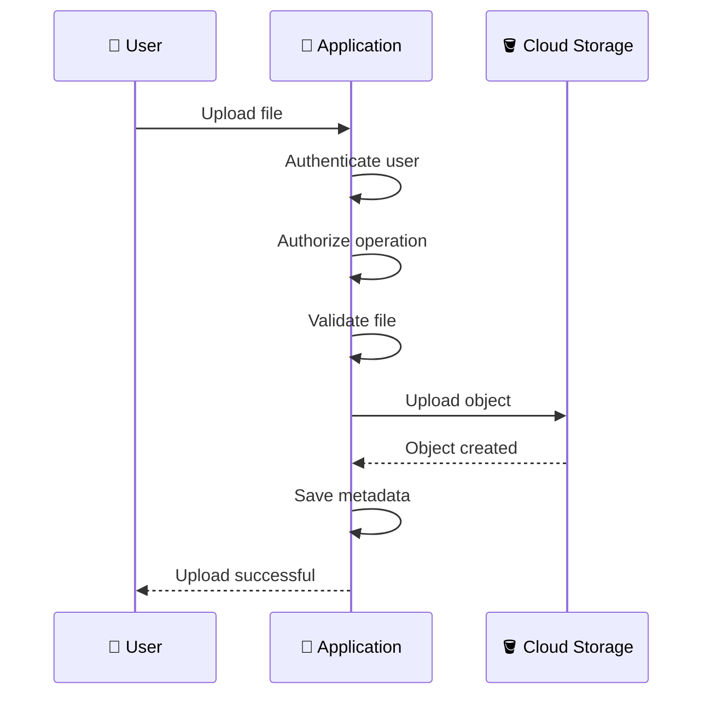
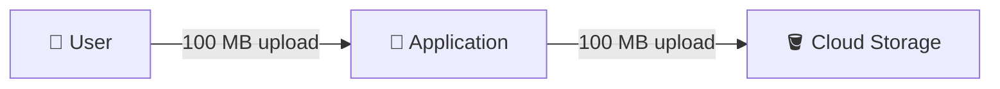
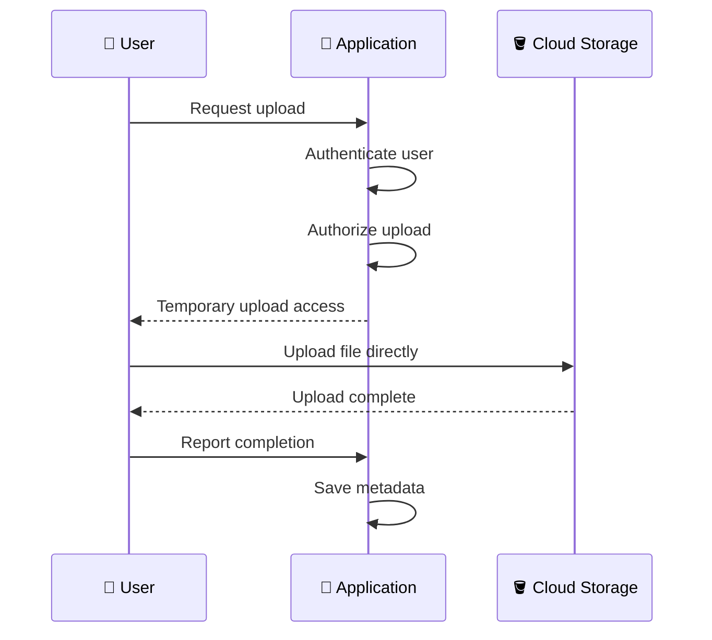
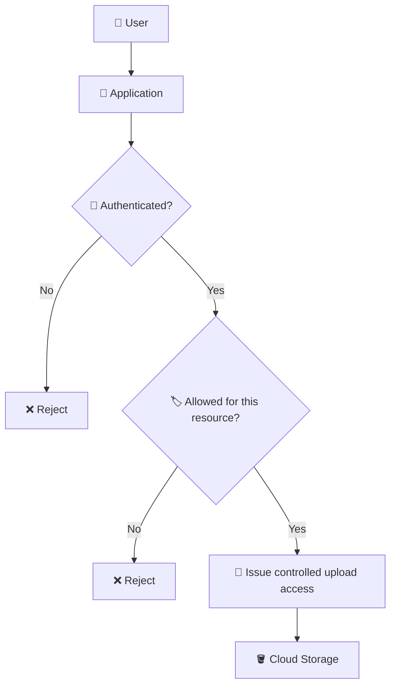
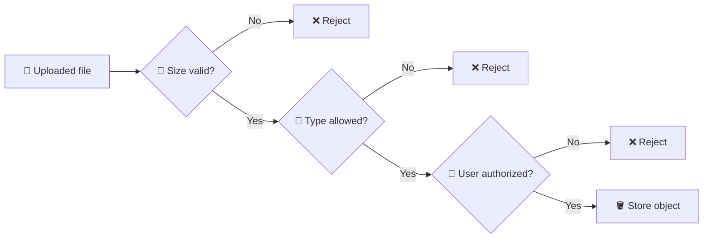
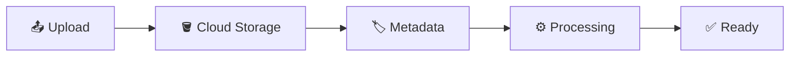
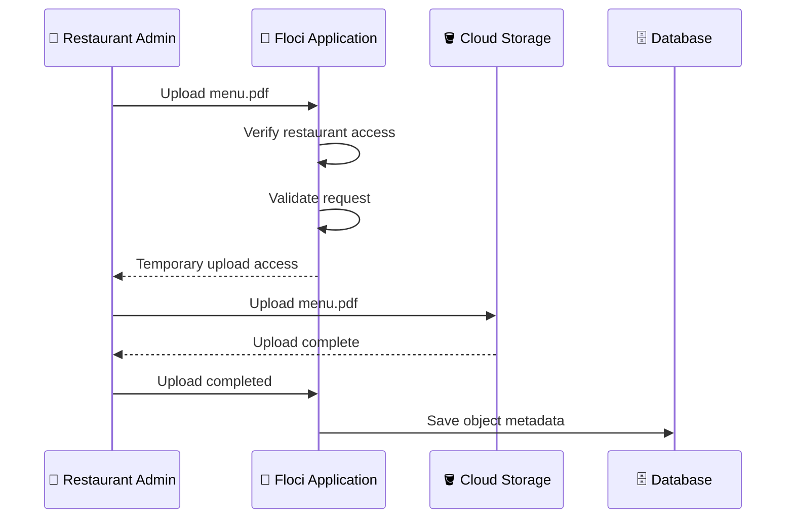
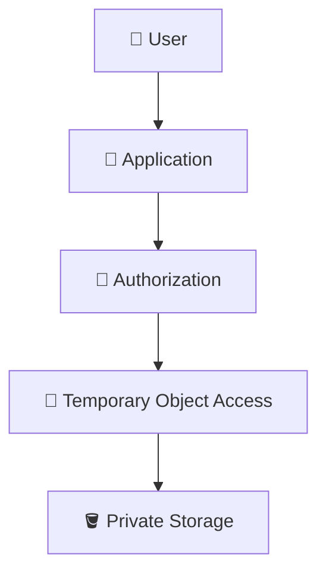
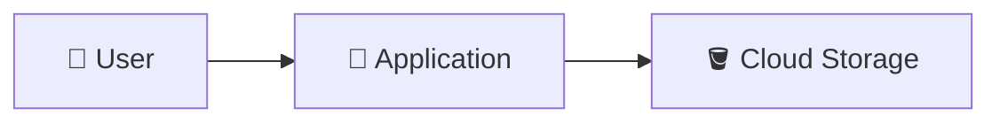
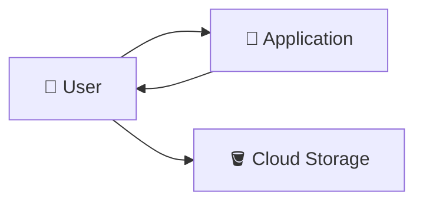

# 2. File Upload Architecture 📤🚀

## 🎯 Learning Objective

By the end of this topic, you should be able to explain the major ways an application uploads files to Cloud Storage, understand the trade-offs between them, and choose an approach based on file size, validation, security, and application requirements.

---

## 🧠 A File Upload Is an Architecture Decision

A file upload may look simple from the user's perspective:

```text
Select file → Upload → Done
```

But the application has to answer several questions:

- 👤 Who is uploading?
- 🔐 Is the user allowed to upload this file?
- 📏 Is the file size acceptable?
- 📄 Is the file type allowed?
- 🪣 Where should the object be stored?
- 🏷️ What should the object be called?
- 🗄️ What metadata should be stored?
- ⚙️ Does the file need processing?
- 🚀 Should the file pass through the application server?

These decisions determine the upload architecture.

---

## 🏗️ Pattern 1 — Application-Mediated Upload

In this model, the client sends the file to the application. The application then sends the file to Cloud Storage.



The application remains in the middle of the file-transfer path.

### When is this useful?

This approach can make sense when:

- 📄 Files are relatively small.
- 🔍 The application must inspect the complete file before storing it.
- 🧹 The application performs transformations during upload.
- 🧠 Business logic is tightly coupled to the upload.
- 🛠️ Simplicity is more important than optimizing large-file transfer.

### Important trade-off

The application server consumes bandwidth and resources while handling the file.

For example:



The application has to receive and then transmit the data.

---

## 🚀 Pattern 2 — Direct-to-Cloud-Storage Upload

In this model, the application authorizes the upload but the client sends the actual file directly to Cloud Storage.

A common mechanism is temporary, scoped access such as a signed URL.



The application is still responsible for authorization and business logic, but it does not necessarily carry the file bytes itself.

---

## ⚖️ Compare the Two Patterns

| Concern | Application-Mediated | Direct Upload |
|---|---|---|
| File passes through application | ✅ Yes | ❌ Usually no |
| Application controls upload flow | High | High for authorization, lower for transfer |
| Application bandwidth usage | Higher | Lower |
| Large files | Can be expensive for app servers | Often a better fit |
| Client needs controlled storage access | Less | Yes |
| Validation before storage | Straightforward | May require a post-upload validation/processing workflow |
| Architecture complexity | Simpler | More moving parts |

There is no universal answer. The right choice depends on the application's requirements.

---

## 🔐 Authorization Must Happen Before Access Is Granted

A common mistake is to think:

> “The user has a signed URL, so security is solved.”

The application still needs to decide whether the user should receive that access.



For a multi-tenant SaaS application, this is critical.

A user belonging to restaurant `101` should not receive upload access to:

```text
restaurants/102/...
```

just because the client requested that path.

---

## 🏷️ Who Chooses the Object Name?

Do not blindly trust a user-provided filename as the complete storage identity.

For example, two users may both upload:

```text
menu.pdf
```

The application can create a controlled object name such as:

```text
restaurants/101/menus/2026/menu-<unique-id>.pdf
```

A useful pattern is:

```text
restaurants/{restaurant_id}/{resource_type}/{unique_identifier}.{extension}
```

This can help avoid accidental collisions and gives the application a predictable namespace.

> 💡 **Interview tip:** Separate the **display filename** from the **storage object name**. A user may see `menu.pdf`, while the application stores it under a controlled object name.

---

## 📏 Validate File Size and Type

Upload security is not only about IAM.

Applications commonly validate things such as:

- 📏 Maximum file size
- 📄 Allowed file types
- 🧾 File extension
- 🔍 Content type
- 🦠 Malware/security scanning where required
- 🏷️ Business ownership

For example:



The exact validation strategy depends on the application and its threat model.

---

## 🔄 What Happens After the Upload?

A successful object upload does not necessarily mean the application's workflow is complete.

For example:



The application may need to:

1. Record the object.
2. Mark the upload as pending.
3. Process the object.
4. Generate a thumbnail or derived file.
5. Update metadata.
6. Mark the object as ready.

This becomes particularly important when processing is asynchronous.

---

## 🧠 Upload Status Is Often Useful

For application workflows, it can be useful to distinguish states such as:

```text
PENDING
   ↓
UPLOADED
   ↓
PROCESSING
   ↓
READY
```

or:

```text
PENDING → FAILED
```

This is an application-level concept. Cloud Storage does not need to understand the application's business workflow.

---

## 🧩 Example: Restaurant Menu Upload

Suppose restaurant `123` uploads `menu.pdf`.

A direct-upload workflow could look like:



The application may store:

```text
restaurant_id = 123
file_type = menu
object_name = restaurants/123/menu/menu-abc.pdf
status = uploaded
```

while Cloud Storage stores the actual object.

---

## ⚠️ Common Interview Trap: “Just Make the Bucket Public”

Making the entire bucket public is not a substitute for application authorization.

For private application data, a safer architecture is usually to keep storage appropriately restricted and expose only the access required for the operation.

For example:



The exact access model depends on whether the data is public, private, user-specific, or subject to additional compliance requirements.

---

## 🎤 Interview Questions

### 1. Why might you avoid sending large files through your application server?

Because the application server must consume bandwidth and resources for the file transfer. Direct-to-Cloud-Storage uploads can separate large object transfer from application request processing.

### 2. Is direct upload less secure because the client talks directly to Cloud Storage?

Not necessarily. The application can authenticate and authorize the user first and issue narrowly scoped, temporary access for the required operation.

### 3. Who should decide the destination object name?

The application should generally control the storage naming strategy rather than trusting arbitrary client-provided paths.

### 4. What should you validate before accepting an upload?

At minimum, consider authorization, file size, file type/content expectations, ownership, and any application-specific security requirements.

### 5. What happens if an upload succeeds but metadata creation fails?

The system can end up with an object that the application does not know about. A robust design should consider idempotency, retries, reconciliation, cleanup, or an explicit upload state so that storage and application metadata do not permanently diverge.

### 6. How would you design uploads for a multi-tenant SaaS platform?

Use a predictable tenant-aware object naming strategy, enforce authorization before granting access, keep storage appropriately private, and ensure that a user cannot request or obtain access to another tenant's objects.

---

## 🧠 What You Should Remember

1. 📤 There are multiple valid upload architectures.
2. 🚀 Application-mediated upload sends file bytes through the application.
3. ⚡ Direct upload lets the client send the object directly to Cloud Storage after authorization.
4. 🔐 Authorization must happen before controlled storage access is issued.
5. 🏷️ Applications should control object naming rather than trusting arbitrary paths.
6. 📏 Validate file size and type according to application requirements.
7. 🗄️ Store application metadata separately from object data when appropriate.
8. ⚙️ Upload completion may be followed by asynchronous processing.
9. 🎤 In interviews, explain the trade-off between application control and file-transfer efficiency.

## 🧪 Checkpoint

Explain the following two architectures without looking at the notes:



and



Then answer:

> **For a 500 MB video upload in a horizontally scaled application, what factors would influence your choice between these two architectures?**
