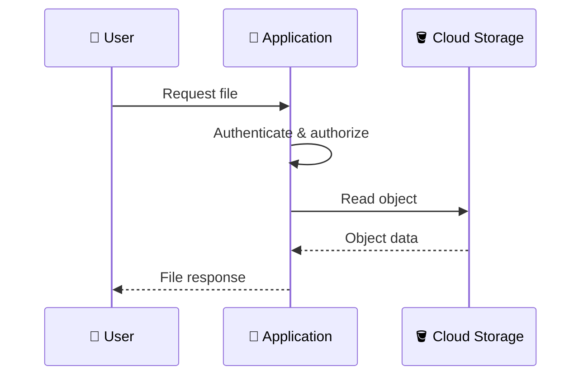
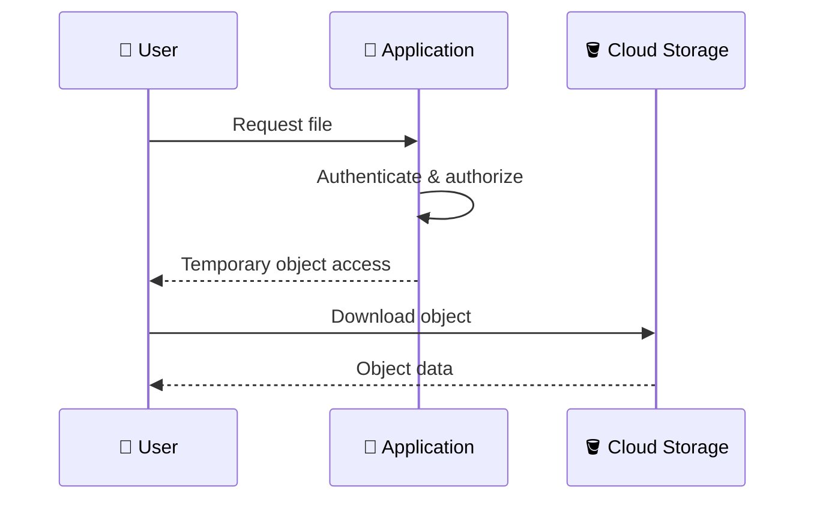
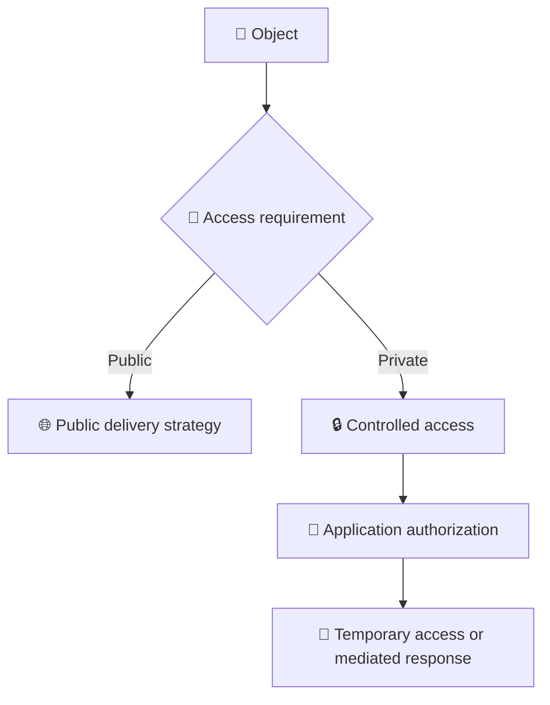
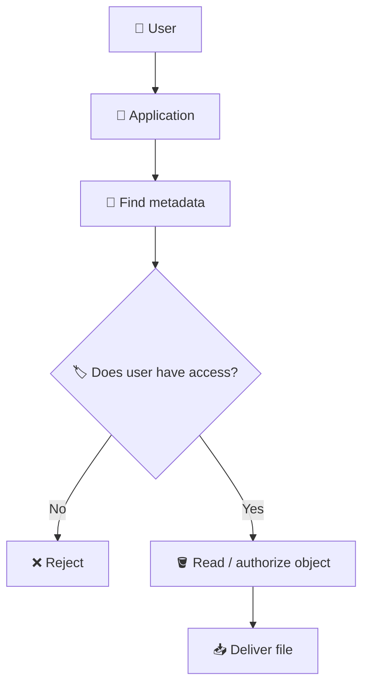
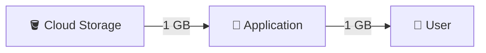
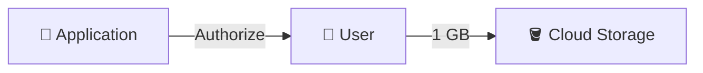
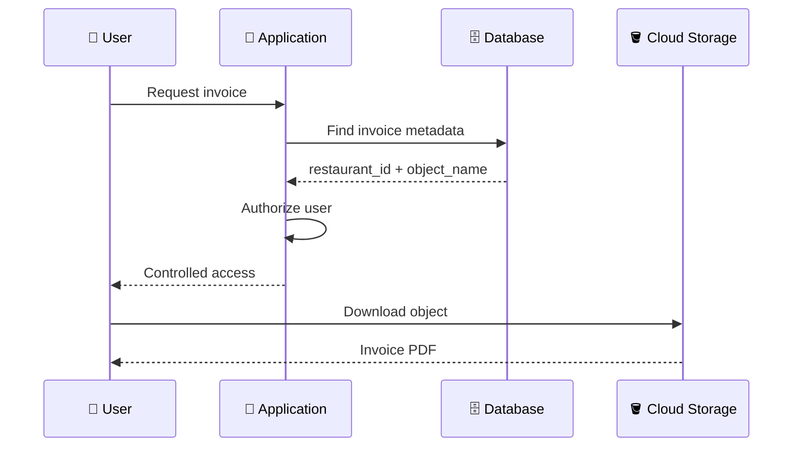

# 3. Reading and Serving Objects 📥🌐

## 🎯 Learning Objective

By the end of this topic, you should be able to explain how an application reads files from Cloud Storage, when the application should proxy a file, when a client can access Storage directly, and how access control affects downloads.

---

## 🧠 Upload and Download Are Different Decisions

A common mistake is to design upload and download using the same pattern automatically.

For uploads:

```text
User → Application → Storage
```

or:

```text
User → Storage
```

For downloads, the application may use:

```text
User → Application → Storage → Application → User
```

or:

```text
User → Application → temporary access → Storage → User
```

The right design depends on authorization, file size, caching, processing, and whether the file is public or private.

---

## 📥 Pattern 1 — Application-Mediated Download

The application retrieves the object and sends it to the user.



This gives the application strong control over the response.

It can be useful when the application must:

- 🔐 Check authorization for every request.
- 🧠 Transform the response.
- 📊 Record download activity.
- 🚫 Hide the underlying storage location.
- 🧩 Combine object data with application logic.

### Trade-off

The application server becomes part of the file-transfer path.

For large or frequently accessed objects, this can consume significant application bandwidth and resources.

---

## ⚡ Pattern 2 — Direct Object Access

For appropriate files, the application can authorize the user and provide controlled access to the object.



The application does not have to transfer the complete file itself.

A signed URL is one common mechanism for temporary access to private objects.

---

## 🔐 Public vs Private Objects

Before designing a download flow, classify the data.

### Public data

Examples might include:

- 🌐 Public website images
- 🖼️ Public marketing assets
- 📚 Public documentation

### Private data

Examples might include:

- 🧾 Customer invoices
- 📄 Restaurant contracts
- 📊 Internal reports
- 🪪 Identity documents

Private objects should not be made public simply because public access is easier.



---

## 🏷️ The Application Still Owns Business Authorization

Suppose a user requests:

```text
restaurants/123/invoices/invoice-001.pdf
```

The application should not assume that the requested object belongs to the user.

A safer flow is:



The database can provide the relationship between:

```text
user → restaurant → file metadata → object name
```

The application then uses that relationship to make the authorization decision.

---

## 📦 Why Large Files Matter

Imagine a 1 GB video.

With application-mediated delivery:



The application is involved in transferring the large payload.

With direct delivery:



The application handles the authorization step without necessarily carrying the entire object payload.

This separation can be important for scalable systems.

---

## 🧠 Do Not Confuse Object Identity With Download Authorization

An object URI such as:

```text
gs://restaurant-files/restaurants/123/menu/menu.pdf
```

identifies a storage object.

It does **not automatically answer**:

> “Is the current application user allowed to read this object?”

That is an application/security question.

This distinction is important in interviews.

---

## 🔄 Download Workflow With Metadata

A typical private-file workflow can look like:



The database is used to find and authorize the business resource; Cloud Storage provides the actual file bytes.

---

## 🧩 Serving Images in a Restaurant Application

Suppose a restaurant has:

```text
restaurants/101/logo/logo.png
restaurants/101/menu/burger.jpg
restaurants/101/menu/pizza.jpg
```

The application might store these object names in metadata.

When the frontend needs an image, the application can determine whether the object is:

- public,
- protected by temporary access,
- or expected to be served through an application/delivery layer.

The exact choice depends on the application's security and performance requirements.

---

## ⚠️ Common Mistakes

### Mistake 1 — Making private files public for convenience

This may expose sensitive data and bypass the application's authorization model.

### Mistake 2 — Sending every large file through the application

This can unnecessarily consume application-server resources.

### Mistake 3 — Trusting a client-provided object path

The client should not be able to choose arbitrary tenant paths and automatically gain access to them.

### Mistake 4 — Assuming a valid URL means valid business authorization

A URL being technically valid does not mean the user should be allowed to access the resource.

---

## 🎤 Interview Questions

### 1. When would you serve a Cloud Storage object through the application?

When the application needs strong control over authorization, transformation, auditing, or other business logic and the additional transfer overhead is acceptable.

### 2. When might you let a client download directly from Cloud Storage?

When the object can be safely accessed using an appropriate access mechanism and you want to avoid routing large object data through the application server.

### 3. How do you protect private downloads?

Authenticate and authorize the user in the application, then use an appropriate controlled access mechanism such as temporary signed access or an application-mediated response.

### 4. Why is object existence not enough to grant access?

Because object existence is a storage fact, while authorization is a business/security decision.

### 5. A user changes `/restaurants/101/` to `/restaurants/102/` in a request. What should happen?

The application should validate ownership or authorization based on its business data and reject access if the user is not authorized for restaurant `102`.

### 6. Why might direct downloads improve scalability for large objects?

They can remove large payload transfer from the application-server path, allowing application resources to focus on business requests and authorization.

---

## 🧠 What You Should Remember

1. 📥 Upload and download architectures do not have to be identical.
2. 🚀 Application-mediated downloads provide strong application control but consume application resources.
3. ⚡ Direct downloads can reduce application-server bandwidth for large objects.
4. 🔐 Private-object access should be authorized by the application/security model.
5. 🗄️ Metadata can map business entities to storage object names.
6. 🌐 Public and private objects require different access strategies.
7. 🎤 In interviews, distinguish **object identity**, **authentication**, and **authorization**.

## 🧪 Checkpoint

Answer this without looking at the notes:

> **A restaurant manager requests a 500 MB video that belongs to their restaurant. Describe a secure and scalable download workflow.**

Your answer should mention:

- Authentication
- Authorization
- Metadata lookup
- Object identification
- Controlled access
- Why the application may avoid transferring the entire 500 MB file itself
