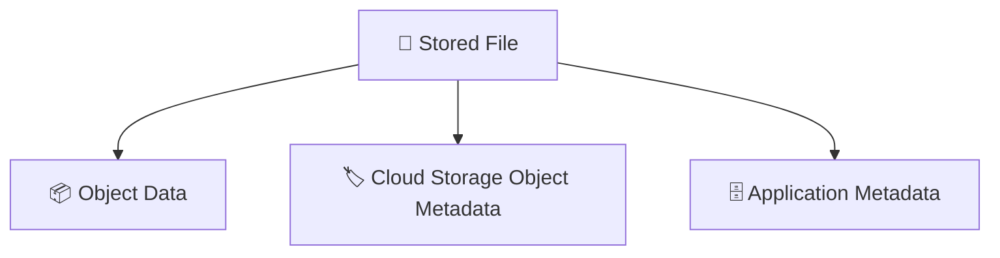
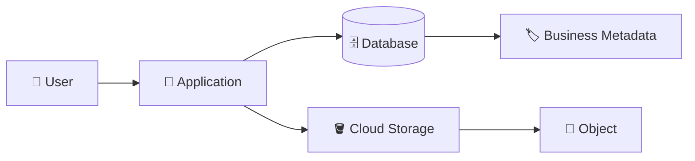
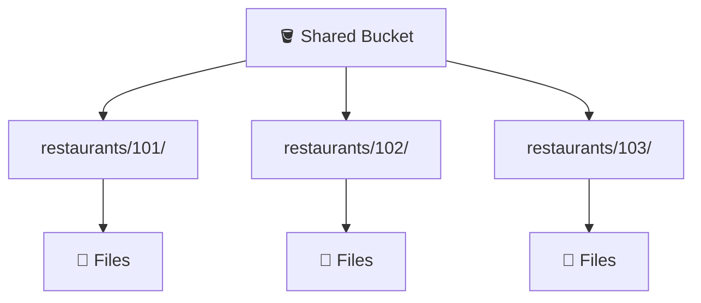
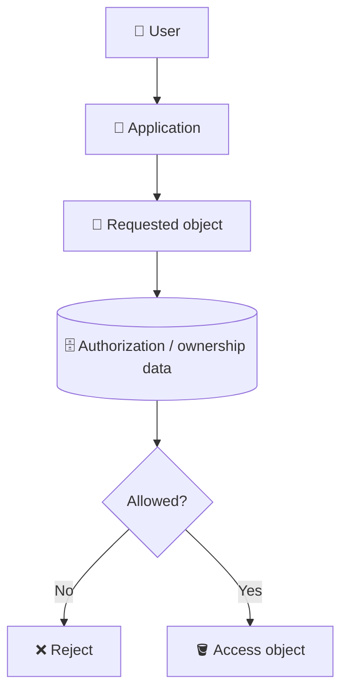
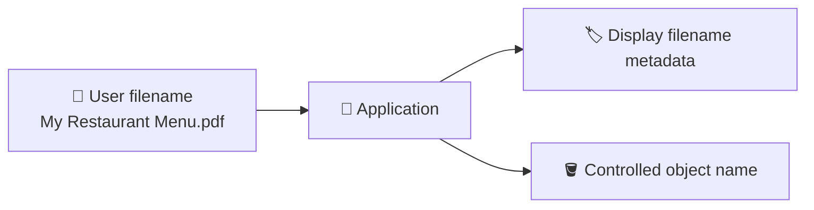

# 4. Metadata and Object Naming 🏷️🗄️

## 🎯 Learning Objective

By the end of this topic, you should be able to explain the difference between object data, object metadata, and application metadata, and design a predictable object-naming strategy for a multi-tenant application.

---

## 🧠 Three Things to Keep Separate

When an application stores a file, think about three layers:



### 1. 📦 Object data

The actual bytes of the file.

Example:

```text
invoice.pdf
```

### 2. 🏷️ Object metadata

Information associated with the Cloud Storage object, such as content-related or storage-related metadata.

### 3. 🗄️ Application metadata

Business information that your application needs to query and manage.

For example:

```text
restaurant_id
uploaded_by
file_type
status
created_at
```

The exact fields depend on the application.

---

## 🏷️ Why Does an Application Need Metadata?

Cloud Storage can tell you that an object exists.

But your application may need to answer questions such as:

> Which restaurant owns this file?

> Is this the current menu?

> Who uploaded the invoice?

> Is the document still being processed?

> Which user is allowed to access it?

These are business questions.

A database is often a better place to store this searchable business information.



---

## 🧩 Example: Restaurant Invoice

Suppose the application uploads:

```text
invoice.pdf
```

The object could be stored as:

```text
gs://restaurant-files/restaurants/123/invoices/2026/09/invoice-abc.pdf
```

The application database could contain:

```text
id: 9001
restaurant_id: 123
file_type: invoice
object_name: restaurants/123/invoices/2026/09/invoice-abc.pdf
uploaded_by: 456
status: ready
```

The database does not need to contain the entire PDF.

It can contain the information needed to locate and manage the object.

---

## 🏗️ Designing Object Names

A predictable object naming strategy helps applications organize objects logically.

One possible pattern is:

```text
restaurants/{restaurant_id}/{resource_type}/{year}/{month}/{unique_id}.{extension}
```

Example:

```text
restaurants/123/invoices/2026/09/a8f2.pdf
restaurants/123/menus/2026/09/b7c1.pdf
restaurants/456/invoices/2026/09/c9d3.pdf
```

The exact convention is an application design decision.

The important properties are:

- 🏷️ Predictable
- 🔑 Unambiguous
- 🧩 Tenant-aware
- 🔄 Stable enough for application use
- 🚫 Resistant to accidental collisions

---

## 👤 Multi-Tenant Storage

Floci is a SaaS-style application, so tenant isolation is an important architectural concept.

Imagine:

```text
Restaurant 101
Restaurant 102
Restaurant 103
```

A naming strategy can make tenant ownership explicit:



However, **naming alone is not a security boundary**.

A user should not gain access to another restaurant merely because they know or guess an object name.

Security must be enforced through the application's authorization model and appropriate storage access controls.

---

## 🔐 Naming Is Not Authorization

This is a very important interview point.

Suppose a user changes:

```text
restaurants/101/menu/menu.pdf
```

to:

```text
restaurants/102/menu/menu.pdf
```

The application must not assume that the request is valid.



> 🎤 **Interview answer:** Object paths help organize data; they do not replace authorization.

---

## 📝 Display Filename vs Object Name

A user's filename does not have to be the final storage name.

User uploads:

```text
My Restaurant Menu.pdf
```

The application could preserve the display filename in metadata:

```text
original_filename = My Restaurant Menu.pdf
```

while storing the object under:

```text
restaurants/123/menus/2026/09/7f92.pdf
```

This separation gives the application control over storage naming while preserving a user-friendly filename.



---

## 🔄 Renaming Objects

Applications should think carefully about renaming.

If a database stores:

```text
object_name = restaurants/123/menu/menu-v1.pdf
```

and the object is later moved/renamed, the database reference may need to change too.

This creates a useful design principle:

> **Treat object names as identifiers used by the application, not merely as cosmetic filenames.**

Depending on the application, a stable internal identifier can make object references easier to manage.

---

## 🧠 Prefixes and Logical Organization

Object names often use prefixes:

```text
restaurants/123/invoices/2026/09/
```

This makes listing and application-level organization convenient.

But remember:

```text
restaurants/123/invoices/2026/09/invoice.pdf
```

is an object name.

The `/` characters provide a folder-like naming convention; they should not automatically be interpreted as traditional filesystem directories.

---

## 🎤 Interview Questions

### 1. Why store file metadata in a database instead of only Cloud Storage?

Because the application often needs searchable business information such as ownership, status, resource type, uploader, and relationships to other business entities.

### 2. Should the database store the entire file?

Not necessarily. For many file-storage workflows, the database stores metadata and the object itself is stored in Cloud Storage.

### 3. Is an object path a security boundary?

No. A predictable path helps organization but does not replace authentication, authorization, IAM, or other security controls.

### 4. Why separate display filename and object name?

The display filename is a user-facing concept, while the object name is an application/storage identifier that should be controlled and collision-resistant.

### 5. How would you organize objects for a multi-tenant application?

Use a predictable tenant-aware naming convention and enforce tenant authorization separately. For example, include a tenant or restaurant identifier in the object name while ensuring the application validates access.

### 6. What happens if the object name stored in the database is wrong?

The application may be unable to retrieve the file even though the object exists. Troubleshooting should compare the database reference, actual bucket, object name, and access permissions.

---

## 🧠 What You Should Remember

1. 📦 Object data is the actual file bytes.
2. 🏷️ Object metadata describes the Cloud Storage object.
3. 🗄️ Application metadata describes business relationships and workflow state.
4. 🏷️ Object names should follow a deliberate application convention.
5. 👤 Tenant identity can be represented in object names, but naming is not authorization.
6. 📄 Display filenames and storage object names can be different.
7. 🔄 Changing an object name can require updating application references.
8. 🎤 Interviewers often test whether you understand the difference between storage organization and security.

## 🧪 Checkpoint

Given:

```text
gs://restaurant-files/restaurants/123/invoices/2026/09/a8f2.pdf
```

Explain:

- 🪣 Which part is the bucket?
- 🏷️ Which part is the object name?
- 👤 Which part identifies the tenant?
- 🗄️ What additional information would you store in application metadata?
- 🔐 Why does knowing this path not automatically authorize a user to access the file?
