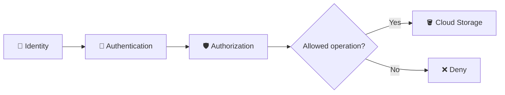
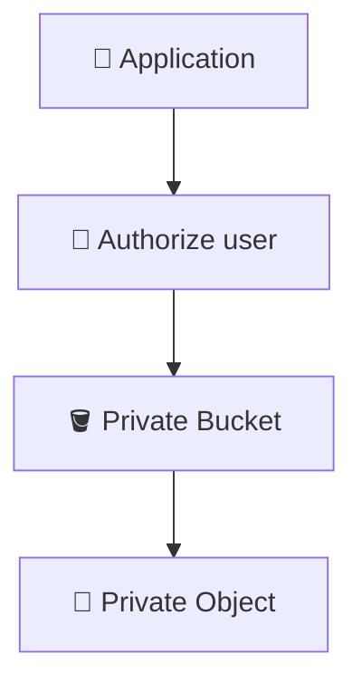
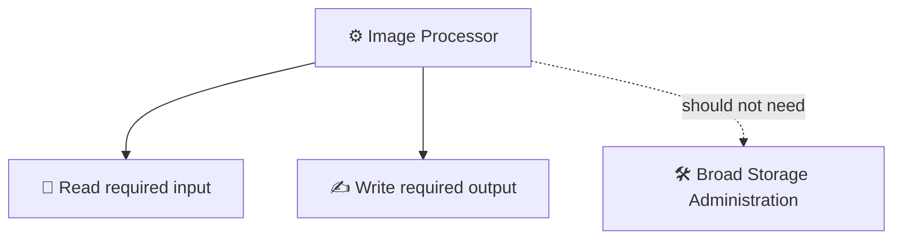
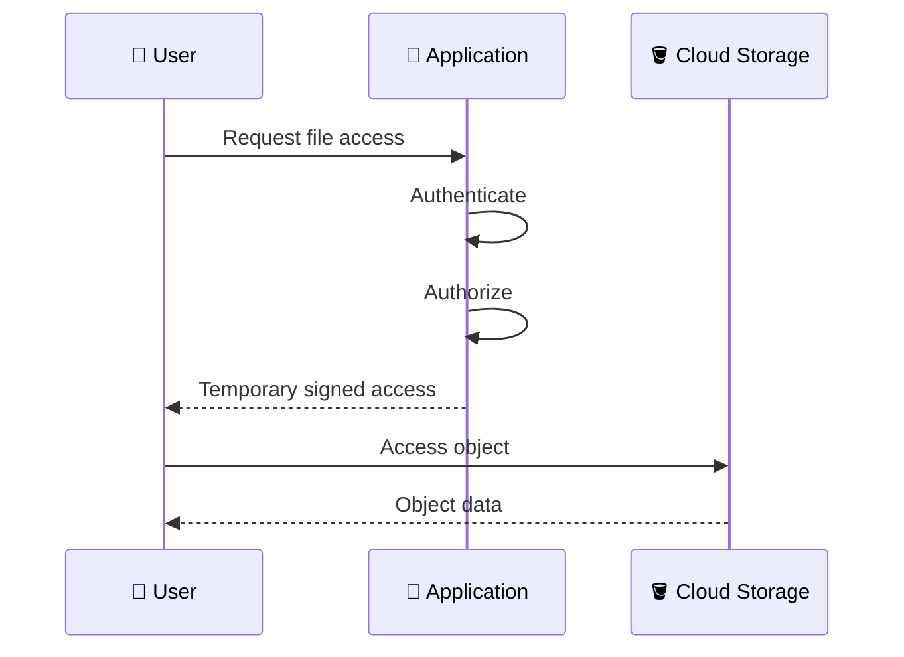
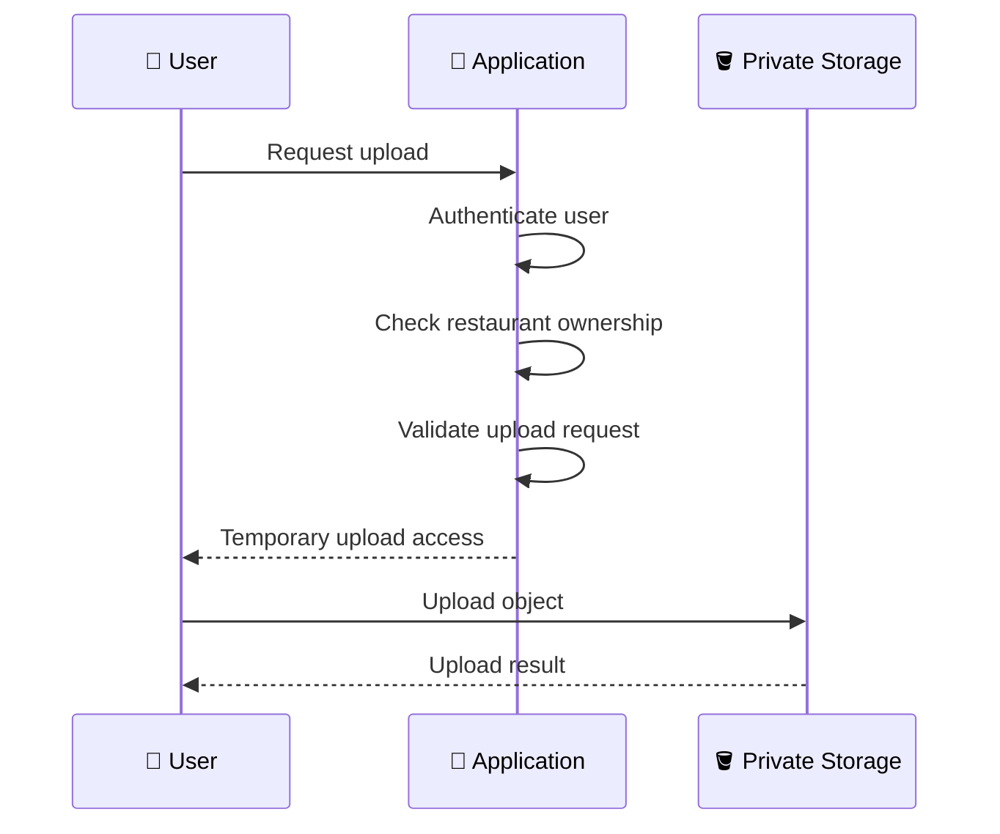
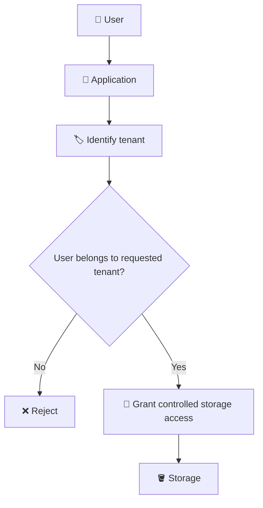
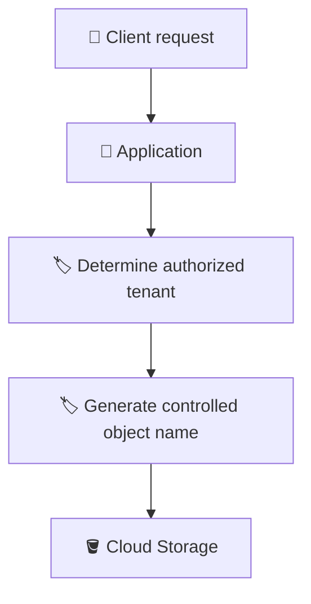
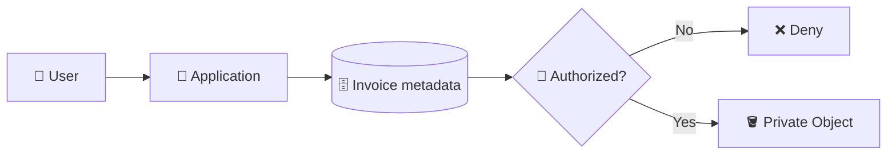

# 5. Access Control and Secure Uploads 🔐📤

## 🎯 Learning Objective

By the end of this topic, you should be able to explain authentication vs authorization, apply least-privilege thinking to Cloud Storage, understand why private buckets are important for sensitive application data, and explain how temporary signed access can support secure uploads and downloads.

---

## 🔐 Authentication vs Authorization

These two concepts are frequently tested in interviews.

### Authentication

> **Who are you?**

Examples:

- User signs in.
- Application identifies a service account.
- A credential proves an identity.

### Authorization

> **What are you allowed to do?**

Examples:

- User can upload a restaurant menu.
- User can read their restaurant's invoice.
- Application identity can create objects in a particular bucket.



A valid identity does not automatically have permission to perform every operation.

---

## 🪣 Keep Sensitive Buckets Private

For application data such as:

- 🧾 invoices
- 📄 contracts
- 🪪 identity documents
- 📊 internal reports
- 🔒 customer files

broad public access may be inappropriate.

A common architecture is:



The exact access model depends on the application's requirements, but the general principle is to expose only the access that is needed.

---

## 🧠 Least Privilege

Least privilege means:

> Give an identity only the permissions required to perform its job.

Suppose an image-processing service only needs to read uploaded images and create processed output.

It should not automatically receive broad administrative permissions over every storage resource.



Least privilege reduces the impact of credential misuse or application compromise.

---

## 🔑 Signed URLs

A signed URL can provide temporary, controlled access to a Cloud Storage object or operation.

A common pattern is:



The application can make the business authorization decision without giving the user broad, long-lived storage credentials.

---

## ⏱️ Why Temporary Access?

Imagine a restaurant manager needs to download an invoice.

The application could issue access intended for a limited period instead of permanently exposing the object.

Conceptually:

```text
Request access
      ↓
Authenticate
      ↓
Authorize
      ↓
Generate temporary access
      ↓
Download object
      ↓
Access expires
```

The exact expiration and permissions depend on the mechanism and application requirements.

> ⚠️ Treat a signed URL as sensitive while it is valid. Anyone who obtains a usable signed URL may be able to perform the operation allowed by that URL.

---

## 📤 Secure Direct Upload

A secure direct-upload workflow can look like this:



The important point is that **the client does not decide its own authorization merely by choosing an object path**.

---

## 🏷️ Tenant Isolation

For a multi-tenant SaaS application:

```text
Restaurant 101
Restaurant 102
```

A user from restaurant `101` should not be able to access:

```text
restaurants/102/...
```

just by changing a URL or request parameter.



This is an application authorization concern as well as a storage access-control concern.

---

## 📄 Validate the File

Authorization answers:

> **Who may upload?**

Validation answers:

> **What are they allowed to upload?**

Depending on the application, validation may include:

- 📏 Maximum size
- 📄 Allowed content types
- 🔍 File content checks
- 🧾 Extension checks
- 🦠 Malware/security scanning
- 🏷️ Business-specific rules

Do not rely only on a filename extension for security-sensitive validation.

---

## 🚫 Avoid Client-Controlled Sensitive Paths

A dangerous design can look like:

```text
POST /upload?path=restaurants/102/invoices/secret.pdf
```

where the server blindly trusts the requested path.

Instead, the application should derive or validate the tenant and resource relationship.



The application should control the namespace used for sensitive objects.

---

## 🧩 Example: Restaurant Invoice

A secure workflow could be:

```text
1. User signs in.
2. User requests invoice 9001.
3. Application verifies invoice 9001 belongs to restaurant 123.
4. Application verifies the user can access restaurant 123.
5. Application obtains the object's storage identity.
6. Application provides controlled access to the object.
```



---

## ⚠️ Common Security Mistakes

### Mistake 1 — Making the entire bucket public

Public access may expose objects that were intended to be private.

### Mistake 2 — Giving the application broad storage administration permissions

This violates least-privilege thinking when the application only needs a smaller set of operations.

### Mistake 3 — Trusting object paths from the browser

A client-controlled path should not determine authorization.

### Mistake 4 — Confusing authentication with authorization

Knowing who the user is does not prove what they can access.

### Mistake 5 — Treating signed URLs as permanent permissions

Signed access is temporary and scoped according to its configuration. It should still be handled as sensitive access while valid.

---

## 🎤 Interview Questions

### 1. What is the difference between authentication and authorization?

Authentication identifies the requester. Authorization determines which operations and resources that identity is allowed to access.

### 2. Why should application storage often be private?

Because many application objects contain sensitive or tenant-specific information and should only be accessible through an appropriate authorization model.

### 3. What is least privilege?

Granting an identity only the permissions it needs for its intended job.

### 4. What is a signed URL?

A signed URL provides controlled, usually temporary access to a specific Cloud Storage resource or operation without requiring the client to receive broad long-lived storage permissions.

### 5. Can a signed URL replace application authorization?

No. The application should decide whether the user is authorized before issuing controlled access.

### 6. How would you secure storage in a multi-tenant SaaS application?

Keep sensitive storage appropriately restricted, identify and authorize the tenant in the application, use controlled object naming, apply least-privilege storage permissions, and use temporary access mechanisms where appropriate.

### 7. A user can upload a file but can also access another restaurant's files. What would you investigate?

Investigate tenant authorization, object naming/path handling, storage IAM, signed-access generation, and whether the application trusts client-supplied object identifiers without validating ownership.

---

## 🧠 What You Should Remember

1. 🔐 Authentication answers **who**; authorization answers **what they can do**.
2. 🪣 Sensitive application buckets should generally use an appropriately restricted access model.
3. 🛡️ Least privilege limits unnecessary permissions.
4. 🔑 Signed URLs can provide temporary controlled access.
5. 👤 Tenant authorization must happen before granting access to tenant-specific objects.
6. 🏷️ Object paths do not replace authorization.
7. 📄 Secure uploads require both access control and input validation.
8. 🎤 In interviews, explain security as a workflow rather than simply saying “use IAM.”

## 🧪 Checkpoint

Answer this scenario without looking at the notes:

> **A restaurant SaaS application stores private invoices in Cloud Storage. A manager should be able to download only invoices belonging to their restaurant. Design the authorization and download flow.**

Your answer should cover:

- Authentication
- Tenant identification
- Authorization
- Object lookup
- Private storage
- Controlled access
- Least privilege
