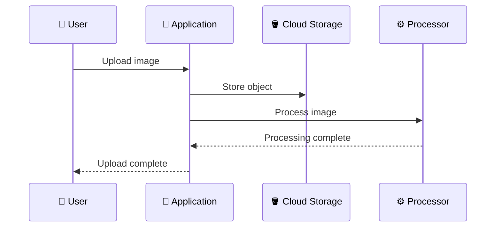
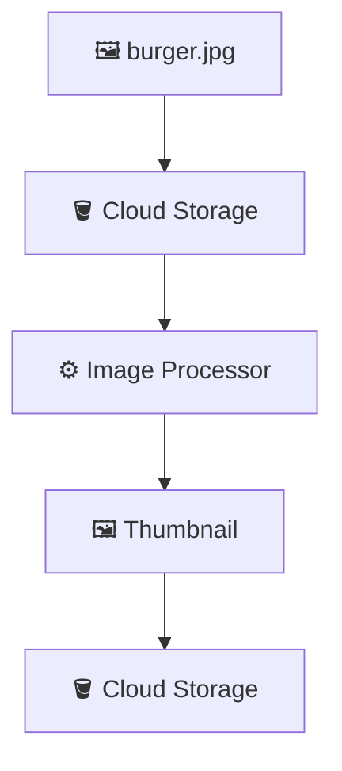
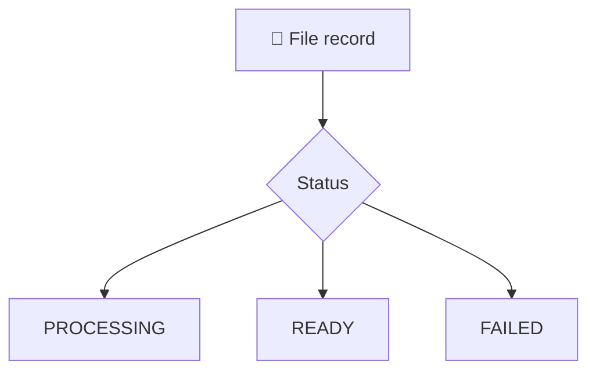
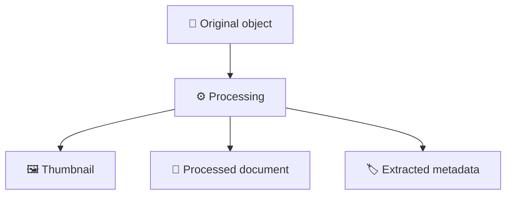
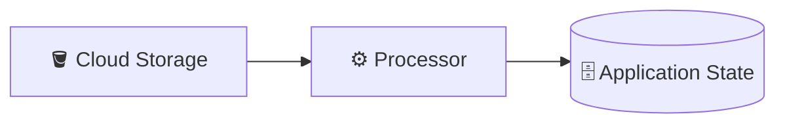

# 6. File Processing Workflow ⚙️📄

## 🎯 Learning Objective

By the end of this topic, you should be able to explain why uploaded files often need processing, understand synchronous vs asynchronous processing, and design a basic storage-processing workflow.

---

## 🧠 Uploading Is Often Only Step One

A file can require additional work after it reaches Cloud Storage.

Examples:

- 🖼️ Resize an image
- 🖼️ Generate a thumbnail
- 📄 Extract document information
- 🧾 Validate an invoice
- 🎥 Generate a video preview
- 🦠 Scan a file
- 📦 Convert a file format

A useful mental model is:


---

## 🔄 Synchronous Processing

In a synchronous workflow, the application waits for processing to finish before responding.



This can be reasonable for small and fast operations.

However, long-running processing can make the user's request slow and can tie up application resources.

---

## ⚡ Asynchronous Processing

In an asynchronous workflow, the application stores the object and allows processing to happen separately.

Conceptually:


The user can receive a response such as:

```text
Upload accepted
Status: PROCESSING
```

The application can later change the status to:

```text
READY
```

This becomes an important bridge to the event-driven architecture chapters later in the tutorial.

---

## 🏷️ Application Processing States

An application can track processing state:

```text
PENDING
   ↓
UPLOADED
   ↓
PROCESSING
   ↓
READY
```

If processing fails:

```text
PROCESSING
   ↓
FAILED
```

These are application-level states.

Cloud Storage stores objects; the application determines what those objects mean to its business workflow.

---

## 🧩 Example: Restaurant Image Upload

Suppose a restaurant uploads:

```text
burger.jpg
```

The application may store the original:

```text
restaurants/123/images/original/burger.jpg
```

and generate a thumbnail:

```text
restaurants/123/images/thumb/burger.jpg
```



The database might track:

```text
restaurant_id: 123
original_object: restaurants/123/images/original/burger.jpg
thumbnail_object: restaurants/123/images/thumb/burger.jpg
status: READY
```

---

## 🗄️ Why Store Processing State?

Imagine the processor fails.

Without application state, the frontend may not know whether the upload:

- succeeded,
- is still processing,
- or failed.

With metadata:



The application can present an appropriate state to the user and potentially retry the processing workflow.

---

## 🔁 Retries and Idempotency

Asynchronous workflows can fail and retry.

For example:

```text
Upload
  ↓
Processing
  ↓
Temporary failure
  ↓
Retry
  ↓
Processing again
```

The processing operation should be designed so that a retry does not create incorrect duplicate business results.

This property is called **idempotency**.

For example, if a thumbnail already exists for a particular source object and processing is retried, the processor should have a deliberate strategy for handling the existing output.

> 🎤 **Interview tip:** When discussing event-driven file processing, mention **retries, duplicate events, idempotency, and failure handling**.

---

## 🧹 Original vs Derived Objects

Applications often need to distinguish the original object from generated objects.



A naming convention can make this relationship easy to understand.

For example:

```text
restaurants/123/images/original/photo.jpg
restaurants/123/images/thumb/photo.jpg
```

The application can also maintain explicit relationships in its metadata.

---

## 🧠 Storage Does Not Automatically Mean Processing

Do not assume that storing an object automatically performs your business logic.

A useful architecture distinction is:

```text
Cloud Storage
    = stores objects

Processor
    = performs application work

Database
    = stores application state/metadata
```



The services can be connected using synchronous calls, events, jobs, or other mechanisms depending on the architecture.

---

## 🎤 Interview Questions

### 1. Why would you process a file after uploading it?

Because applications often need transformations, validation, scanning, extraction, compression, thumbnail generation, or other business processing.

### 2. When would you prefer asynchronous processing?

When processing can take significant time, when user requests should return quickly, or when the workload should be handled independently from the request lifecycle.

### 3. Why track `PROCESSING` and `FAILED` states?

So the application can communicate workflow status, support retries, and avoid assuming that object upload automatically means business processing succeeded.

### 4. What is idempotency in file processing?

It means processing the same input more than once does not create an incorrect business result. This matters because retries and duplicate events can occur in distributed systems.

### 5. Where would you store the original file and generated thumbnail?

Both can be stored as Cloud Storage objects, with application metadata recording their relationship and state.

### 6. How would you connect Cloud Storage to an asynchronous processor?

A storage event or application-triggered job can initiate processing, after which the processor writes results back to Storage and updates application metadata. The exact mechanism depends on the GCP services used.

---

## 🧠 What You Should Remember

1. ⚙️ Uploading a file can be only the first step in a workflow.
2. 🔄 Processing can be synchronous or asynchronous.
3. ⚡ Asynchronous processing separates long-running work from the user request.
4. 🏷️ Application state can represent `UPLOADED`, `PROCESSING`, `READY`, and `FAILED`.
5. 🔁 Distributed processing should consider retries and idempotency.
6. 🪣 Cloud Storage stores objects; processors perform application work.
7. 🗄️ The database can track processing state and relationships between objects.
8. 🎤 Processing workflows are a natural bridge from Cloud Storage to event-driven architecture.

## 🧪 Checkpoint

Design a workflow for this requirement:

> **A restaurant uploads a food image. The original must be stored, a thumbnail must be generated, and the UI should show whether processing is complete.**

Explain:

- Where the original is stored
- Where the thumbnail is stored
- What metadata is tracked
- Whether processing is synchronous or asynchronous
- What happens if processing fails
- How retries should be handled
