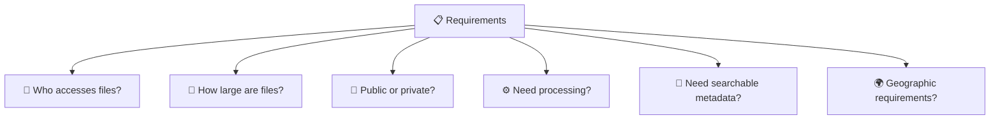
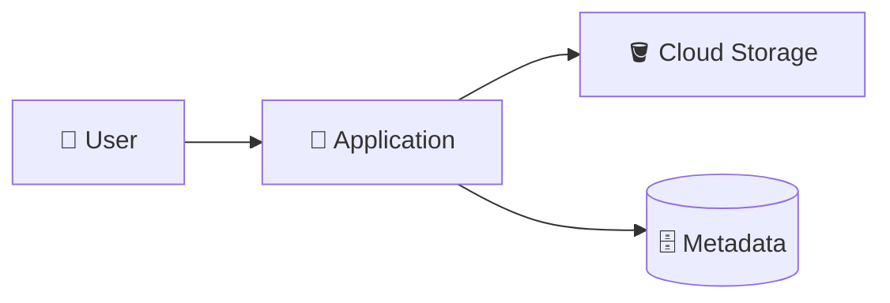
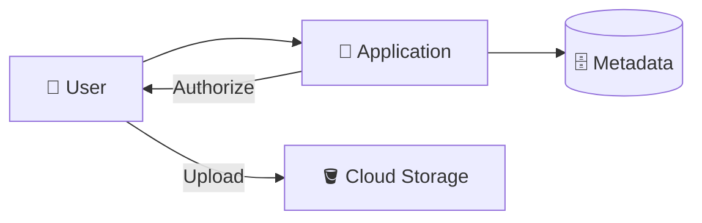
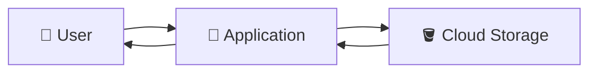
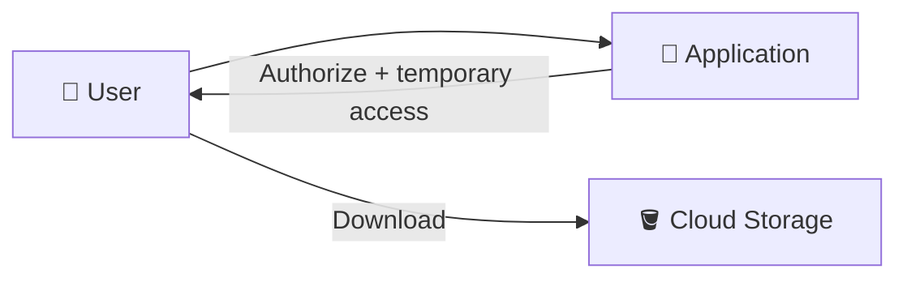
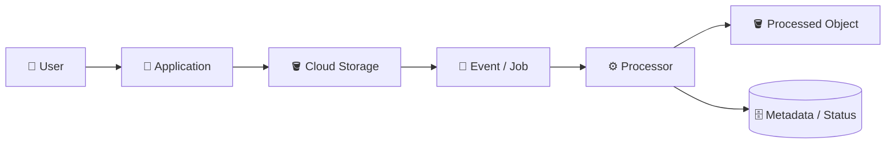
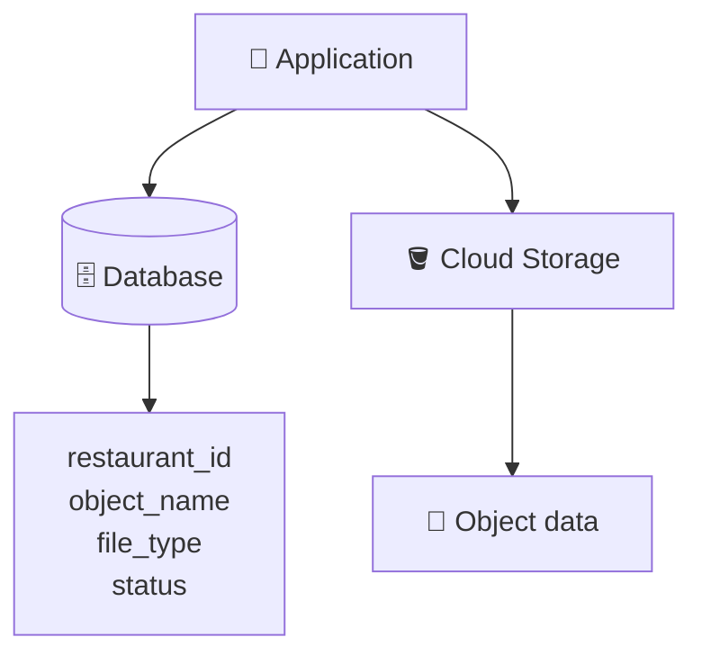
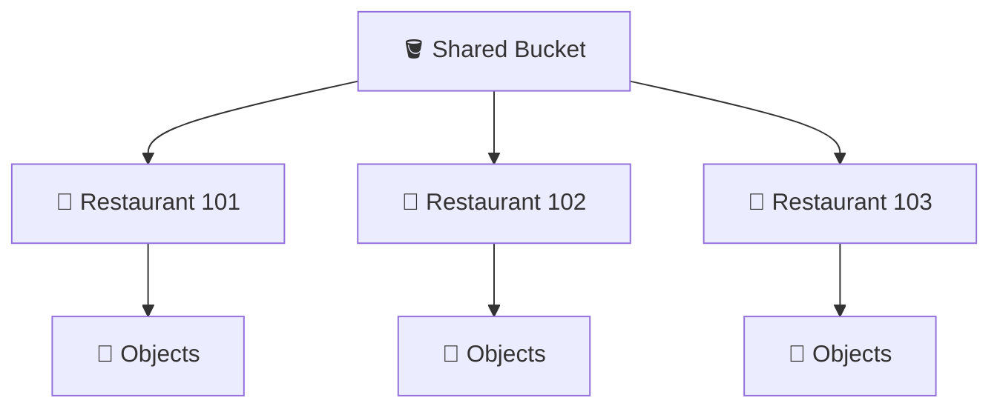
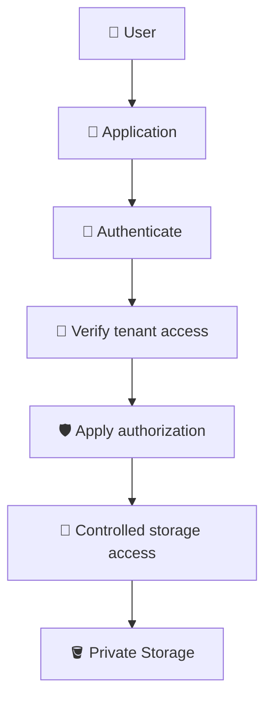
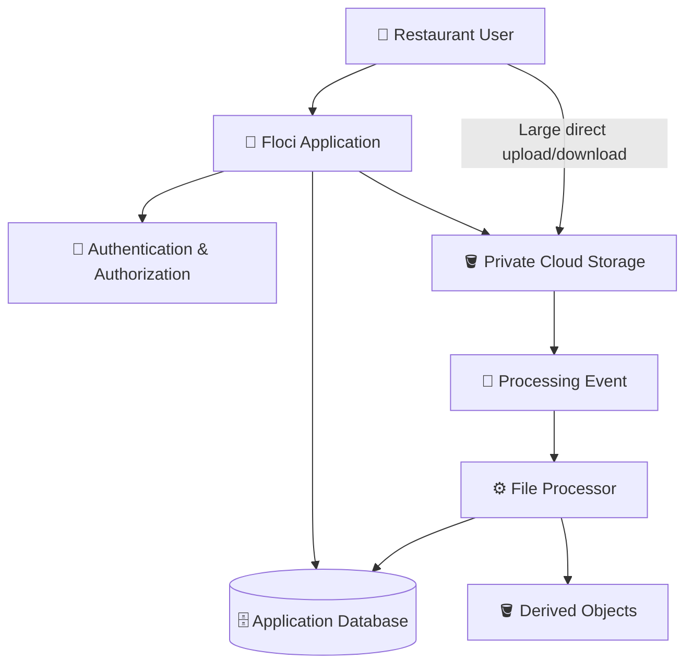

# 7. Storage Application Patterns 🏗️🪣

## 🎯 Learning Objective

By the end of this topic, you should be able to recognize common Cloud Storage application patterns, explain their trade-offs, and design a storage workflow for a multi-tenant SaaS application.

This topic is intentionally interview-focused. Instead of memorizing one architecture, learn how to reason from requirements.

---

## 🧠 Start With Requirements

When an interviewer says:

> “Design file storage for our application.”

Do not immediately draw a bucket.

First ask:



The answers influence the architecture.

---

## 📤 Pattern 1 — Application-Mediated Upload



### Useful when

- Files are relatively small.
- Application logic must inspect the file before storage.
- Simplicity is important.
- The application needs to transform the file during the request.

### Trade-off

The application carries the file traffic and therefore consumes application resources.

---

## ⚡ Pattern 2 — Direct Upload



### Useful when

- Files can be large.
- High upload volume is expected.
- Application servers should avoid carrying large payloads.
- Temporary controlled access can be issued to clients.

### Trade-off

The architecture has more moving pieces, and the application must carefully handle authorization and post-upload validation/processing.

---

## 📥 Pattern 3 — Application-Mediated Download



Useful when the application needs to control the response or perform processing, auditing, or business logic.

The trade-off is that object data passes through the application.

---

## 🔑 Pattern 4 — Controlled Direct Download



Useful for large private objects where the application needs to authorize access but should avoid transferring the full payload itself.

---

## ⚙️ Pattern 5 — Upload + Asynchronous Processing



Useful for:

- Image resizing
- Thumbnail generation
- Document processing
- File scanning
- Video processing
- Other long-running tasks

Important interview topics include retries, duplicate events, idempotency, and failure handling.

---

## 🏷️ Pattern 6 — Database for Metadata, Storage for Files



This pattern separates:

```text
Business data → Database
File bytes → Cloud Storage
```

It is especially useful when the application needs to query or relate files to business entities.

---

## 👥 Pattern 7 — Multi-Tenant Object Namespace

A SaaS application may organize objects using tenant-aware names:

```text
restaurants/101/...
restaurants/102/...
restaurants/103/...
```



This helps organization but does not provide security by itself.

The application still needs tenant authorization.

---

## 🔐 Security Pattern

A common secure architecture is:



The important concept is that security is not simply:

```text
Private bucket = complete security
```

The application and cloud IAM/access model work together.

---

## ⚖️ How to Choose an Architecture

Use requirements to reason about the design.

| Requirement | Questions to ask |
|---|---|
| Large files | Can application servers handle the transfer? |
| High upload volume | Can the application scale with the traffic? |
| Private data | Who is authorized to access each object? |
| Public assets | Can direct/public delivery be appropriate? |
| Processing | Does work need to happen synchronously? |
| Multi-tenancy | How is tenant ownership enforced? |
| Searchable metadata | What information belongs in the database? |
| Reliability | What happens when storage or processing fails? |
| Cost | What data-transfer and storage implications exist? |
| Compliance | Where and how must data be stored? |

The goal is not to memorize a “correct” architecture. The goal is to explain the trade-offs.

---

## 🧩 Complete Restaurant SaaS Example

Suppose the application supports:

- Restaurant logos
- Menu PDFs
- Food images
- Invoices
- Large promotional videos

One possible architecture is:



Different file types can use different access patterns.

For example:

```text
Logo
→ possibly public delivery

Invoice
→ private + controlled access

Large video
→ direct upload/download

Food image
→ upload + asynchronous thumbnail generation
```

This is an important system-design insight:

> **One application does not have to use one storage access pattern for every file type.**

---

## ⚠️ Common Interview Mistakes

### Mistake 1 — Starting with technology instead of requirements

Do not begin with “I'll use a bucket.” Start with access, size, processing, tenancy, and reliability requirements.

### Mistake 2 — Treating object naming as security

`restaurants/123/...` helps organization but does not authorize the user.

### Mistake 3 — Routing every large file through the API

This can create unnecessary application-server bandwidth and scaling pressure.

### Mistake 4 — Ignoring failure handling

Storage upload, metadata persistence, and processing can fail independently.

### Mistake 5 — Ignoring retries

Distributed systems can retry operations. Processing workflows should be designed with idempotency in mind.

---

## 🎤 Interview Questions

### 1. How would you design file storage for a multi-tenant SaaS application?

Discuss tenant-aware object naming, private storage where appropriate, application authorization, metadata storage, controlled upload/download access, and processing requirements.

### 2. Would you use one bucket per restaurant?

There is no universal answer. Discuss operational scale, access-control requirements, tenant isolation, naming, management overhead, and application requirements before choosing a bucket strategy.

### 3. How would you handle 1 GB video uploads?

Consider direct-to-Cloud-Storage upload so that large payloads do not unnecessarily pass through application servers. Explain how authorization and temporary access would work.

### 4. How would you serve private invoices?

Authenticate the user, verify tenant/resource authorization, identify the correct object, and provide controlled access or mediate the download according to the application's requirements.

### 5. How would you process uploaded images?

Store the original, trigger a processing workflow, generate derived objects such as thumbnails, update application metadata, and design for retries and idempotency.

### 6. What happens if Cloud Storage upload succeeds but the database write fails?

The system can have an orphaned object. Discuss reconciliation, retry, cleanup, idempotency, or state-management strategies rather than assuming both operations are automatically atomic.

### 7. Why is Cloud Storage a good fit for horizontally scaled applications?

Because object storage is independent of an individual application server, allowing multiple application instances to access shared object data.

---

## 🧠 What You Should Remember

1. 🏗️ Start storage architecture from requirements.
2. 📤 Application-mediated and direct uploads solve different operational problems.
3. 📥 Download architecture should consider file size and authorization.
4. 🔐 Private storage requires an appropriate authorization model.
5. 🏷️ Tenant-aware object naming helps organization but is not security.
6. ⚙️ Asynchronous processing is useful for long-running file workflows.
7. 🗄️ Databases are often used for searchable business metadata.
8. 🔁 Distributed storage workflows need failure, retry, and idempotency thinking.
9. 🎤 Interview answers should explain trade-offs instead of declaring one architecture universally correct.

## 🧪 Checkpoint

Design storage for this requirement:

> **A restaurant SaaS platform lets each restaurant upload logos, menus, invoices, food images, and 1 GB promotional videos. Invoices are private, logos may be public, food images require thumbnails, and videos should not consume application-server bandwidth unnecessarily.**

Explain your architecture and why different file types may use different access patterns.
