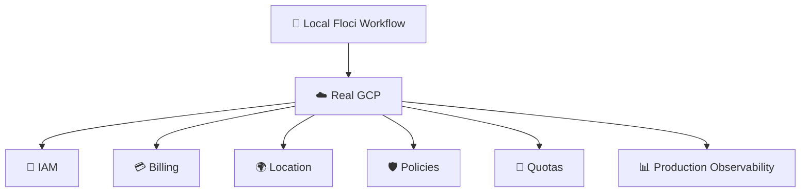
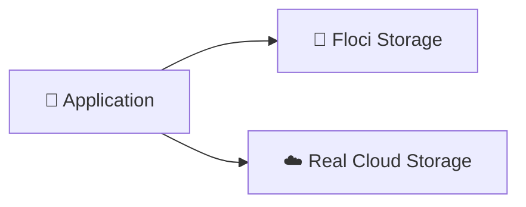
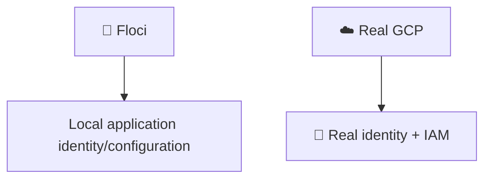
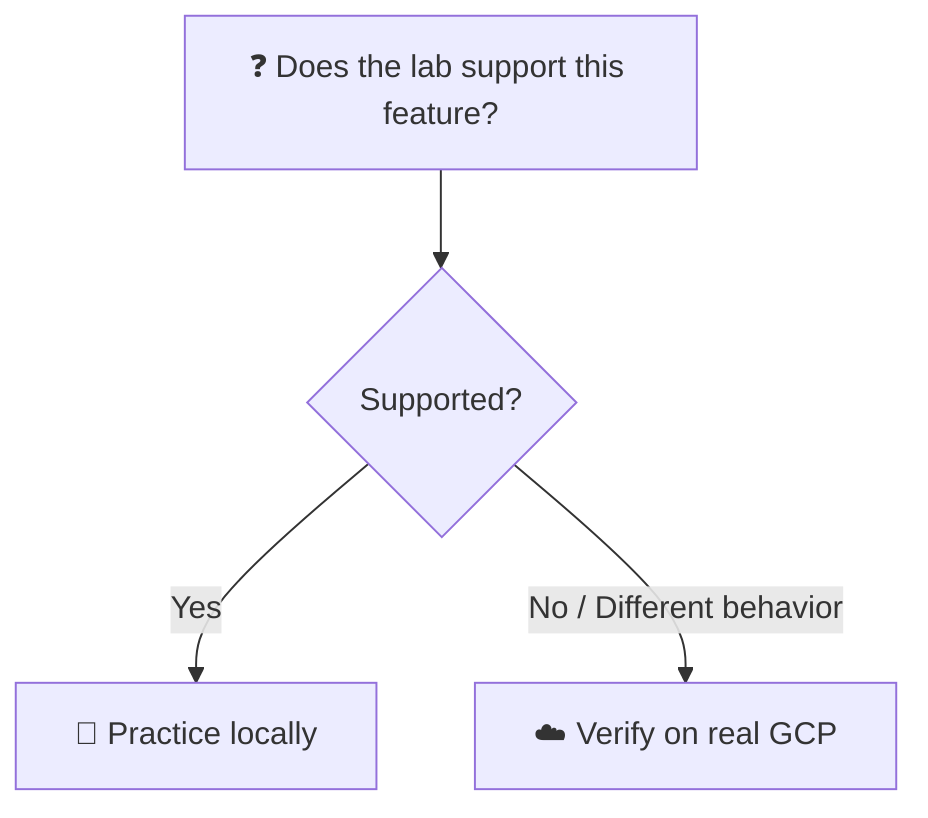

# 8. Floci vs Real GCP Storage 🧩☁️

## 🎯 Learning Objective

By the end of this topic, you should be able to explain what you are learning with Floci, what can be practiced locally, and which production behaviors must be verified in real Google Cloud.

---

## 🧠 Why This Distinction Matters

Floci is being used as a local learning environment.

The goal is to build understanding of the GCP resource model and application workflows without requiring a live GCP environment for every exercise.


The important distinction is:

> **Learning an API/resource workflow locally is not the same as reproducing every production behavior of Google Cloud.**

---

## 🧪 What Floci Is Good For

Floci is useful for practicing concepts such as:

- 🪣 Buckets and objects
- 📤 Upload workflows
- 📥 Download workflows
- 🏷️ Object naming
- 🧩 Application integration concepts
- 🛠️ CLI workflows supported by the emulator
- 🧪 Repeatable local experiments

These exercises help you build the mental model before moving to real infrastructure.

---

## ☁️ What Real GCP Adds

A real GCP environment introduces production concerns such as:

- 🔐 IAM and identity
- 💳 Billing
- 🌍 Resource locations
- 🛡️ Organization policies
- 📊 Quotas
- 🔒 Security controls
- 🔄 Data protection and retention requirements
- 📈 Production scaling
- 📡 Networking and connectivity
- 📝 Audit and observability requirements



---

## 🪣 Same Mental Model, Different Environment

The conceptual model remains:

```text
Project
  ↓
Bucket
  ↓
Object
```

And the application concept remains:

```text
Application
  ↓
Storage
```

But the environment around those resources changes.



Do not assume that because the first workflow succeeds locally, every production feature behaves identically.

---

## 🔐 Authentication and IAM

Local emulation can simplify authentication so that you can focus on resource behavior.

Real GCP requires you to understand:

- Identity
- IAM permissions
- Roles
- Service accounts
- Application credentials
- Least privilege

This becomes especially important when the application accesses private objects.



The exact authentication flow in production depends on where the application runs and how workload identity is configured.

---

## 💳 Billing

A local emulator is useful because experiments do not require ordinary production cloud resource consumption.

Real GCP resources can incur charges.

For production storage architecture, consider:

- Storage usage
- Data retrieval
- Data transfer
- Processing
- Request volume
- Retention
- Lifecycle policies

> 💡 **Interview tip:** “Cloud Storage is cheap” is not a complete cost analysis. Cost depends on storage, operations, data movement, access patterns, and configuration.

---

## 🌍 Location

A local environment does not reproduce every production consideration around geographic placement.

In real GCP, bucket location can affect:

- Latency
- Data residency
- Availability characteristics
- Cost
- Interaction with other services

Always treat location as a real architecture decision when moving to production.

---

## 🧪 Emulator Limitations

An emulator may not reproduce every behavior of the managed service.

Therefore, for any feature involving:

- IAM behavior
- Organization policies
- Production networking
- Billing
- Quotas
- Advanced data protection
- Enterprise governance

assume that real-GCP verification may be required.



---

## 🧠 How to Talk About Floci in an Interview

Do not say:

> “Floci is Google Cloud.”

Instead say:

> “I used Floci as a local GCP-style environment to practice the resource model and application workflows. For production-specific behavior such as real IAM, billing, quotas, and managed infrastructure controls, I would verify the behavior in Google Cloud.”

This demonstrates that you understand the difference between an emulator and the managed cloud platform.

---

## 🎤 Interview Questions

### 1. Does successful local emulation prove production behavior?

No. It proves that the workflow works in the local environment's supported implementation. Production GCP can add behavior and constraints that the emulator does not reproduce.

### 2. What kinds of concerns should you verify on real GCP?

Authentication, IAM, billing, quotas, organization policies, networking, geographic placement, production security, and any service feature not supported or fully reproduced by the emulator.

### 3. Why use Floci for learning?

It provides a repeatable local environment for practicing concepts and workflows without requiring every learning exercise to run against live cloud infrastructure.

### 4. If a command works in Floci, can you use the same command on real GCP?

The command may be conceptually or syntactically similar, but production behavior, authentication, permissions, configuration, and supported features must still be verified.

### 5. How would you explain the value of an emulator to an interviewer?

It helps develop understanding and repeatable hands-on experience locally, while the candidate should clearly understand which production concerns require real cloud infrastructure.

---

## 🧠 What You Should Remember

1. 🧪 Floci is a local learning environment.
2. 🧠 Floci helps practice GCP resource and application concepts.
3. ☁️ Real GCP adds managed infrastructure, identity, billing, networking, policies, quotas, and production controls.
4. 🔐 Real IAM behavior should be learned and verified separately when required.
5. 💳 Real GCP usage can incur costs.
6. 🌍 Production location is an architecture concern.
7. ⚠️ Emulator support does not imply complete production equivalence.
8. 🎤 Be explicit about the boundary between local learning and real GCP behavior.

## 🧪 Checkpoint

Explain this statement:

> **“Floci teaches the GCP resource and application model, but it should not be treated as a complete replacement for real GCP.”**

Give at least five examples of production concerns that may require real GCP verification.
