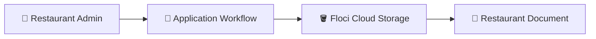
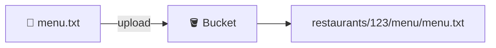
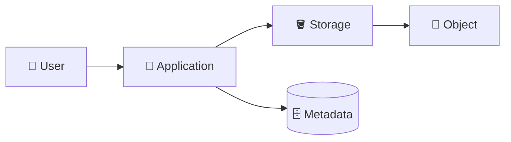
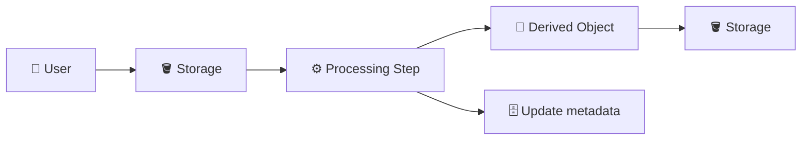
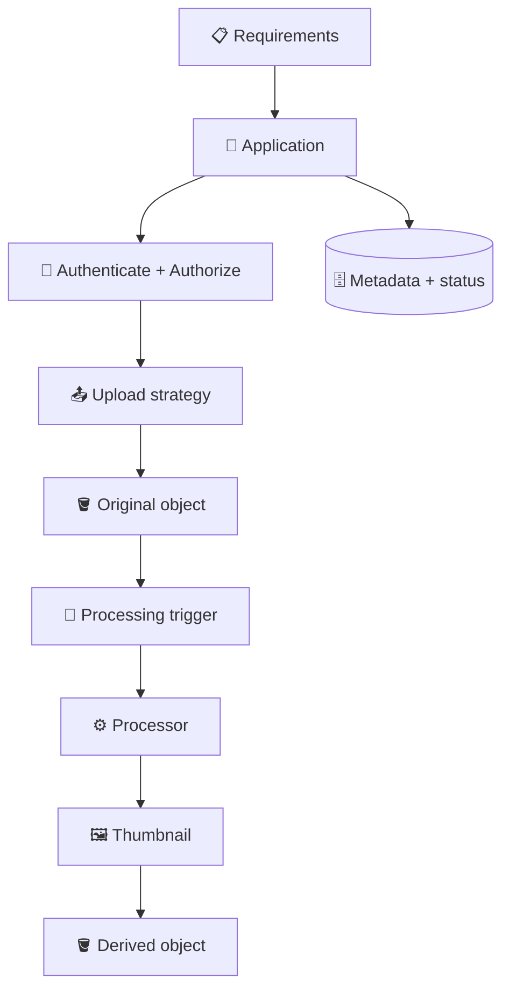

# 9. Hands-On Labs 🧪🚀

## 🎯 Objective

These labs connect the concepts from Chapter 4 into application-oriented storage workflows using the Floci local GCP environment.

The goal is not to build a production application. The goal is to practice the **mental model and workflow** you should be able to explain in an interview.

You will complete two labs:

1. 📤 Restaurant document upload workflow
2. ⚙️ File processing workflow

---

# 🧪 Lab 1 — Restaurant Document Upload Workflow

## 🎯 Goal

Simulate how a restaurant application could store an uploaded document in Cloud Storage using a tenant-aware object naming convention.

You will practice:

- Creating a bucket
- Creating a local file
- Uploading an object
- Using application-style object names
- Reading/listing the object
- Downloading the object
- Deleting the object
- Explaining the application workflow

---

## 🏗️ Target Architecture



For this lab, the CLI represents the application's storage operation.

---

## 1. Verify Your Floci Environment

Check the Google Cloud CLI:

```bash
gcloud --version
```

Confirm that your Floci local configuration is active according to the repository setup guide.

---

## 2. Create a Sample Restaurant Document

Create a file:

```bash
echo "Restaurant 123 - Sample Menu" > menu.txt
```

On PowerShell:

```powershell
"Restaurant 123 - Sample Menu" | Set-Content menu.txt
```

Verify it:

```bash
cat menu.txt
```

On PowerShell:

```powershell
Get-Content menu.txt
```

---

## 3. Create a Bucket

Create a bucket using a lab-specific name:

```bash
gcloud storage buckets create gs://YOUR-BUCKET-NAME
```

Example:

```bash
gcloud storage buckets create gs://floci-ch4-restaurant-files
```

If your local Floci setup has a different naming requirement, follow that environment's requirement.

---

## 4. Upload Using an Application-Style Object Name

Upload the file as:

```text
restaurants/123/menu/menu.txt
```

Command:

```bash
gcloud storage cp menu.txt gs://YOUR-BUCKET-NAME/restaurants/123/menu/menu.txt
```

Conceptually:



---

## 5. Verify the Object

List the object:

```bash
gcloud storage ls gs://YOUR-BUCKET-NAME/restaurants/123/menu/
```

You should see the uploaded object.

---

## 6. Download the Object

Download it under a different local filename:

```bash
gcloud storage cp gs://YOUR-BUCKET-NAME/restaurants/123/menu/menu.txt menu-copy.txt
```

Verify:

```bash
cat menu-copy.txt
```

PowerShell:

```powershell
Get-Content menu-copy.txt
```

Expected content:

```text
Restaurant 123 - Sample Menu
```

---

## 7. Explain the Application Metadata

You are not required to create a database for this lab.

Instead, write down the metadata the application would likely need:

```text
restaurant_id: 123
file_type: menu
original_filename: menu.txt
object_name: restaurants/123/menu/menu.txt
status: uploaded
```

Then answer:

> Why would these values belong to application metadata rather than being represented only by the object itself?

---

## 8. Delete the Object

Delete it:

```bash
gcloud storage rm gs://YOUR-BUCKET-NAME/restaurants/123/menu/menu.txt
```

Verify:

```bash
gcloud storage ls gs://YOUR-BUCKET-NAME/restaurants/123/menu/
```

---

## 🧠 Lab 1 Interview Challenge

Explain this workflow without looking at the commands:



Be able to explain:

1. Who authorizes the upload?
2. Who determines the object name?
3. Where does the file data live?
4. Where would restaurant ownership be stored?
5. Why is `restaurants/123/` not a security boundary?

---

# 🧪 Lab 2 — File Processing Workflow

## 🎯 Goal

Simulate an application workflow in which an uploaded object is processed and a derived object is created.

You will model:

```text
Original object
     ↓
Processing
     ↓
Derived object
     ↓
Application metadata
```

---

## 🏗️ Target Architecture



The lab uses simple text files so that the processing step can be reproduced locally.

---

## 1. Create the Original File

Create:

```bash
echo "Original restaurant document" > source.txt
```

PowerShell:

```powershell
"Original restaurant document" | Set-Content source.txt
```

---

## 2. Upload the Original Object

Use an object name such as:

```text
restaurants/123/documents/original/source.txt
```

Command:

```bash
gcloud storage cp source.txt gs://YOUR-BUCKET-NAME/restaurants/123/documents/original/source.txt
```

---

## 3. Simulate Processing

Create a derived file locally.

Linux/macOS:

```bash
echo "Processed version of restaurant document" > processed.txt
```

PowerShell:

```powershell
"Processed version of restaurant document" | Set-Content processed.txt
```

In a real application, this step could be performed by an image processor, document processor, function, job worker, or another service.

---

## 4. Upload the Derived Object

Store it as:

```text
restaurants/123/documents/processed/processed.txt
```

Command:

```bash
gcloud storage cp processed.txt gs://YOUR-BUCKET-NAME/restaurants/123/documents/processed/processed.txt
```

---

## 5. Verify Both Objects

List the objects:

```bash
gcloud storage ls gs://YOUR-BUCKET-NAME/restaurants/123/documents/
```

Also inspect the prefixes if supported by your local environment:

```bash
gcloud storage ls gs://YOUR-BUCKET-NAME/restaurants/123/documents/original/
gcloud storage ls gs://YOUR-BUCKET-NAME/restaurants/123/documents/processed/
```

---

## 6. Model Application State

Write down a possible application record:

```text
restaurant_id: 123
source_object: restaurants/123/documents/original/source.txt
processed_object: restaurants/123/documents/processed/processed.txt
status: READY
```

Now change the thought experiment:

```text
PROCESSING
```

What should happen if the processor fails?

A reasonable design might move the state to:

```text
FAILED
```

and make the workflow retryable.

---

## 7. Clean Up

Delete the objects:

```bash
gcloud storage rm gs://YOUR-BUCKET-NAME/restaurants/123/documents/original/source.txt
gcloud storage rm gs://YOUR-BUCKET-NAME/restaurants/123/documents/processed/processed.txt
```

Verify they are gone.

---

# 🎤 Final Interview Challenge

Design this system verbally:

> A restaurant uploads an image. The original must be retained. A thumbnail must be generated asynchronously. The user should only access images belonging to their restaurant. Large uploads should not unnecessarily consume application-server bandwidth.

Use this structure:



Your explanation should cover:

1. 📤 Upload architecture
2. 🔐 Authorization
3. 👥 Tenant isolation
4. 🏷️ Object naming
5. 🗄️ Metadata
6. ⚙️ Asynchronous processing
7. 🔁 Retries
8. ♻️ Idempotency
9. 📥 Download strategy
10. 🧹 Failure/cleanup handling

---

## ✅ Lab Completion Checklist

### Lab 1

- [ ] Verified Floci and `gcloud`
- [ ] Created a sample restaurant document
- [ ] Created a bucket
- [ ] Uploaded using a tenant-aware object name
- [ ] Listed the object
- [ ] Downloaded the object
- [ ] Verified the downloaded content
- [ ] Identified application metadata
- [ ] Deleted the object
- [ ] Explained the upload architecture

### Lab 2

- [ ] Created an original object
- [ ] Uploaded the original object
- [ ] Simulated a processing step
- [ ] Created a derived object
- [ ] Uploaded the derived object
- [ ] Modeled processing state
- [ ] Considered failure and retry behavior
- [ ] Cleaned up both objects
- [ ] Explained the complete processing architecture

### 🎤 Interview Readiness

- [ ] I can explain application-mediated upload.
- [ ] I can explain direct upload.
- [ ] I can explain controlled direct download.
- [ ] I understand metadata vs object data.
- [ ] I understand tenant-aware object naming.
- [ ] I understand that object naming is not authorization.
- [ ] I can explain asynchronous file processing.
- [ ] I can explain why retries require idempotency.
- [ ] I can design a basic storage architecture from requirements.
