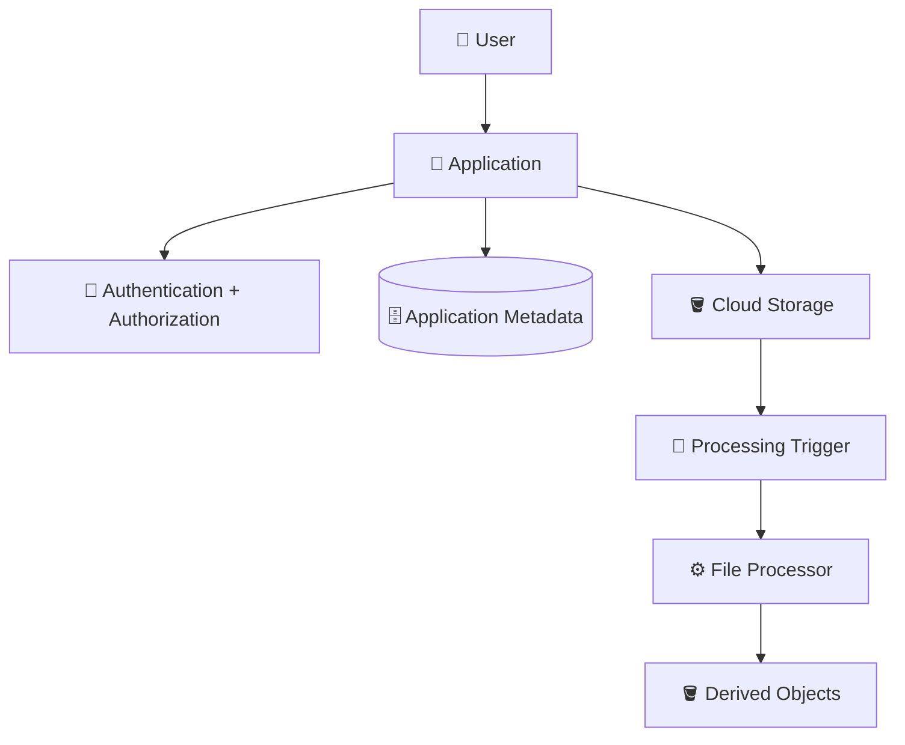

# 10. Storage in an Application — Learning Checklist ✅

Use this checklist before moving to **Chapter 5 — Firestore**.

---

## 🧠 Core Concepts

- [ ] I can explain how Cloud Storage fits into an application architecture.
- [ ] I can explain why applications often separate file data from application metadata.
- [ ] I can distinguish object data, object metadata, and application metadata.
- [ ] I understand application-mediated uploads.
- [ ] I understand direct-to-Cloud-Storage uploads.
- [ ] I understand application-mediated downloads.
- [ ] I understand controlled direct downloads.
- [ ] I understand why large files can affect application-server resources.
- [ ] I understand tenant-aware object naming.
- [ ] I understand that object naming is not authorization.

---

## 🔐 Security

- [ ] I can explain authentication vs authorization.
- [ ] I understand least privilege.
- [ ] I understand why sensitive application objects should use an appropriate restricted access model.
- [ ] I understand the purpose of signed URLs.
- [ ] I know that a signed URL should be treated as sensitive while it is valid.
- [ ] I understand why a client-provided object path cannot be trusted for authorization.
- [ ] I can explain how tenant isolation should be enforced.
- [ ] I understand that upload validation is separate from IAM authorization.

---

## 🏷️ Metadata and Naming

- [ ] I can explain why a database may store `restaurant_id`.
- [ ] I can explain why a database may store `object_name`.
- [ ] I can distinguish display filename from storage object name.
- [ ] I can design a tenant-aware object naming convention.
- [ ] I understand why changing an object name can affect application references.
- [ ] I understand that prefixes provide logical organization but are not automatically security boundaries.

---

## ⚙️ File Processing

- [ ] I understand why files may need processing after upload.
- [ ] I can explain synchronous processing.
- [ ] I can explain asynchronous processing.
- [ ] I understand application states such as `UPLOADED`, `PROCESSING`, `READY`, and `FAILED`.
- [ ] I understand why distributed processing needs retry handling.
- [ ] I can explain idempotency in a file-processing workflow.
- [ ] I can distinguish original objects from derived objects.

---

## 🧪 Hands-On

- [ ] I completed Lab 1 — Restaurant Document Upload Workflow.
- [ ] I used a tenant-aware object name.
- [ ] I uploaded, listed, downloaded, verified, and deleted an object.
- [ ] I identified the metadata the application would need.
- [ ] I completed Lab 2 — File Processing Workflow.
- [ ] I created an original and derived object.
- [ ] I modeled processing state.
- [ ] I considered failure and retry behavior.
- [ ] I cleaned up the lab resources.
- [ ] I completed the final interview challenge without copying the architecture.

---

## 🧩 Floci vs Real GCP

- [ ] I understand that Floci is a local learning environment.
- [ ] I know that local success does not prove complete production equivalence.
- [ ] I can identify production concerns that require real GCP verification.
- [ ] I understand that real GCP adds IAM, billing, quotas, networking, policies, location, and other production concerns.
- [ ] I can explain the emulator boundary in an interview.

---

## 🎤 Interview Readiness

Try answering these in your own words before reviewing previous notes.

### Fundamentals

1. What role does Cloud Storage play in an application?
2. Why separate file data from application metadata?
3. What is the difference between an object and an application file record?
4. Why should object naming be predictable?

### Uploads

5. Explain application-mediated upload.
6. Explain direct-to-Cloud-Storage upload.
7. What are the trade-offs between the two?
8. How would you handle a 500 MB upload?
9. Who should control the destination object name?

### Downloads

10. How would you serve a private invoice?
11. When might you avoid routing a large download through the application server?
12. What is the role of a signed URL?
13. Does knowing an object path mean the user can access the object?

### Security

14. What is authentication vs authorization?
15. What does least privilege mean for Cloud Storage?
16. How would you prevent restaurant 101 from accessing restaurant 102's files?
17. Why is object naming not a security boundary?
18. What would you validate during a file upload?

### Processing

19. Why process files asynchronously?
20. What happens if processing fails?
21. Why is idempotency important?
22. How would you store an original image and its thumbnail?

### System Design

23. Design storage for a multi-tenant restaurant SaaS application.
24. Design a secure invoice upload/download workflow.
25. Design an image-upload and thumbnail-generation workflow.
26. Design storage for large promotional videos.
27. What happens if Cloud Storage succeeds but the database update fails?
28. What changes when moving the architecture from Floci to real GCP?

---

## 🧠 Final Mental Model

Before moving to the next chapter, you should be able to explain this architecture from memory:



And explain:

> **Who is the user?**
>
> **Who authorizes access?**
>
> **Where are the file bytes stored?**
>
> **Where is application metadata stored?**
>
> **How are large files uploaded/downloaded?**
>
> **How are files processed?**
>
> **What happens when processing fails?**
>
> **How is tenant isolation enforced?**
>
> **Which parts need real GCP rather than Floci?**

---

## 🚦 Ready for Chapter 5?

You are ready to move forward when you can design and explain a basic application file-storage workflow **without relying on the notes or memorized commands**.

The key skill is not remembering every Cloud Storage command.

The key skill is being able to reason about:

```text
Requirements
    ↓
Application workflow
    ↓
Authorization
    ↓
Storage strategy
    ↓
Metadata
    ↓
Processing
    ↓
Failure handling
```

That is the foundation we will build on when introducing **Firestore** in the next chapter.
