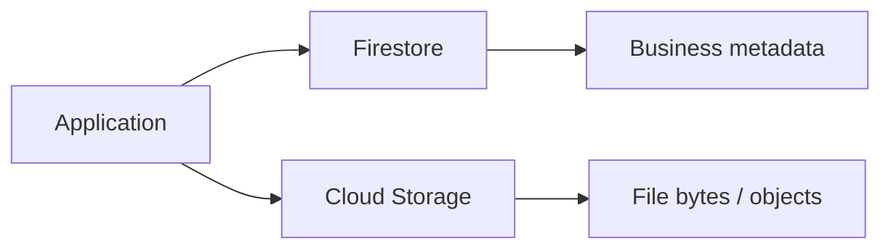
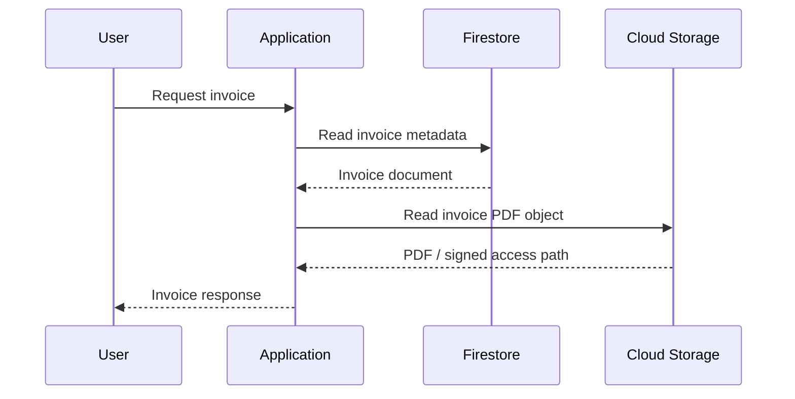
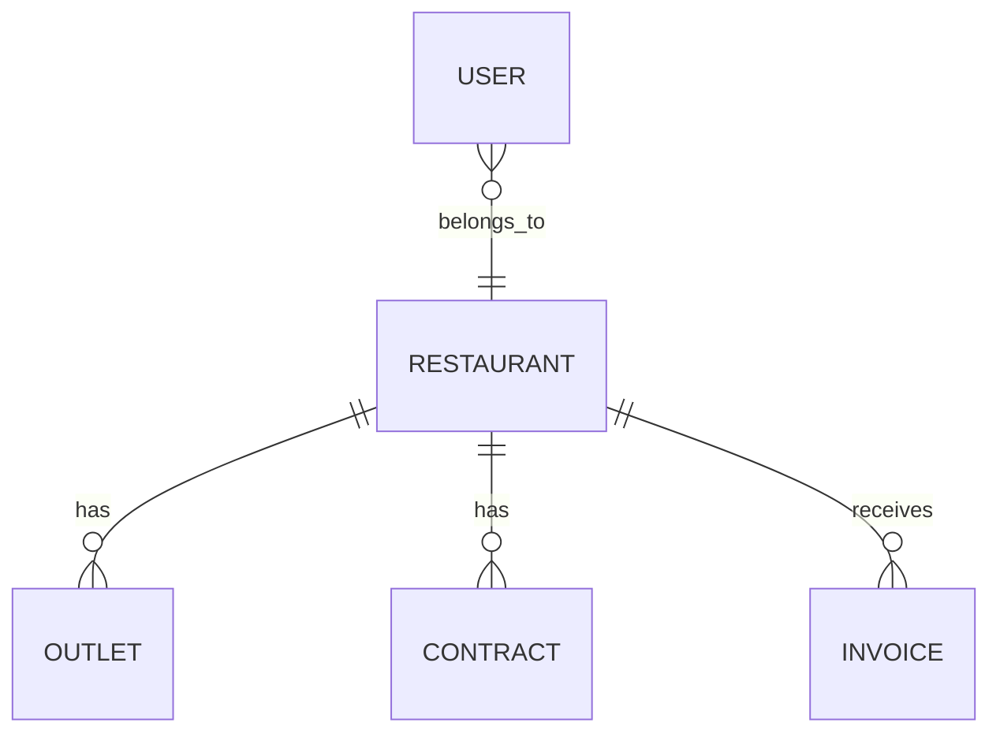
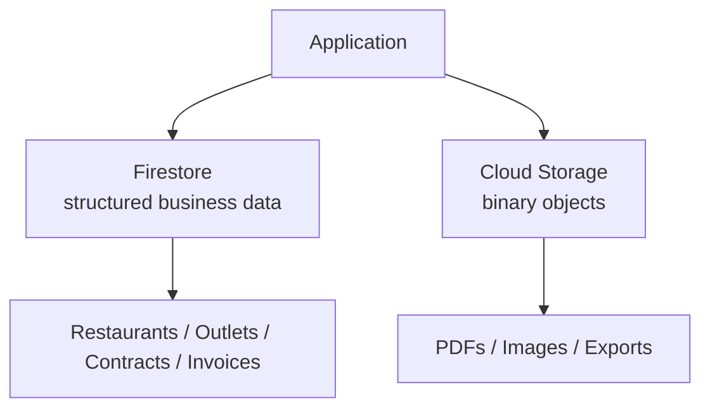

# Chapter 5 — Firestore

## 01 — Introduction to Firestore

> 🎯 **Goal:** Understand where Firestore fits in a GCP application and when to use a document database instead of object storage or a relational database.

## What is Firestore?

[Firestore](https://firebase.google.com/docs/firestore) is a NoSQL document database designed for application data. It stores information as **documents grouped into collections**.

Think about the distinction from Chapter 4:

- **Cloud Storage** stores files/objects: PDFs, images, exports, videos, backups.
- **Firestore** stores application data: users, restaurants, outlets, contracts, invoices, statuses and configuration.

A useful mental model is:



## Firestore vs Cloud Storage

| Question | Firestore | Cloud Storage |
|---|---|---|
| Primary purpose | Application data | Object/file storage |
| Unit of data | Document | Object |
| Query structured fields | Yes | Not as a database query model |
| Example | Invoice status | Invoice PDF |
| Relationships | Modeled through document structure/references | Usually represented through metadata elsewhere |
| Typical access | Read/write application records | Upload/download objects |

### Example

A restaurant invoice might look conceptually like:

```text
Firestore
restaurants/acme
  name = "Acme Restaurants"
  status = "active"

invoices/inv-1001
  restaurantId = "acme"
  amount = 25000
  status = "generated"
  pdfObject = "invoices/acme/inv-1001.pdf"
```

The PDF itself belongs in Cloud Storage:

```text
Cloud Storage
invoices/acme/inv-1001.pdf
```

## Firestore vs a relational database

Firestore is not simply “SQL without tables.” The data model and query patterns are different.

| Relational database | Firestore |
|---|---|
| Tables | Collections |
| Rows | Documents |
| Columns | Fields |
| JOINs | Application-level modeling / references / denormalization |
| Schema often defined centrally | Documents can have flexible fields |
| SQL queries | Firestore query APIs |
| Normalization is common | Access-pattern-driven modeling is important |

The important interview idea is:

> **Firestore data modeling starts from how the application reads and writes data.**

Do not blindly copy a normalized SQL schema into Firestore.

## Where Firestore fits in an application

For a SaaS platform, a typical request path could be:



Firestore can hold the application's source-of-truth metadata while Cloud Storage holds large binary objects.

## Example Firestore entities

A restaurant SaaS application could model:

- `restaurants`
- `outlets`
- `contracts`
- `invoices`
- `users`
- `menus`

For example:



This diagram describes the business relationships. The actual Firestore structure may use top-level collections, subcollections, references, or denormalized fields depending on application access patterns.

## When Firestore is a good fit

Firestore is useful when an application needs:

- Flexible document-shaped data.
- Fast reads for known access patterns.
- Simple application-centric queries.
- Automatic scaling without managing database servers.
- Strong integration with GCP/Firebase application ecosystems.
- Real-time listeners for applications that need changing data pushed to clients.

## When to think carefully

Firestore may require more deliberate design when the application depends heavily on:

- Complex relational joins.
- Highly relational reporting workloads.
- Large analytical queries.
- SQL-specific capabilities.
- Ad-hoc relational reporting across many entities.

The answer in an interview should not be “Firestore is better than SQL.” Explain the workload and access patterns first.

## Interview checkpoint 💡

**Question:** Why wouldn't you store an invoice PDF directly in Firestore?

**Answer:** Firestore is intended for structured application data and document fields. A PDF is a binary object and is better suited to Cloud Storage. Firestore can store metadata and the object's storage path while Cloud Storage stores the actual file.

**Question:** Why not use Cloud Storage for everything?

**Answer:** Cloud Storage is object storage, not a general-purpose application database. Firestore provides document-level application data and query capabilities over structured fields.

## Chapter takeaway

Keep this mental model:



**Firestore answers:** “What does my application know about this entity?”

**Cloud Storage answers:** “Where is the actual file/object?”

Next, we will build the Firestore data model from the inside out: **database → collection → document → fields → subcollection**.