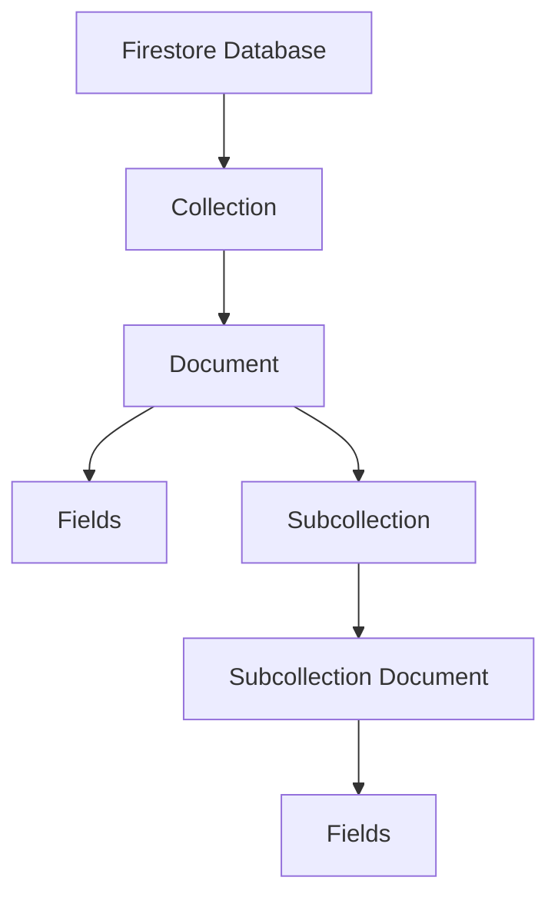
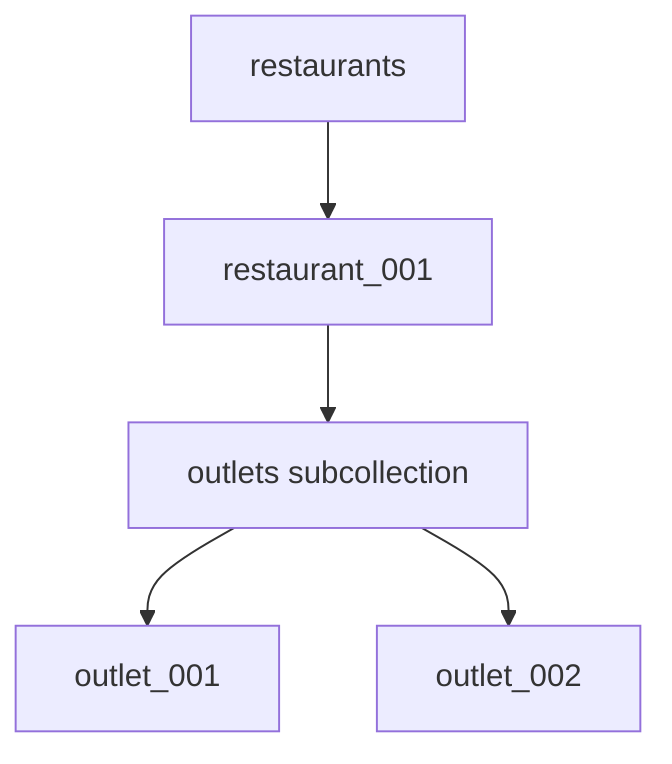
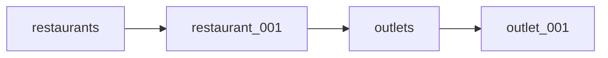

# Chapter 5 — Firestore

## 02 — Firestore Data Model

> 🧠 **Core idea:** Firestore is a document database. Learn the hierarchy before learning commands.

## The hierarchy

The basic Firestore model is:



A simplified example:

```text
Firestore database
└── restaurants                 ← collection
    └── restaurant_001          ← document
        ├── name: "Floci Foods" ← field
        ├── city: "Mumbai"      ← field
        ├── active: true        ← field
        └── outlets             ← subcollection
            └── outlet_001      ← document
```

## Database

A Firestore database contains your application's document data.

At the application level, you normally think about the database as the container in which collections and documents live.

## Collection

A **collection** is a group of documents.

Examples:

```text
restaurants
outlets
contracts
invoices
users
```

A collection does not behave exactly like a SQL table. Documents in the same collection can contain different fields.

## Document

A **document** is a JSON-like record containing fields.

Example:

```json
{
  "name": "Floci Foods",
  "city": "Mumbai",
  "active": true,
  "outletCount": 12
}
```

A document also has a unique document ID within its collection.

Conceptually:

```text
restaurants/floci-foods
```

Here:

- `restaurants` = collection
- `floci-foods` = document ID

## Fields

Fields hold the actual values inside a document.

Common Firestore field types include:

| Type | Example |
|---|---|
| String | `"Mumbai"` |
| Boolean | `true` |
| Number | `12500` |
| Timestamp | `2026-09-17T10:00:00Z` |
| Null | `null` |
| Array | `["veg", "pizza"]` |
| Map | `{ "city": "Mumbai", "pin": "400001" }` |
| Reference | Reference to another document |

## Nested maps

Fields can contain structured objects.

```json
{
  "name": "Floci Foods",
  "address": {
    "city": "Mumbai",
    "state": "Maharashtra",
    "country": "India"
  }
}
```

This is useful when the nested data is naturally read together with the parent document.

## Arrays

Documents can contain arrays:

```json
{
  "supportedPlatforms": [
    "swiggy",
    "zomato",
    "direct"
  ]
}
```

Arrays are useful for bounded lists that belong naturally to the document. They are not a replacement for a collection when the list can become large or needs independent querying and updates.

## Subcollections

A document can contain subcollections.

For example:

```text
restaurants/{restaurantId}/outlets/{outletId}
```

Visualized:



Subcollections are useful when child records naturally belong to a parent and the application frequently works with them in that context.

## References

A document can also store a reference to another document.

Conceptually:

```text
invoices/invoice_001
    restaurantRef → restaurants/restaurant_001
```

A reference expresses a relationship, but it does not magically perform a SQL-style JOIN for you.

## Top-level collection vs subcollection

Suppose we have outlets.

### Option A — top-level

```text
restaurants/restaurant_001
outlets/outlet_001
outlets/outlet_002
```

### Option B — subcollection

```text
restaurants/restaurant_001/outlets/outlet_001
restaurants/restaurant_001/outlets/outlet_002
```

Neither is universally correct.

Ask:

1. How will the application query outlets?
2. Do outlets always belong to one restaurant?
3. Do we frequently need all outlets across all restaurants?
4. What security boundary should apply?
5. What data needs to be read together?

That is the beginning of Firestore data modeling.

## Firestore paths

A Firestore path alternates between collections and documents:

```text
collection / document / collection / document
```

For example:

```text
restaurants/restaurant_001/outlets/outlet_001
```

Breakdown:



A useful interview observation: a document can have subcollections, and those subcollections can exist independently of whether the parent document is currently being displayed by your application.

## Data modeling mindset

Do not begin with:

> “How do I normalize this data like SQL?”

Begin with:

> “What questions does my application need to answer?”

For example:

- Show a restaurant dashboard.
- Show all outlets for a restaurant.
- Show active outlets.
- Show recent invoices for an outlet.
- Show all invoices for a billing period.

Those access patterns influence the document structure, fields and indexes.

## Interview checkpoint 💡

**Q: What is the difference between a collection and a document?**

A collection groups documents; a document contains fields representing one logical application record.

**Q: Can a Firestore document contain another collection?**

Yes. A document can have subcollections.

**Q: Is a Firestore reference the same as a SQL foreign key?**

It can represent a relationship, but Firestore references do not provide SQL-style automatic joins. The application still needs to retrieve related data as required.

## Takeaway

Remember:

```text
Database
  ↓
Collection
  ↓
Document
  ↓
Fields
  ↓
Optional subcollections
```

Once this hierarchy is clear, CRUD operations become much easier to understand.