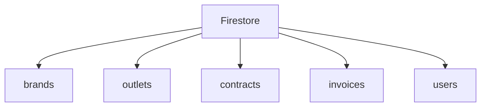
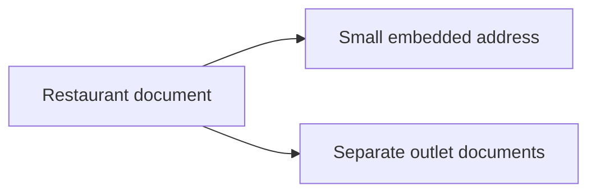
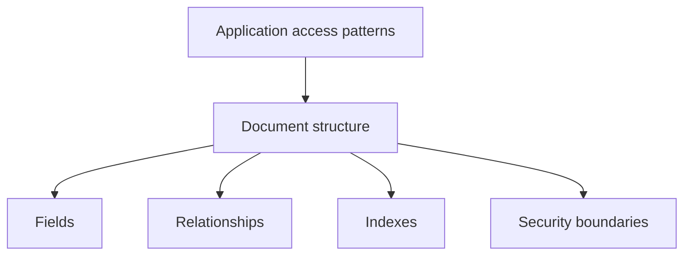

# Chapter 5 — Firestore

## 03 — Collections and Documents

> 🧩 **Goal:** Learn how to turn application entities into Firestore collections and documents.

## Start with the business entities

For a restaurant SaaS platform, we might have:

```text
Brand
Outlet
Contract
Invoice
User
```

A first Firestore representation could be:



Each collection contains documents representing individual records.

## Example: restaurant document

```text
restaurants/restaurant_001
```

```json
{
  "name": "Floci Foods",
  "city": "Mumbai",
  "active": true,
  "createdAt": "timestamp"
}
```

Another restaurant might have additional fields. This flexibility is one of the characteristics of document databases.

## Document IDs

You can choose meaningful IDs or let Firestore generate IDs.

### Meaningful ID

```text
restaurants/restaurant_001
```

Advantages:

- Easy to reason about.
- Convenient when you already have a stable application ID.
- Can simplify direct document lookup.

Potential drawback:

- Poorly designed predictable IDs can create undesirable patterns in some workloads.

### Auto-generated ID

```text
restaurants/X8fK2mP...
```

Advantages:

- Convenient.
- IDs are designed to be distributed rather than sequential.

The important point for interviews is not that one choice is always better. Explain why the ID strategy matches the application's lookup and write patterns.

## Modeling outlets

### Top-level outlets

```text
restaurants/restaurant_001
outlets/outlet_001
outlets/outlet_002
```

The outlet document can contain:

```json
{
  "restaurantId": "restaurant_001",
  "name": "Bandra West",
  "city": "Mumbai",
  "active": true
}
```

This makes global outlet queries straightforward.

### Outlets as a subcollection

```text
restaurants/restaurant_001/outlets/outlet_001
restaurants/restaurant_001/outlets/outlet_002
```

This naturally represents the parent-child relationship.

The choice depends on access patterns.

## Modeling invoices

Invoices could be top-level:

```text
invoices/invoice_001
```

with:

```json
{
  "restaurantId": "restaurant_001",
  "outletId": "outlet_001",
  "amount": 25000,
  "status": "generated",
  "invoiceDate": "timestamp"
}
```

This works well when the application frequently queries invoices across restaurants or billing periods.

Alternatively, invoices could be scoped below an outlet:

```text
restaurants/restaurant_001/outlets/outlet_001/invoices/invoice_001
```

Again, access patterns decide.

## One useful rule

> **Model for the reads you need to perform.**

Suppose your most common operation is:

> “Show the latest 20 invoices for this outlet.”

A structure that makes this query simple is valuable.

If another common operation is:

> “Show all invoices generated on a particular billing date across every restaurant.”

A top-level invoice collection may be more convenient.

## Embedding vs separate documents

Suppose a restaurant has a small address:

```json
{
  "name": "Floci Foods",
  "address": {
    "city": "Mumbai",
    "state": "Maharashtra"
  }
}
```

Embedding makes sense when the data is small and normally read with the restaurant.

But a growing collection of independently managed outlets should generally not be packed into one huge restaurant document.



## Parent-child thinking

A useful modeling question is:

> “If the parent were deleted or inaccessible, should the child still be independently addressable?”

This is not the only deciding factor, but it helps reason about subcollections and top-level collections.

## Common modeling mistakes

### Mistake 1 — Copying SQL tables directly

Creating one collection for every SQL table without considering queries often produces an awkward Firestore model.

### Mistake 2 — Over-embedding

Putting thousands of child records inside one document can make the document difficult to maintain and can run into Firestore document-size and update limitations.

### Mistake 3 — Ignoring query patterns

A model that looks clean but makes every screen require many reads can be expensive and slow.

### Mistake 4 — Assuming references create joins

References represent relationships; they do not eliminate the need to design how related data is fetched.

## Interview exercise

Design Firestore for:

> A restaurant has 50 outlets. Each outlet receives many invoices. The dashboard needs the latest invoices for one outlet, while finance needs invoices across all outlets for a billing period.

Think about:

- Collection placement.
- Fields needed for queries.
- Document IDs.
- Indexes.
- Whether invoices should be top-level.

There is not necessarily one perfect schema. The important part is being able to justify it using access patterns.

## Takeaway

Firestore gives you flexible building blocks, not a fixed schema prescription.

Your design should answer:



Next, we will perform the basic CRUD operations against those documents.