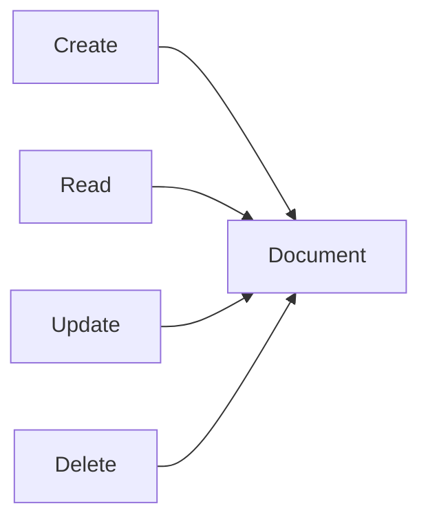
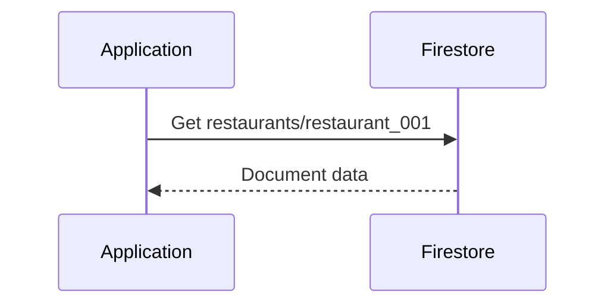
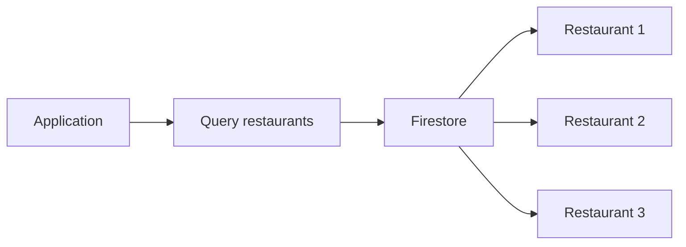
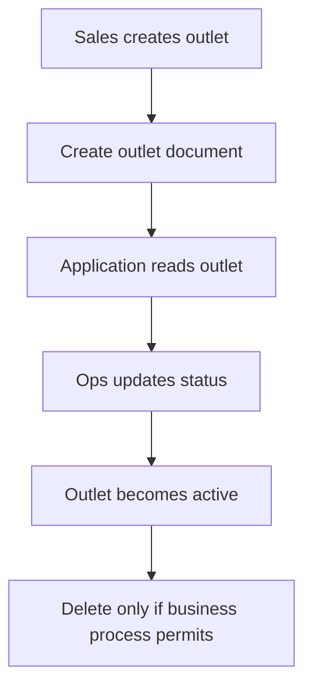
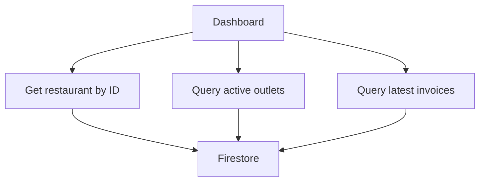

# Chapter 5 — Firestore

## 04 — CRUD Operations

> 🛠️ **Goal:** Understand the four basic application operations: create, read, update and delete.

## CRUD mental model



A Firestore application normally performs these operations through a Firestore SDK or API rather than manually editing database files.

## Create

Suppose we create a restaurant:

```text
restaurants/restaurant_001
```

Conceptually:

```json
{
  "name": "Floci Foods",
  "city": "Mumbai",
  "active": true
}
```

There are two common approaches:

- Specify the document ID yourself.
- Let Firestore generate an ID.

The important thing is that the application knows how it will later locate the document.

## Read a single document

If the application knows the path:

```text
restaurants/restaurant_001
```

it can perform a direct document read.

Conceptually:



This is different from querying a collection. A direct document lookup uses a known document path.

## Read a collection

The application can also query a collection:

```text
restaurants
```

The query may return multiple documents.



In real applications, avoid blindly reading an entire large collection. Use filters, ordering and limits appropriate to the screen or workflow.

## Update

Suppose the restaurant changes status:

```json
{
  "active": false
}
```

A partial update can change only the fields that need changing rather than replacing the entire logical record.

Conceptually:

```text
restaurants/restaurant_001
    active: true → false
```

Be explicit about whether an operation is intended to replace a document or update selected fields. This distinction matters when a document contains fields that should not be overwritten.

## Delete

A document can be deleted:

```text
restaurants/restaurant_001
```

Deletion should be designed carefully when the document has related subcollections or when the application requires audit history.

Do not assume that deleting a parent document automatically means every related piece of application data has been safely removed. Model cleanup behavior deliberately.

## CRUD example: outlet lifecycle

Imagine an outlet onboarding flow:



Example document:

```json
{
  "name": "Bandra West",
  "restaurantId": "restaurant_001",
  "active": true,
  "createdAt": "timestamp"
}
```

## CRUD and access patterns

CRUD alone is not enough for a good Firestore design.

Suppose the dashboard needs:

1. One restaurant by ID.
2. All active outlets for that restaurant.
3. Latest 20 invoices for an outlet.

These are different operations and should influence your schema and indexes.



## Server-side vs client-side access

Firestore can be accessed by application clients using supported SDKs, with security rules controlling access in client-facing architectures. Server applications can also access Firestore using server credentials and IAM.

Keep these concepts separate:

- **Authentication:** Who is the caller?
- **Authorization:** What is the caller allowed to do?
- **Firestore Security Rules:** What access is permitted for supported client access patterns?
- **IAM:** What identities/services are allowed to access the GCP resource at the IAM layer?

Security is covered in detail later in this chapter.

## CRUD interview questions

### Q: What is the difference between a document read and a query?

A document read targets a known document path. A query evaluates documents in a collection or collection group against query conditions.

### Q: Why should you avoid reading an entire collection for a dashboard?

Because the collection may grow significantly. Unbounded reads increase work, latency and potentially cost. Design queries around the data actually needed by the screen.

### Q: When would you use an application-generated document ID?

When the application already has a stable identifier and direct lookup by that identifier is useful.

### Q: Does deleting a parent document automatically solve all child-data cleanup concerns?

No. Related subcollection data and business/audit requirements must be handled according to the application's design.

## Practice task

Create a small Firestore dataset containing:

- 3 restaurants.
- At least 2 outlets per restaurant.
- Active/inactive outlet states.

Practice:

- Creating documents.
- Reading a known document.
- Listing documents.
- Updating one field.
- Deleting a test document.

Then ask yourself:

> “What query would my application need next?”

That question leads directly into Firestore queries and indexes.