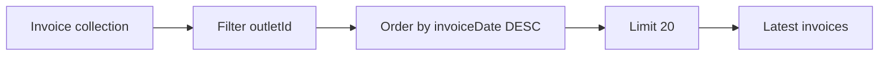
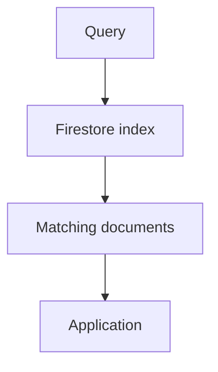
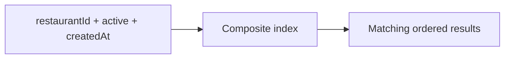

# Chapter 5 — Firestore

## 05 — Queries and Indexes

> 🔎 **Goal:** Understand how Firestore queries work and why indexes are a core part of Firestore design.

## A query answers a business question

Instead of thinking only in database syntax, start with the application question:

> “Give me all active outlets for restaurant `restaurant_001`.”

The query needs fields that represent that access pattern:

```json
{
  "restaurantId": "restaurant_001",
  "active": true
}
```

Conceptually:


## Equality filters

A common query is equality:

```text
restaurantId == restaurant_001
```

For example:

```text
Find outlets where restaurantId = restaurant_001
```

You can combine conditions when the Firestore query model supports the required combination.

## Range filters

Applications often need conditions such as:

```text
amount > 10000
```

or:

```text
invoiceDate >= startDate
```

Example business question:

> “Find invoices above ₹10,000.”

The document might contain:

```json
{
  "amount": 25000,
  "status": "generated"
}
```

## Ordering

You may need results ordered by a field:

```text
order by invoiceDate descending
```

For example:

> “Show the latest 20 invoices for an outlet.”

This usually combines:

- An outlet filter.
- Ordering by invoice date.
- A limit of 20.



## Limits

A limit prevents an application from requesting more documents than the screen needs.

For example:

```text
latest 20 invoices
```

is generally more intentional than:

```text
all invoices ever created
```

Pagination should be considered for larger result sets.

## Why indexes matter

Firestore uses indexes to make many queries efficient.

Think of an index as a structure that helps Firestore locate matching records without scanning every document for every query.



Indexes therefore are not an optional afterthought. They are part of query design.

## Single-field indexes

Firestore automatically provides many single-field indexes. These support straightforward filtering and ordering patterns.

You should still understand what fields your application queries and how those queries behave.

## Composite indexes

A composite index supports queries involving multiple fields or combinations that require an index beyond the available single-field behavior.

Example query intent:

```text
restaurantId == restaurant_001
AND active == true
ORDER BY createdAt DESC
```

Conceptually:



The exact index requirements depend on the query.

## Missing index errors

A useful Firestore development experience is that unsupported queries can produce an error indicating that an index is required, often with a link or guidance for creating it in real GCP/Firebase tooling.

For interview preparation, understand the principle:

> **A query that needs a composite index is telling you something about your access pattern.**

Do not treat index creation as random configuration. Ask why the query exists and whether the data model supports it well.

## Query design example

Suppose invoices have:

```json
{
  "outletId": "outlet_001",
  "status": "generated",
  "amount": 25000,
  "invoiceDate": "timestamp"
}
```

Potential access patterns:

| Business requirement | Query idea |
|---|---|
| Outlet invoices | `outletId == ...` |
| Generated invoices | `status == generated` |
| Large invoices | `amount > ...` |
| Latest invoices | order by `invoiceDate DESC` |
| Latest generated invoices for outlet | outlet + status + order by date |

This table is effectively the beginning of your index design.

## Collection group queries

A collection group query can query collections with the same collection ID across different parent documents.

For example, if every restaurant has an `outlets` subcollection:

```text
restaurants/r1/outlets/o1
restaurants/r2/outlets/o2
restaurants/r3/outlets/o3
```

a collection group query can target the `outlets` collections across parents, subject to Firestore query capabilities and indexes.

This is an important interview topic because it shows that subcollections do not necessarily mean “only queryable through the parent.”

## Pagination mindset

For a growing invoice list, avoid repeatedly loading every previous page.

A typical design is:


The exact SDK syntax varies, but the conceptual pattern is important.

## Query limitations and trade-offs

Firestore queries are intentionally different from arbitrary SQL.

If a requirement sounds like:

> “Join five collections, group by multiple dimensions, calculate complex aggregates, and dynamically sort on arbitrary fields.”

pause before forcing it into Firestore.

Consider whether the workload belongs in:

- Application-side aggregation.
- Precomputed/denormalized data.
- Another database.
- An analytical system such as BigQuery for analytics workloads.

## Interview questions

**Q: Why does Firestore need indexes?**

Indexes allow Firestore to efficiently locate documents matching supported query patterns.

**Q: What is a composite index?**

An index built across multiple fields to support query patterns that require that combination.

**Q: If Firestore says an index is required, what should you do?**

Inspect the query, determine whether the access pattern is intentional, then create the required index using the supported tooling/configuration.

**Q: Should you create every possible index?**

No. Indexes should support actual query patterns. Unnecessary indexing adds storage/write-maintenance overhead and complicates configuration.

## Practice

Write down five questions your restaurant application must answer.

For each question, record:

| Question | Filters | Sort | Limit | Possible index |
|---|---|---|---|---|
| Latest outlet invoices | outletId | invoiceDate DESC | 20 | Composite as required |
| Active outlets | restaurantId + active | — | — | As required |
| Large invoices | amount | — | — | As required |
| Recent contracts | restaurantId | createdAt DESC | 20 | As required |
| Pending invoices | status | invoiceDate DESC | 50 | As required |

This is exactly the kind of reasoning interviewers look for in a Firestore system-design discussion.

Next: **how to model the documents themselves so these queries remain practical.**