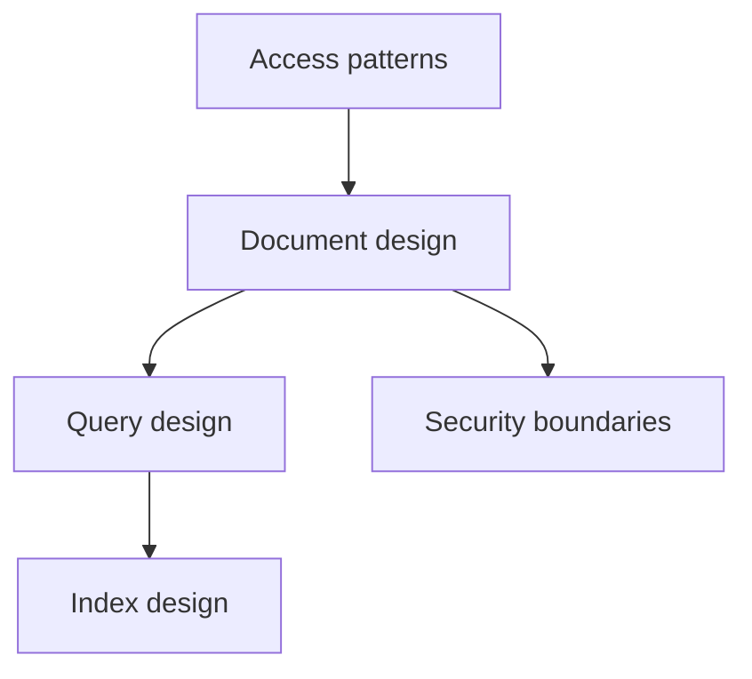
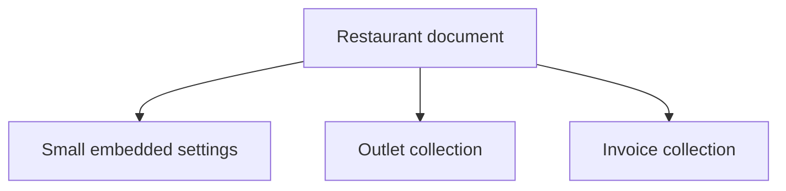
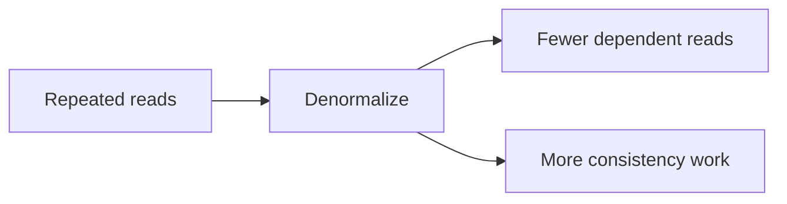
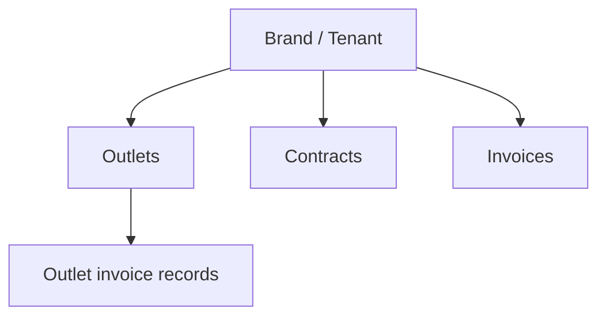
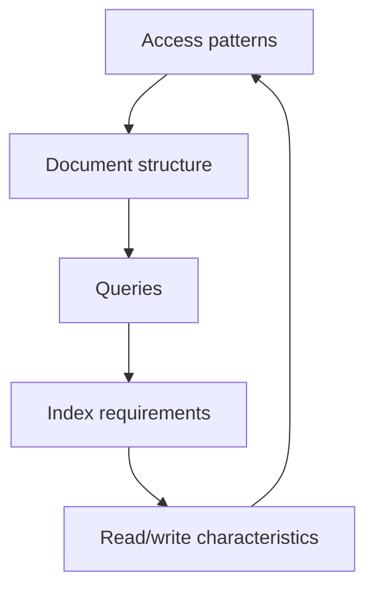

# Chapter 5 — Firestore

## 06 — Document Design and Data Modeling

> 🧠 **Goal:** Learn to design Firestore around application access patterns instead of copying relational schemas.

## The central rule

> **Design your Firestore model around the application's reads and writes.**

In a relational database, normalization often drives schema design. In Firestore, denormalization and duplication can be deliberate choices when they make common reads simpler and faster.

## Start with access patterns

Imagine a restaurant SaaS application needs:

1. Show restaurant details.
2. List active outlets for a restaurant.
3. Show the latest invoices for an outlet.
4. Show invoices for a billing period.
5. Show the current contract amount.

Write these down before creating collections.



## Embedding

Embed small, tightly coupled data inside the parent document.

```json
{
  "name": "Floci Foods",
  "address": {
    "city": "Mumbai",
    "state": "Maharashtra"
  }
}
```

Good candidates include:

- Small addresses.
- Display configuration.
- Small preference objects.
- Data always read with the parent.

## Separate documents

Use separate documents when records are:

- Large in number.
- Independently updated.
- Independently queried.
- Owned by different security boundaries.
- Likely to grow beyond a comfortable document structure.

For example, do not place hundreds or thousands of invoices into one restaurant document.



## Denormalization

Suppose an invoice screen needs the restaurant name every time.

You could store only:

```json
{
  "restaurantId": "restaurant_001"
}
```

and fetch the restaurant separately.

Or you could also store:

```json
{
  "restaurantId": "restaurant_001",
  "restaurantName": "Floci Foods"
}
```

The second approach duplicates data but can simplify reads.

The trade-off is consistency.

If the restaurant name changes, duplicated copies may need to be updated.

## Duplication is a trade-off

Think about denormalization as:



The correct design depends on the application's read/write ratio and consistency requirements.

## Subcollections

Suppose outlets belong naturally to a restaurant:

```text
restaurants/{restaurantId}/outlets/{outletId}
```

This can provide a clear ownership boundary.

For invoices, you might choose:

```text
invoices/{invoiceId}
```

if finance frequently needs to query invoices across the whole platform.

Or you might use:

```text
restaurants/{restaurantId}/outlets/{outletId}/invoices/{invoiceId}
```

if most access is scoped to a particular outlet.

Neither structure should be chosen by habit.

## Multi-tenant SaaS modeling

A multi-tenant system needs tenant boundaries.

For example:

```json
{
  "brandId": "brand_001",
  "outletId": "outlet_001",
  "amount": 25000
}
```

The `brandId` may support:

- Tenant-scoped queries.
- Authorization checks.
- Operational filtering.
- Debugging and auditing.

A conceptual model:



## Hotspot and write-pattern thinking

When designing IDs and write-heavy collections, consider how writes are distributed. Avoid designing a system around monotonically increasing identifiers when the workload would benefit from distributed writes.

This is one reason auto-generated Firestore document IDs can be useful.

The exact performance characteristics depend on the workload and current Firestore implementation, so benchmark important production workloads rather than relying on folklore.

## Document size matters

Firestore documents have a maximum size. Even before reaching the hard limit, a document containing a huge and frequently changing nested structure can become awkward to update and expensive to read.

A useful rule:

> If a child record needs independent lifecycle, querying or frequent updates, consider making it a document rather than embedding it.

## Example: contract + invoice

A contract might contain:

```json
{
  "brandId": "brand_001",
  "billingPeriod": "monthly",
  "monthlyAmount": 50000,
  "status": "active"
}
```

An invoice might contain:

```json
{
  "brandId": "brand_001",
  "contractId": "contract_001",
  "periodStart": "timestamp",
  "periodEnd": "timestamp",
  "amount": 50000,
  "status": "generated"
}
```

Notice that the invoice can retain the contract relationship and relevant billing information without requiring a relational join for every display.

## Schema evolution

Because Firestore documents can evolve, applications often need to handle old and new document shapes during migrations.

For example:

```text
Version 1
{name, city}

Version 2
{name, city, timezone}
```

A production application should decide how new fields are introduced and how older documents are backfilled when necessary.

## Modeling checklist

Before finalizing a collection, ask:

- What are the top reads?
- What are the top writes?
- Which fields are filtered?
- Which fields are sorted?
- Which data is always read together?
- Which data grows without bound?
- Which records need independent lifecycle?
- What needs to be tenant-scoped?
- What needs strong consistency together?
- What indexes will these queries require?

## Interview question

**Q: Why would you intentionally duplicate data in Firestore?**

Because denormalization can reduce dependent reads and make common access patterns efficient. The trade-off is additional write/update complexity and possible consistency management.

**Q: How do you decide between a subcollection and a top-level collection?**

Start with access patterns, ownership, security boundaries, growth and query requirements. There is no universal rule.

**Q: What is the biggest Firestore modeling mistake?**

Treating Firestore like a relational database without designing for its document and query model.

## Takeaway

Firestore modeling is a loop:



Good Firestore design is not about finding the prettiest schema. It is about creating a schema that makes the application's important operations predictable, secure and practical.