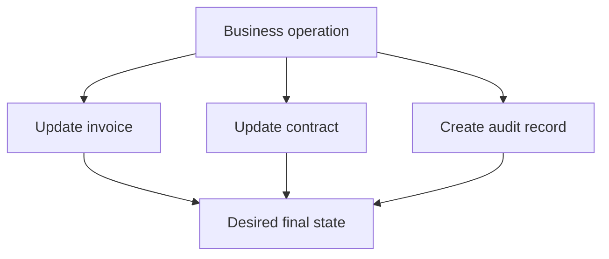
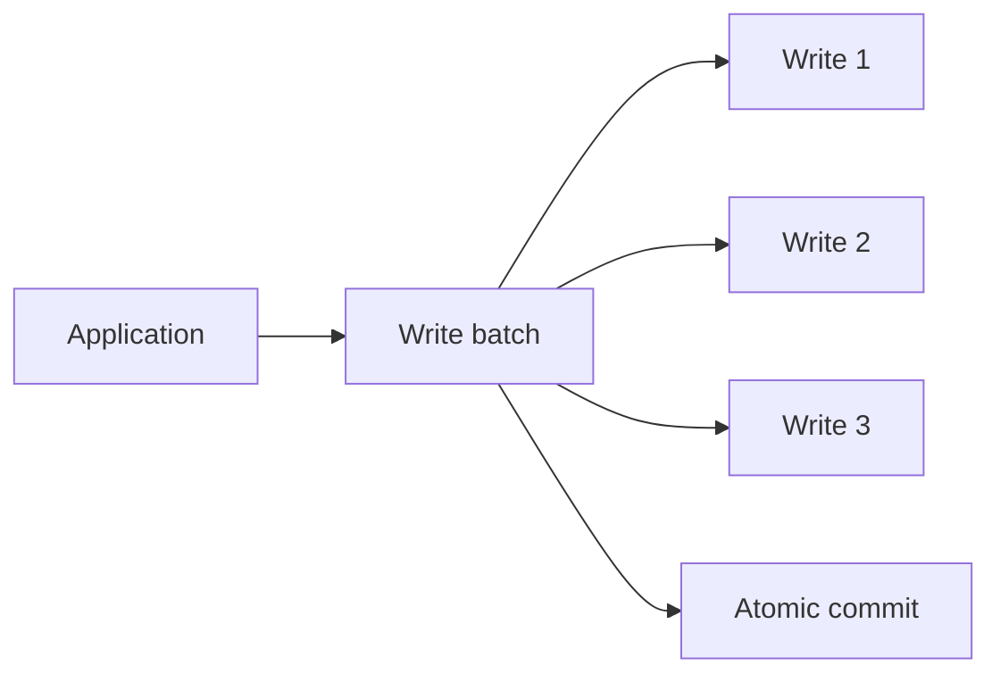
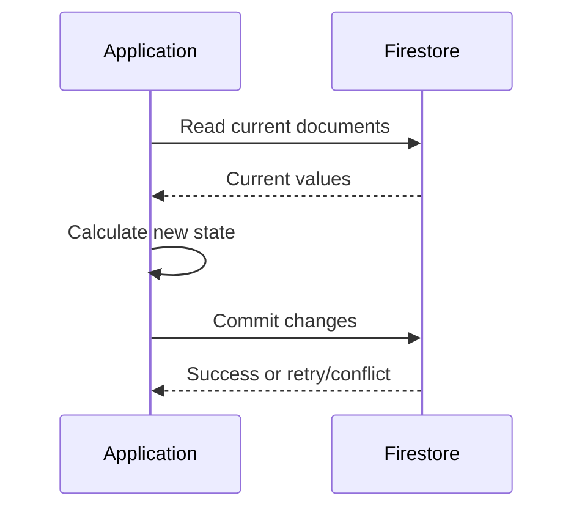
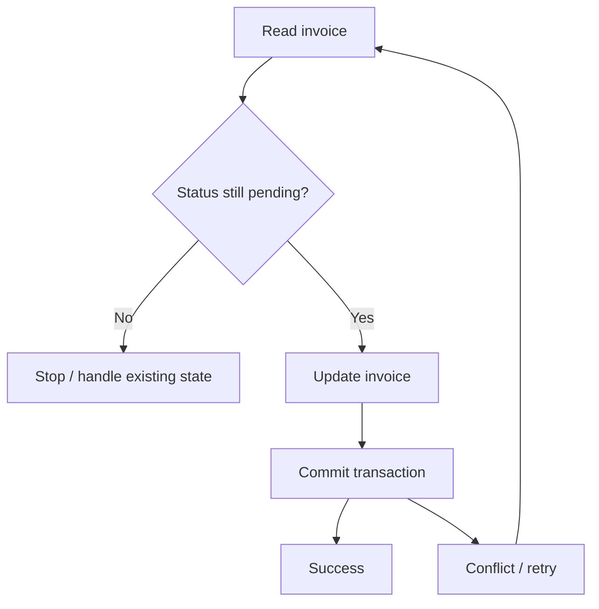
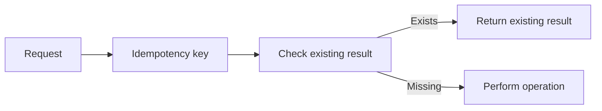

# Chapter 5 — Firestore

## 07 — Transactions and Batched Writes

> 🔐 **Goal:** Understand when multiple Firestore operations need to be coordinated atomically.

## Why multiple writes become interesting

Suppose an invoice workflow needs to:

1. Mark an invoice as `generated`.
2. Update a contract's billing state.
3. Record an audit event.

If one write succeeds and another fails, the application may end up in an inconsistent state.



Firestore provides mechanisms for coordinating writes.

## Batched writes

A **batched write** groups multiple writes so they can be committed atomically as one batch.

Typical operations include:

- Create.
- Update.
- Delete.

Conceptually:



The important idea is that the writes in the batch are committed together rather than as unrelated operations.

## When to use a batch

Use a batch when you already know all the writes that need to happen and do not need to read current values to decide what to write.

Example:

> “Activate these five outlets and update their timestamps.”

The application knows the intended updates in advance.

## Transactions

A transaction is appropriate when the new value depends on the current value of one or more documents.

Example:

> “Read the current balance, calculate a new balance, then save it only if the transaction's assumptions remain valid.”

Conceptually:



Firestore transactions can retry when concurrent changes invalidate the transaction's assumptions.

## Batch vs transaction

| Situation | Mechanism |
|---|---|
| Multiple known writes | Batched write |
| Writes depend on current values | Transaction |
| Need atomic group of writes | Batch or transaction depending on logic |
| Need read-modify-write consistency | Transaction |

## Example: invoice generation

Imagine an invoice record:

```json
{
  "status": "pending",
  "amount": 25000
}
```

The application needs to ensure it does not incorrectly generate the same invoice based on stale state.

A transaction can conceptually:

1. Read invoice.
2. Verify current status.
3. Calculate/update state.
4. Commit if the read state is still valid.



## Transactions are not magic distributed business workflows

A Firestore transaction gives atomicity for the Firestore operations participating in that transaction. It does not automatically make an external API call transactional.

For example, this is dangerous:

```text
Firestore transaction
    ↓
Call payment provider
    ↓
Update Firestore
```

If the external provider succeeds but the Firestore transaction retries or fails, you need an idempotency/reconciliation strategy.

The general interview lesson:

> **Database atomicity does not automatically extend across external systems.**

## Idempotency

Suppose a request can be retried.

Instead of blindly creating duplicate invoices, use an idempotency key or deterministic business identifier where appropriate.



This is a broader distributed-systems principle that becomes important when Firestore is part of a larger application.

## Common mistakes

### Mistake 1 — Using transactions for everything

Transactions add complexity. Use a simple write when a simple write is enough.

### Mistake 2 — Assuming a batch can contain arbitrary application logic

The batch coordinates writes. It does not turn external API calls into atomic operations.

### Mistake 3 — Ignoring retries

Transaction logic should be safe to execute again because the transaction may be retried.

### Mistake 4 — Performing non-idempotent side effects inside retryable logic

Be careful with emails, payments, external APIs or other side effects when transaction code can run more than once.

## Interview questions

**Q: What is the difference between a batch and a transaction?**

A batch coordinates a known set of writes. A transaction supports read-modify-write logic where the operation depends on current document state and may retry on contention.

**Q: Why can a transaction retry?**

Because concurrent changes can invalidate the values read by the transaction. The database can retry the transaction to preserve its consistency guarantees.

**Q: Can a Firestore transaction make an HTTP API call atomic?**

No. The external service has its own state. Use idempotency, outbox/event patterns, reconciliation or other distributed-systems techniques as appropriate.

## Takeaway

Remember:

```text
Known writes → Batch
Read + decide + write → Transaction
External side effect → Separate consistency strategy
```

This distinction is a frequent interview discussion point.