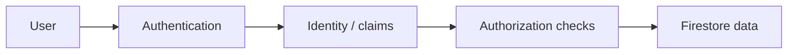
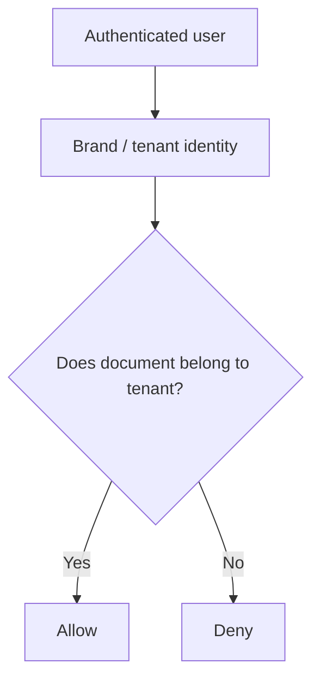
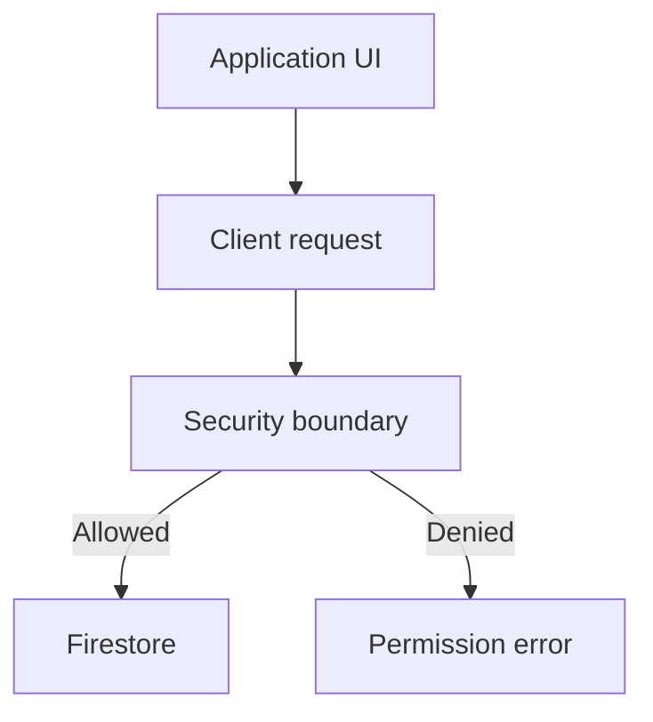
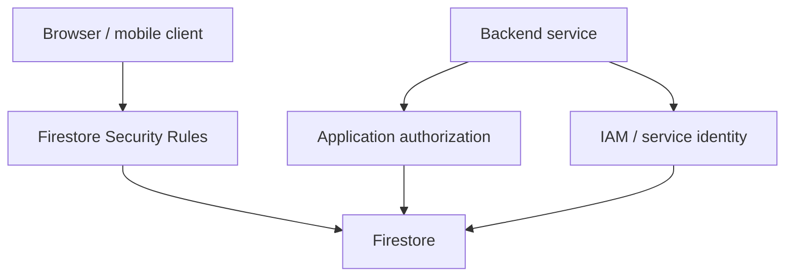
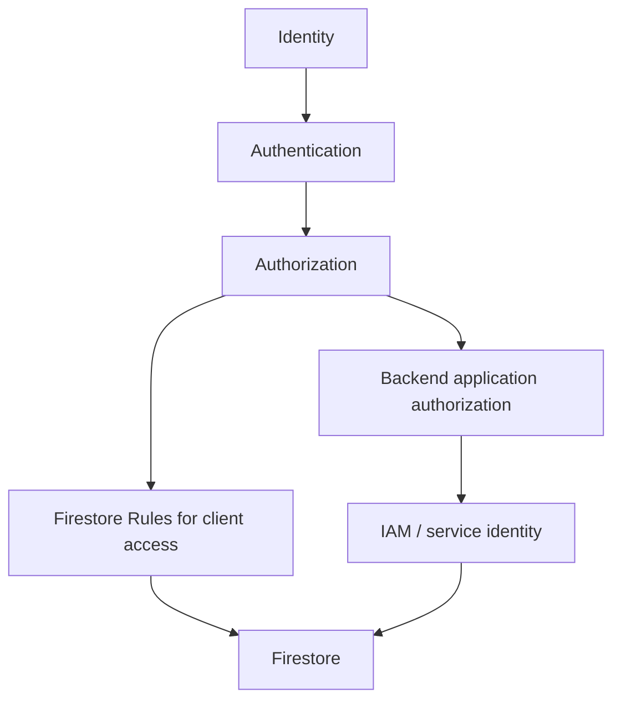

# Chapter 5 — Firestore

## 08 — Firestore Security Rules

> 🛡️ **Goal:** Understand authentication, authorization, Firestore Security Rules and IAM without mixing their responsibilities.

## Authentication vs authorization

These are different questions:

- **Authentication:** Who are you?
- **Authorization:** What are you allowed to access or change?

For a multi-tenant application:



## What are Firestore Security Rules?

Firestore Security Rules are a declarative authorization layer used primarily for client access to Firestore.

Rules can evaluate things such as:

- The authenticated user.
- The requested document path.
- Existing document data.
- Incoming data.
- Whether the requested operation is a read or write.

The exact rule syntax belongs to the Firebase/Firestore rules language.

## Tenant example

Suppose every invoice contains:

```json
{
  "brandId": "brand_001",
  "amount": 25000,
  "status": "generated"
}
```

The application may need to enforce:

> A user belonging to `brand_001` can read only data belonging to `brand_001`.

Conceptually:



The exact implementation depends on your authentication and data model.

## Validate writes

Rules can also protect fields during writes.

For example, you may want to prevent an untrusted client from changing a protected field such as:

```text
createdBy
brandId
billingAmount
```

A rule can validate incoming data according to the application's authorization policy.

## Rules are not UI security

Hiding a button is not authorization.

This is unsafe as a security strategy:

```text
UI hides “Delete Invoice”
        ↓
Assume users cannot delete
```

A malicious client can bypass the UI and issue a request directly.

Authorization must be enforced at the data/service boundary.



## Rules vs IAM

These mechanisms solve different problems.

| Mechanism | Primary question |
|---|---|
| Authentication | Who is the caller? |
| Firestore Security Rules | Is this client operation allowed? |
| IAM | Which Google Cloud identity has permission on the resource? |
| Application authorization | What business action is allowed? |

Do not collapse all four concepts into “permissions.”

## Server SDKs and rules

A common interview trap is assuming that Firestore Security Rules protect every access path in the same way.

Server-side access using privileged Google Cloud credentials is controlled through IAM rather than treating the server as an untrusted browser client.

Therefore, if your backend uses a privileged service identity, you still need application-level authorization checks in your backend.

Conceptually:



## Least privilege

A secure design should give each identity only the access it needs.

For example:

- A frontend user should access only authorized tenant data.
- A backend worker should have only the permissions needed for its workload.
- An invoice-processing service should not automatically receive unrestricted access to every unrelated GCP resource.

## Security design example

For a restaurant SaaS platform:

```text
User
  ↓
Authentication
  ↓
Tenant identity
  ↓
Authorization policy
  ↓
Firestore document access
```

For a backend worker:

```text
Worker service account
  ↓
IAM permissions
  ↓
Firestore
  ↓
Application-level authorization where needed
```

## Common mistakes

### Mistake 1 — Trusting the frontend

Anything enforced only in the UI can potentially be bypassed.

### Mistake 2 — Putting authorization only in application code

For client-direct access, Firestore rules are an important authorization boundary.

### Mistake 3 — Treating IAM and Firestore Rules as interchangeable

They operate at different layers and for different access models.

### Mistake 4 — Allowing broad access for convenience

Broad permissions make accidental or malicious access more damaging.

## Interview questions

**Q: What is the difference between authentication and authorization?**

Authentication establishes identity. Authorization determines what that identity can access or perform.

**Q: Why are Firestore Security Rules important?**

They provide declarative access control for supported client access patterns and can validate document reads/writes against application policies.

**Q: Does hiding a UI button provide security?**

No. Security must be enforced at the actual data/service boundary.

**Q: Are Firestore Security Rules a replacement for IAM?**

No. They address different access layers. IAM controls Google Cloud resource access for identities; Firestore rules primarily govern client data access.

## Takeaway

Keep the layers separate:



Security is part of the data model, not something to add after the schema is finished.