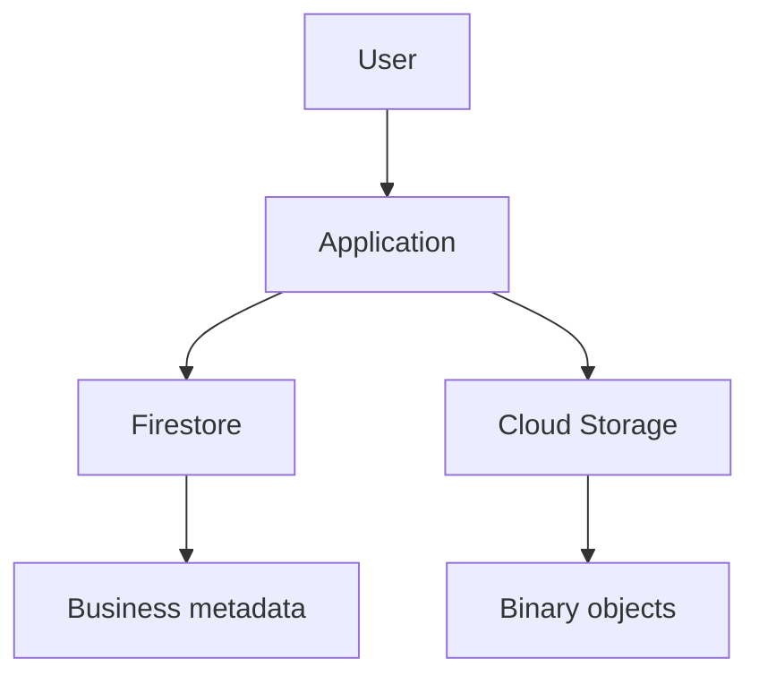
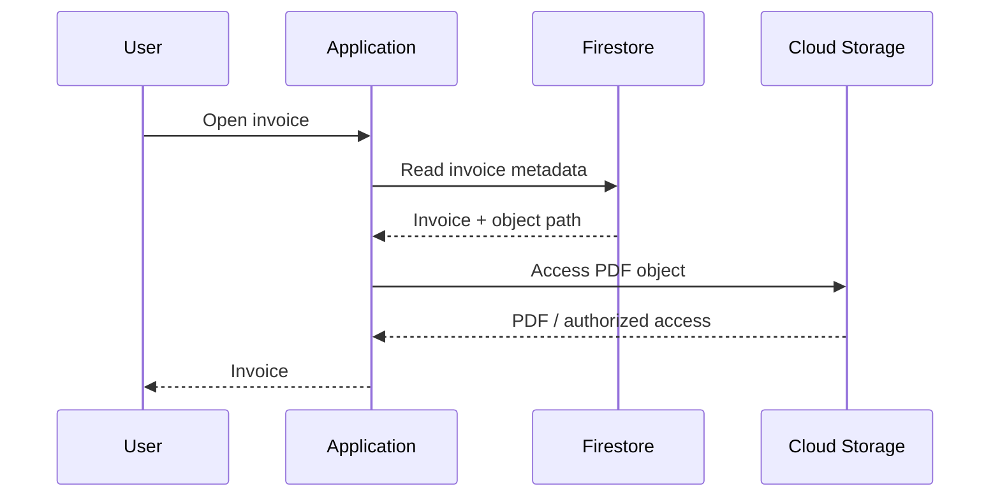
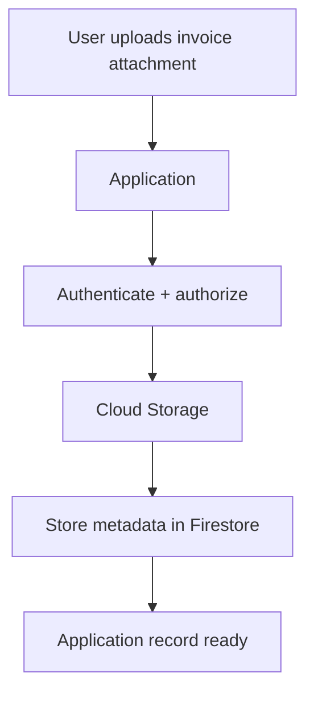
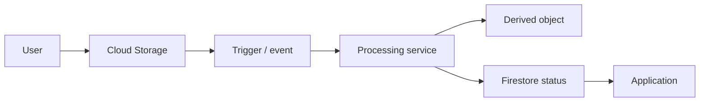
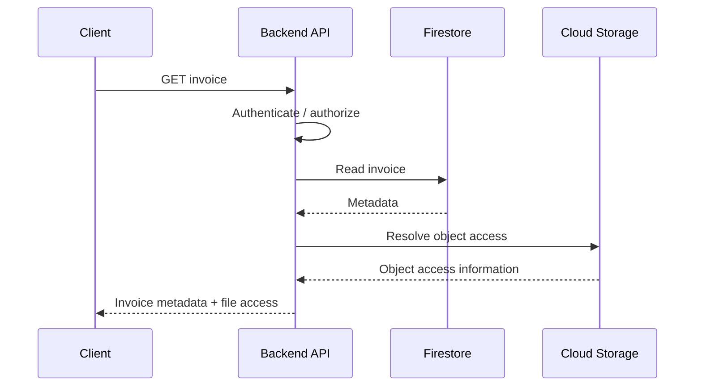
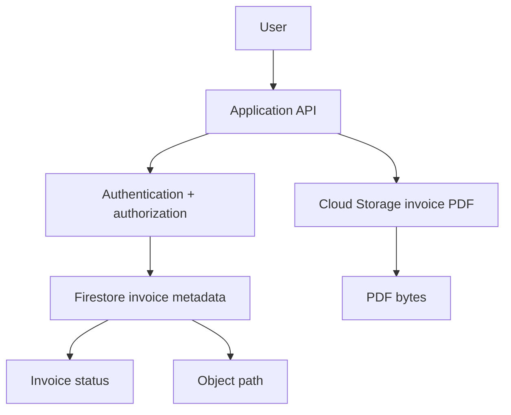

# Chapter 5 — Firestore

## 09 — Firestore with an Application

> 🔗 **Goal:** Connect the Firestore mental model with the Cloud Storage architecture from Chapter 4.

## Two services, two responsibilities

A typical application can use Firestore and Cloud Storage together:



Firestore can store:

- Restaurant metadata.
- Outlet metadata.
- Contract state.
- Invoice metadata.
- User preferences.
- Storage object paths.

Cloud Storage can store:

- Invoice PDFs.
- Menu images.
- CSV exports.
- Other large binary files.

## Example: invoice workflow

Suppose the user requests an invoice.

The application can retrieve the Firestore document first:

```json
{
  "invoiceNumber": "INV-1001",
  "brandId": "brand_001",
  "outletId": "outlet_001",
  "amount": 25000,
  "status": "generated",
  "pdfObject": "invoices/brand_001/INV-1001.pdf"
}
```

Then it can use the object path to retrieve or authorize access to the PDF in Cloud Storage.



## Why keep the object path in Firestore?

It creates a clean separation:

```text
Firestore
    ↓
“What is this invoice?”

Cloud Storage
    ↓
“Where is the invoice file?”
```

The application can also store useful metadata such as:

- Content type.
- File size.
- Upload timestamp.
- Processing status.
- Object generation/version information where relevant.

## File upload example

The Chapter 4 pattern can now become:



The application can first establish who owns the upload, then store the object, then record its metadata.

For workflows where upload and metadata creation can fail independently, design retry and reconciliation behavior.

## Processing workflow

Suppose a user uploads a menu image and the system must generate a thumbnail.



Firestore can track:

```json
{
  "status": "processed",
  "originalObject": "menus/restaurant_001/original.jpg",
  "thumbnailObject": "menus/restaurant_001/thumb.jpg"
}
```

Cloud Storage holds both actual files.

## Firestore is not a replacement for object storage

Avoid treating Firestore as a file repository just because documents can contain strings or encoded data.

A useful architecture principle is:

> Store structured, queryable application state in Firestore; store large binary objects in Cloud Storage.

## Firestore and application architecture

A backend might expose:

```text
GET /invoices/INV-1001
```

The backend could:

1. Authenticate the request.
2. Authorize access to the tenant/outlet.
3. Read invoice metadata from Firestore.
4. Resolve the storage object.
5. Return metadata and an authorized file-access mechanism.



## Multi-tenant application

For a SaaS product, both Firestore data and Storage objects should have tenant-aware naming and authorization.

Example:

```text
Firestore
brands/brand_001
invoices/invoice_1001

Cloud Storage
brands/brand_001/invoices/invoice_1001.pdf
```

The exact structure can vary, but the important property is that ownership is explicit and consistently enforced.

## Common interview scenario

**Question:** Design an invoice system where invoices are generated as PDFs and users can download them.

A strong answer should cover:



Then discuss:

- Idempotent invoice generation.
- Access control.
- Object naming.
- Metadata consistency.
- Retry/reconciliation.
- Large-file handling.
- Retention/deletion requirements.

## Takeaway

Chapter 4 and Chapter 5 fit together naturally:

```text
Firestore → application/business data
Cloud Storage → files/objects
Application → authorization + workflow orchestration
```

This combined mental model is more valuable in interviews than memorizing isolated commands.