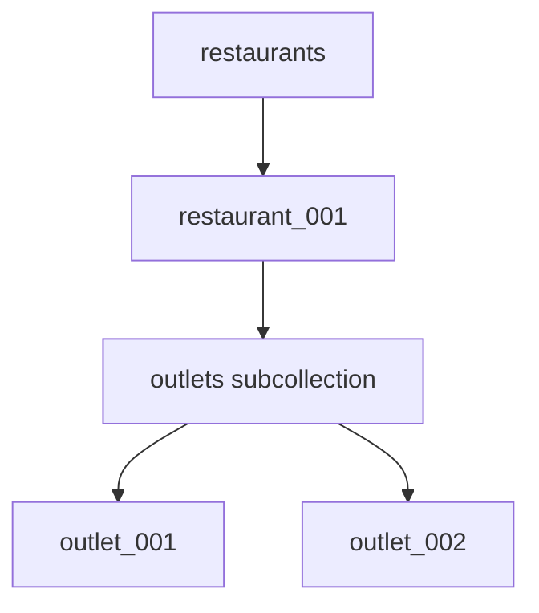
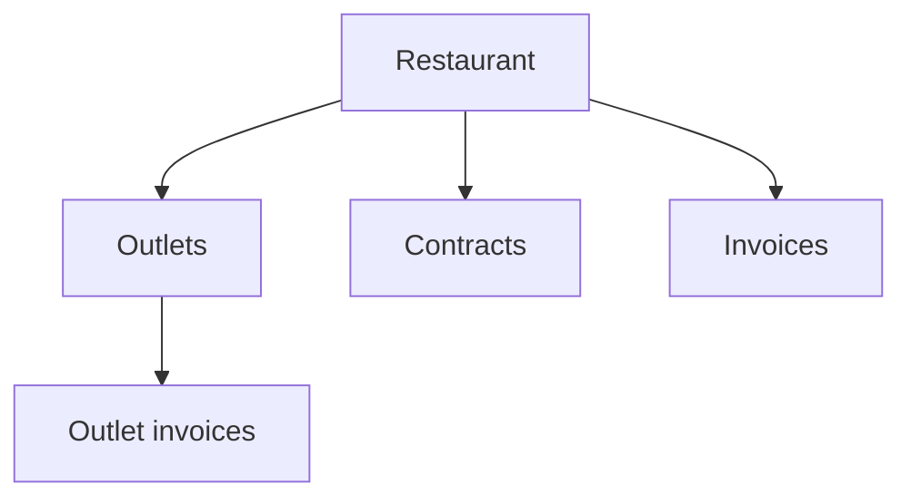
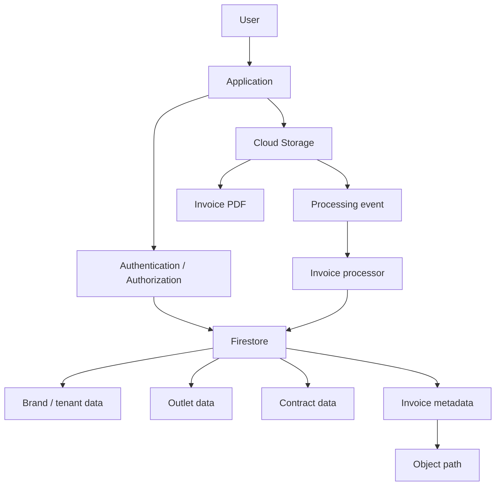

# Chapter 5 — Firestore

## 10 — Hands-On Labs

> 🧪 These labs are designed to turn the concepts from this chapter into practical interview-ready skills.

## Before you start

Make sure the Floci environment is running and your `gcloud` CLI is configured for the local tutorial environment as described in the earlier chapters.

> ⚠️ **Floci note:** Firestore emulator support can differ by Floci version. The commands below use GCP-style `gcloud` workflows where supported. If a particular command is unavailable in your Floci version, use the equivalent Firestore API/SDK operation supported by that version. Do not assume that emulator support means identical behavior to production Firestore.

---

# Lab 1 — Restaurant CRUD 🏪

## Objective

Build a small Firestore dataset representing restaurants and outlets.

You will practice:

- Creating documents.
- Reading documents.
- Listing/querying documents.
- Updating fields.
- Deleting a test document.
- Thinking in collection/document paths.

## Step 1 — Identify the model

Start with:

```text
restaurants/{restaurantId}
restaurants/{restaurantId}/outlets/{outletId}
```



## Step 2 — Create a restaurant

Use the Firestore document commands available in your configured `gcloud` environment.

Conceptually, the operation should create:

```text
restaurants/restaurant_001
```

with:

```json
{
  "name": "Floci Foods",
  "city": "Mumbai",
  "active": true
}
```

If your Floci version exposes Firestore document CRUD through `gcloud`, verify the exact syntax with:

```bash
gcloud firestore --help
gcloud firestore documents --help
```

Then create the document using the generated help for your installed version.

## Step 3 — Create outlets

Create:

```text
restaurants/restaurant_001/outlets/outlet_001
restaurants/restaurant_001/outlets/outlet_002
```

Suggested data:

```json
{
  "name": "Bandra West",
  "city": "Mumbai",
  "active": true
}
```

and:

```json
{
  "name": "Andheri East",
  "city": "Mumbai",
  "active": false
}
```

## Step 4 — Read the restaurant

Read:

```text
restaurants/restaurant_001
```

Verify that the returned document contains the fields you created.

## Step 5 — List/query outlets

Query the `outlets` collection under the restaurant and verify that both outlet documents exist.

Then identify which outlet is active.

## Step 6 — Update an outlet

Change `outlet_002` from:

```text
active = false
```

to:

```text
active = true
```

Read the document again and verify the change.

## Step 7 — Delete a test document

Create a temporary document such as:

```text
restaurants/restaurant_001/outlets/test-outlet
```

Then delete it and verify that it is no longer returned.

## Lab 1 questions

Answer these without looking back at the chapter:

1. What is the collection name?
2. What is the document ID?
3. What is the full path of `outlet_001`?
4. Why is `outlets` a subcollection here?
5. How would the design change if finance needed to query all outlets globally?
6. What fields would you add for tenant isolation?

### Lab 1 checkpoint ✅

You should now be comfortable explaining:

```text
Collection → Document → Fields
Document → Subcollection → Child document
```

---

# Lab 2 — Queries + Data Modeling 🔎

## Objective

Build a dataset that lets you practice realistic Firestore queries and reason about indexes.

Create these conceptual entities:



## Step 1 — Create sample restaurants

Create at least three restaurant documents with fields such as:

```json
{
  "name": "Floci Foods",
  "city": "Mumbai",
  "active": true,
  "createdAt": "timestamp"
}
```

Use different `active` values and cities.

## Step 2 — Create outlets

Create multiple outlets for each restaurant.

Include:

```json
{
  "restaurantId": "restaurant_001",
  "name": "Bandra West",
  "active": true,
  "city": "Mumbai"
}
```

## Step 3 — Create invoices

Create invoices with fields such as:

```json
{
  "restaurantId": "restaurant_001",
  "outletId": "outlet_001",
  "amount": 25000,
  "status": "generated",
  "invoiceDate": "timestamp"
}
```

Create enough variation to answer the queries below.

## Step 4 — Practice these queries

### Query A — Active restaurants

> Find restaurants where `active == true`.

### Query B — Outlets for a restaurant

> Find outlets where `restaurantId == restaurant_001`.

### Query C — Invoices for an outlet

> Find invoices where `outletId == outlet_001`.

### Query D — Large invoices

> Find invoices where `amount > 10000`.

### Query E — Latest invoices

> Order invoices by `invoiceDate` descending and return the latest 20.

### Query F — Combined access pattern

> Find generated invoices for one outlet and order them by invoice date descending.

For every query, write down:

| Item | Your answer |
|---|---|
| Collection | |
| Filters | |
| Ordering | |
| Limit | |
| Required index | |
| Expected result size | |

## Step 5 — Think about indexes

For Query F, ask:

> Does the query combine filtering and ordering in a way that requires a composite index?

If your Floci version surfaces a missing-index error, inspect the error and identify the required index rather than blindly adding indexes.

If your emulator does not reproduce the production index workflow, record the expected production behavior in your notes.

## Step 6 — Compare two data models

Compare:

### Model A

```text
invoices/{invoiceId}
```

with:

```json
{
  "restaurantId": "restaurant_001",
  "outletId": "outlet_001"
}
```

### Model B

```text
restaurants/{restaurantId}/outlets/{outletId}/invoices/{invoiceId}
```

Write down:

- Which reads are easier with Model A?
- Which reads are easier with Model B?
- How would tenant security differ?
- How would global invoice reporting differ?
- Which model better fits your application's dominant access patterns?

There is no universal answer. Your explanation is the important part.

### Lab 2 checkpoint ✅

You should be able to move from:

```text
Business requirement
        ↓
Access pattern
        ↓
Firestore query
        ↓
Index requirement
        ↓
Document model
```

---

# Final Lab — Design a Multi-Tenant Billing System 🏗️

## Scenario

You are designing a Firestore-backed billing system for a SaaS product serving restaurant brands.

The system has:

- Brands.
- Outlets.
- Contracts.
- Invoices.
- Users.
- Invoice PDFs stored in Cloud Storage.

## Requirements

The application must support:

1. A user viewing their brand.
2. Listing all outlets for a brand.
3. Viewing the active contract.
4. Viewing the latest invoices for an outlet.
5. Finding invoices for a billing period.
6. Storing invoice PDF metadata.
7. Restricting users to their authorized tenant.
8. Processing invoice files asynchronously.

## Your task

Design the Firestore model.

Document:

### 1. Collections

List your top-level collections.

### 2. Documents

Give an example document for each collection.

### 3. Subcollections

Identify where you would use subcollections and explain why.

### 4. Fields

List the fields required for the main queries.

### 5. IDs

Decide whether IDs are application-generated or auto-generated and explain your choice.

### 6. Queries

Write at least five application queries.

### 7. Indexes

Identify which queries may need composite indexes.

### 8. Security

Describe how tenant isolation would work.

### 9. Cloud Storage

Show where invoice PDFs live and what Firestore stores about them.

### 10. Failure handling

Explain what happens if:

- The PDF upload succeeds but Firestore metadata creation fails.
- Firestore metadata exists but PDF generation fails.
- The invoice-generation request is retried.

## Expected architecture

Your final diagram should resemble this conceptually, but your exact collection structure is your design decision:



## Final lab interview questions

Try answering these aloud:

1. Why Firestore instead of Cloud Storage for invoice metadata?
2. Why not store the PDF in Firestore?
3. How do you model a one-to-many relationship?
4. When would you use a subcollection?
5. When would you denormalize?
6. How do indexes affect query design?
7. What is the difference between a batch and a transaction?
8. How would you enforce tenant isolation?
9. What happens when an external API call is involved in a Firestore transaction?
10. How would you make invoice generation idempotent?

## Lab completion checklist

- [ ] Created Firestore documents.
- [ ] Read individual documents.
- [ ] Queried collections.
- [ ] Updated fields.
- [ ] Deleted a test document.
- [ ] Practiced equality filters.
- [ ] Practiced range filters.
- [ ] Practiced ordering and limits.
- [ ] Investigated index requirements.
- [ ] Compared top-level collections and subcollections.
- [ ] Designed a multi-tenant model.
- [ ] Connected Firestore metadata to Cloud Storage objects.
- [ ] Explained transactions and batches.
- [ ] Explained security boundaries.
- [ ] Explained failure and retry handling.

> 🎯 **Interview readiness test:** If you can explain your final model by starting with the application's access patterns and defending every collection, field, query and index choice, you understand Firestore at an interview-ready level.