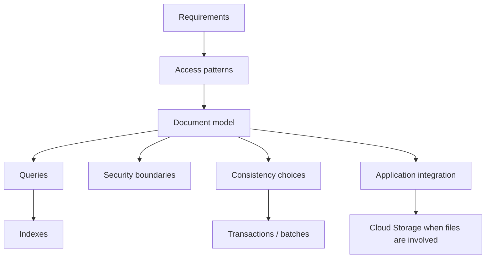

# Chapter 5 — Firestore

## 11 — Learning Checklist

> 🎯 Use this file as the final revision sheet for Chapter 5.

## 1. Core concepts

- [ ] I can explain what Firestore is.
- [ ] I can explain why Firestore is a NoSQL document database.
- [ ] I can distinguish Firestore from Cloud Storage.
- [ ] I can compare Firestore with a relational database.
- [ ] I can explain when Firestore is a reasonable application database choice.

## 2. Data model

- [ ] I understand database → collection → document → field.
- [ ] I understand document IDs.
- [ ] I understand nested maps.
- [ ] I understand arrays.
- [ ] I understand timestamps and common field types.
- [ ] I understand document references.
- [ ] I understand subcollections.
- [ ] I can explain a Firestore document path.

## 3. CRUD

- [ ] I can create a document.
- [ ] I can read a known document.
- [ ] I can query a collection.
- [ ] I can update selected fields.
- [ ] I can delete a document.
- [ ] I understand the difference between a direct document read and a collection query.

## 4. Queries

- [ ] I can explain equality filters.
- [ ] I can explain range filters.
- [ ] I can explain ordering.
- [ ] I can explain limits.
- [ ] I understand pagination conceptually.
- [ ] I understand collection group queries conceptually.
- [ ] I can turn a business requirement into a Firestore query.

## 5. Indexes

- [ ] I understand why Firestore uses indexes.
- [ ] I understand single-field indexes conceptually.
- [ ] I understand composite indexes.
- [ ] I understand what a missing-index error means.
- [ ] I can derive possible index requirements from application queries.
- [ ] I understand that unnecessary indexes are not free.

## 6. Data modeling

- [ ] I design from access patterns.
- [ ] I understand embedding.
- [ ] I understand references.
- [ ] I understand subcollections.
- [ ] I understand denormalization.
- [ ] I can explain the consistency trade-off of duplicated data.
- [ ] I consider document growth and independent child lifecycles.
- [ ] I can design a multi-tenant document model.

## 7. Transactions and batches

- [ ] I understand batched writes.
- [ ] I understand transactions.
- [ ] I know when to use a batch.
- [ ] I know when to use a transaction.
- [ ] I understand transaction retries.
- [ ] I understand why external side effects are not automatically transactional.
- [ ] I understand why idempotency matters for retried operations.

## 8. Security

- [ ] I can distinguish authentication from authorization.
- [ ] I understand Firestore Security Rules conceptually.
- [ ] I understand tenant-scoped authorization.
- [ ] I know that UI restrictions are not security controls.
- [ ] I can distinguish Firestore rules from IAM.
- [ ] I understand why backend services still need application authorization.
- [ ] I understand least privilege.

## 9. Application integration

- [ ] I can explain how an application uses Firestore.
- [ ] I can explain how Firestore and Cloud Storage work together.
- [ ] I know that Firestore can store object metadata and storage paths.
- [ ] I know that Cloud Storage stores the actual binary object.
- [ ] I can explain an invoice PDF workflow.
- [ ] I can explain retry/reconciliation concerns between Firestore and Storage.

## 10. Hands-on readiness

- [ ] I completed Restaurant CRUD.
- [ ] I practiced Firestore queries.
- [ ] I practiced thinking about indexes.
- [ ] I compared top-level collections with subcollections.
- [ ] I completed the multi-tenant billing design challenge.

## 11. Interview questions

Try answering these without opening the chapter.

| # | Question |
|---:|---|
| 1 | What is Firestore? |
| 2 | Firestore vs Cloud Storage? |
| 3 | Firestore vs SQL database? |
| 4 | What is a collection? |
| 5 | What is a document? |
| 6 | What is a subcollection? |
| 7 | How do you model one-to-many relationships? |
| 8 | When would you embed data? |
| 9 | When would you denormalize? |
| 10 | Why are indexes important? |
| 11 | What is a composite index? |
| 12 | What do you do when Firestore reports a missing index? |
| 13 | How would you paginate a large result set? |
| 14 | What is a collection group query? |
| 15 | What is a batched write? |
| 16 | What is a transaction? |
| 17 | Batch vs transaction? |
| 18 | Why can a transaction retry? |
| 19 | Can a Firestore transaction make an external API call atomic? |
| 20 | What is idempotency and why does it matter? |
| 21 | What are Firestore Security Rules? |
| 22 | Authentication vs authorization? |
| 23 | Firestore Security Rules vs IAM? |
| 24 | How would you isolate tenants in a SaaS application? |
| 25 | How would you store invoice PDFs with Firestore? |
| 26 | How would you design invoices for both outlet-specific and global queries? |
| 27 | What are the risks of over-denormalization? |
| 28 | What are the risks of over-embedding? |

## 12. One-minute mental model

If an interviewer says **“Design an application using Firestore,”** think:

Then explain your choices rather than listing features.

## 13. Chapter 5 final summary

The most important lessons are:

1. **Firestore is a document database for application data.**
2. **Collections contain documents, and documents contain fields.**
3. **Subcollections and references represent relationships, but they do not behave like SQL joins.**
4. **Design around access patterns.**
5. **Queries and indexes should be considered together.**
6. **Denormalization can improve reads but introduces consistency work.**
7. **Use transactions for read-dependent atomic updates.**
8. **Use batches for known groups of writes.**
9. **Security must be enforced at the data/service boundary.**
10. **Firestore and Cloud Storage solve different problems and often work together.**

## Ready for the next chapter? 🚀

You are ready to move on when you can design the Firestore model for a real application **without starting from tables**.

Your first question should be:

> **“What does the application need to read and write?”**

That question drives the model, queries, indexes, security boundaries and consistency strategy.