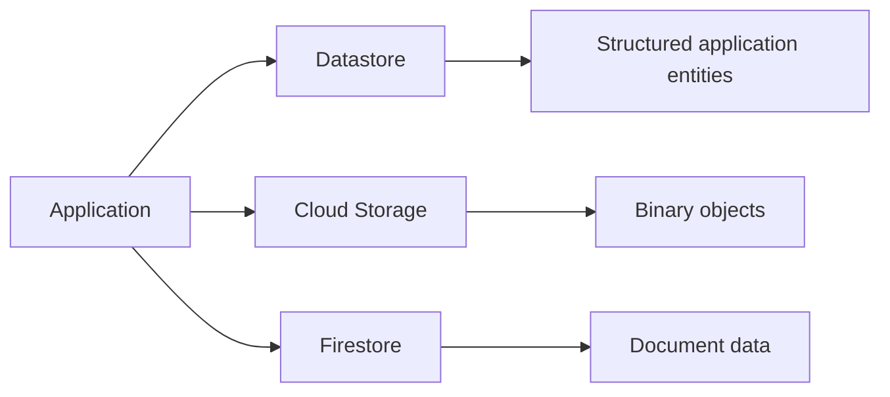
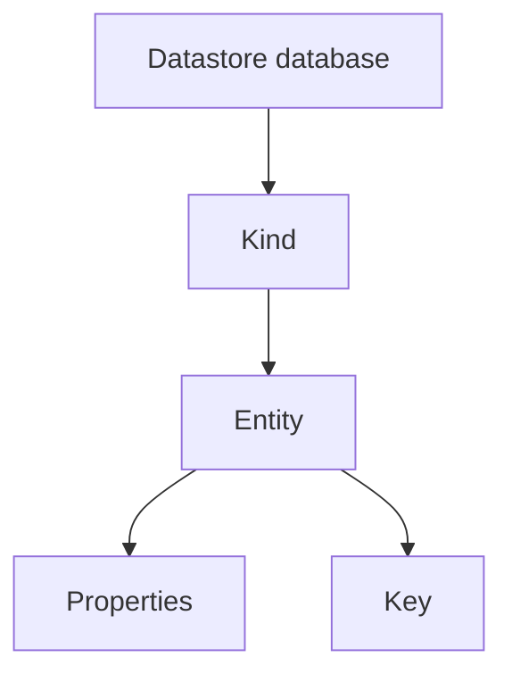
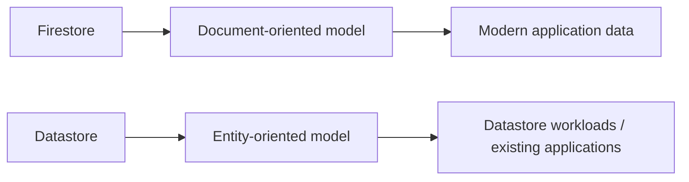
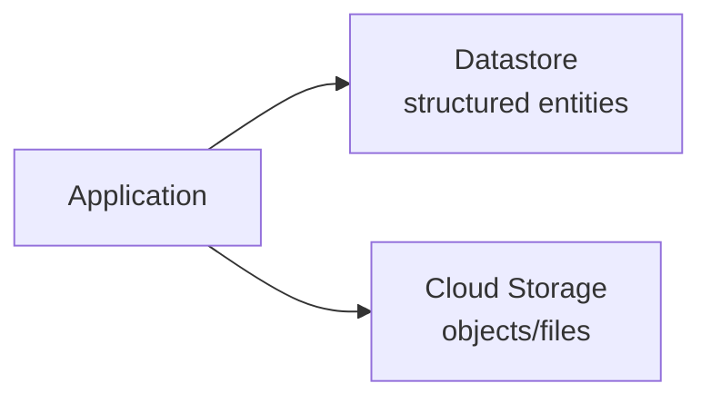

# Chapter 6 — Datastore

## 01 — Introduction to Datastore

> 🎯 **Goal:** Understand what Google Cloud Datastore is, what problem it solves, and how it differs from Firestore and Cloud Storage.

## What is Datastore?

Datastore is a managed NoSQL database for applications that need to store structured data as **entities** rather than relational rows.

The vocabulary is different from Firestore:

| Firestore | Datastore |
|---|---|
| Collection | Kind |
| Document | Entity |
| Document ID | Key / entity key |
| Field | Property |
| Subcollection / document hierarchy | Key hierarchy / ancestor relationships |

The important point is not to memorize the terminology. Understand the data model and the access patterns.

## Where Datastore fits



In a real architecture, you would normally choose the appropriate data service for a workload rather than automatically storing the same data in every database.

## Datastore's mental model

Think in terms of:



For example, a restaurant entity could conceptually be:

```text
Kind: Restaurant
Key: restaurant-001

name       = "Floci Foods"
status     = "active"
city       = "Mumbai"
outletCount = 12
```

## Why use a NoSQL entity database?

Datastore is designed around scalable application data access rather than relational JOIN-heavy workloads.

Typical application data might include:

- Customers
- Restaurants
- Outlets
- Orders
- User preferences
- Application configuration
- Workflow state

The exact model should be driven by how the application reads and writes the data.

## Datastore vs Firestore

This comparison matters because Chapter 5 introduced Firestore.



They are both managed NoSQL data services, but their APIs, terminology, feature sets, and modeling approaches differ.

For interviews, avoid saying “they are exactly the same.” Instead explain the specific data model and workload you are discussing.

## Datastore and Cloud Storage solve different problems

A useful distinction from earlier chapters:



An order record belongs in a database. An uploaded invoice PDF belongs in object storage.

## When Datastore is relevant

You should understand Datastore particularly when:

- Working with applications already built around Datastore.
- Maintaining or migrating existing GCP workloads.
- Interviewing for roles involving GCP NoSQL systems.
- Comparing GCP data-model choices.
- Designing workloads around entity keys and indexed properties.

## Floci note ⚠️

This tutorial uses Floci as a local learning environment. Emulator support can differ from real GCP behavior. Treat local commands as practice for the concepts, and verify production-specific behavior against current Google Cloud documentation before deploying.

## Interview checkpoint 💡

**Question:** What is Datastore?

**Answer:** Datastore is a managed NoSQL database that stores structured application data as entities identified by keys and grouped into kinds. It is designed for scalable application workloads and uses indexed queries rather than relational SQL joins.

**Question:** What is the difference between a Datastore entity and a Firestore document?

**Answer:** Both represent structured application data, but they belong to different data models and APIs. Datastore uses entities, kinds, properties, and keys; Firestore uses documents, collections, fields, and document paths.

## What you should understand before moving on

You should be able to explain:

1. What problem Datastore solves.
2. What a kind, entity, property, and key are.
3. Why Datastore is different from Cloud Storage.
4. Why Datastore should not simply be treated as a relational database.
5. Why comparing Datastore with Firestore matters.

Next: **Datastore's data model — entities, properties, keys, and hierarchy.**