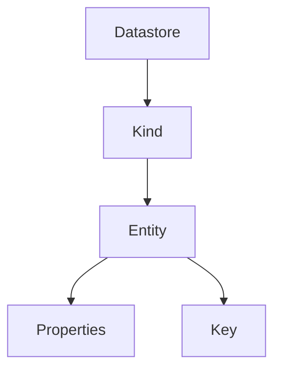
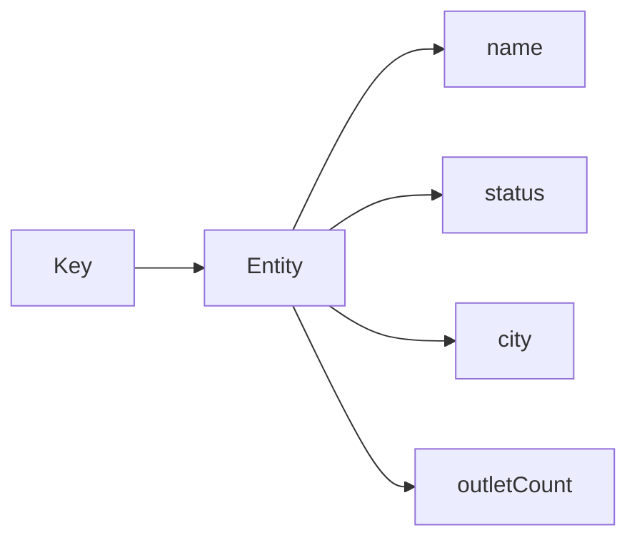
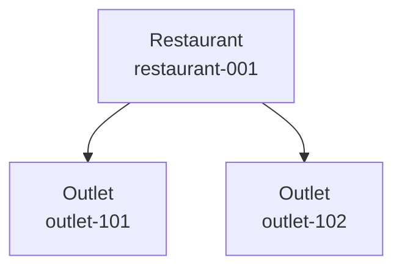
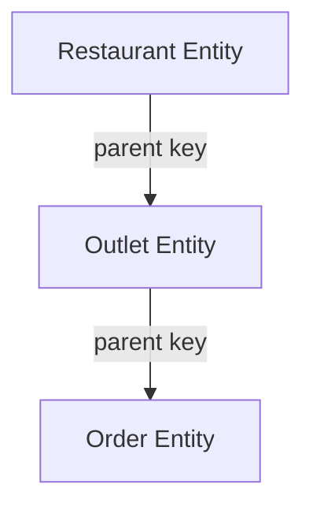

# 02 — Datastore Data Model

> 🎯 **Goal:** Understand how Datastore represents data using kinds, entities, properties, and keys.

## The four concepts to remember



### Kind

A **kind** groups entities of a similar conceptual type.

Examples:

```text
Restaurant
Outlet
Order
Invoice
Customer
```

A kind is conceptually similar to a collection in Firestore or a table in a relational database, but it should not be assumed to behave exactly like either one.

### Entity

An **entity** is an individual record stored in Datastore.

```text
Kind: Restaurant
Key: restaurant-001

name   = "Floci Foods"
city   = "Mumbai"
status = "active"
```

### Property

A **property** is a value stored on an entity.

Common property types include:

- Strings
- Integers
- Floating-point numbers
- Booleans
- Dates/timestamps
- Lists
- Embedded structured values, where supported
- Key values

### Key

Every entity has a **key** that identifies it.

The key is important because it provides the entity's identity and can also participate in hierarchy and query behavior.

## Entity structure



Think of an entity as:

```text
Entity
├── Key
└── Properties
    ├── name
    ├── status
    ├── city
    └── outletCount
```

## Keys

Datastore keys can use either:

- Automatically allocated numeric IDs.
- Application-supplied string names.

Example string key:

```text
Restaurant / restaurant-001
```

Example numeric key:

```text
Restaurant / 12345
```

A stable application-generated key can be useful when the application already has a natural unique identifier.

## Key hierarchy

Datastore also supports hierarchical keys.

For example:

```text
Restaurant(restaurant-001)
  └── Outlet(outlet-101)
```

Conceptually:



The parent is part of the entity's key path. This is useful when the application needs a strong relationship between entities and ancestor-based access patterns.

## Parent-child entities

A hierarchical key can be represented as:

```text
Restaurant / restaurant-001
    └── Outlet / outlet-101
```

This is different from merely storing:

```text
Outlet
restaurantId = "restaurant-001"
```

The latter is an ordinary property relationship. The former is a key hierarchy.

Understanding that distinction is important for Datastore interviews.

## Namespaces

Datastore supports **namespaces**, which can logically separate groups of entities.

A multi-tenant application might conceptually use:

```text
namespace: brand-a
namespace: brand-b
namespace: brand-c
```

Namespaces can be useful for isolation patterns, but they should not automatically be treated as a complete security boundary. Authentication and authorization still need to be designed separately.

## Datastore vs Firestore terminology

| Concept | Firestore | Datastore |
|---|---|---|
| Group | Collection | Kind |
| Record | Document | Entity |
| Attribute | Field | Property |
| Identity | Document ID/path | Key |
| Nested relationship | Subcollection | Key hierarchy / properties |

This table is worth memorizing, but understanding the underlying behavior is more important than terminology.

## Modeling a restaurant application

Suppose we need to model:

```text
Restaurant
Outlet
Order
```

One possible conceptual model is:



Another model might keep entities in separate kinds and store identifiers as properties.

The correct choice depends on the application's access patterns, consistency requirements, and query needs.

## Interview checkpoint 💡

**Question:** What is the difference between a Datastore key and a property?

**Answer:** A key identifies the entity and can define its hierarchy. A property stores application data on the entity and can be used in indexed queries.

**Question:** Why would you use a string key instead of an automatically allocated numeric ID?

**Answer:** A string key can provide a deterministic identity when the application already has a stable unique identifier. It can also make debugging and entity addressing easier.

## What you should understand before moving on

You should be able to explain:

- Kind vs entity.
- Entity vs property.
- Key vs property.
- Numeric ID vs string key.
- Parent/child key hierarchy.
- What namespaces are used for.
- How Datastore terminology differs from Firestore.

Next: **creating and organizing kinds and entities.**