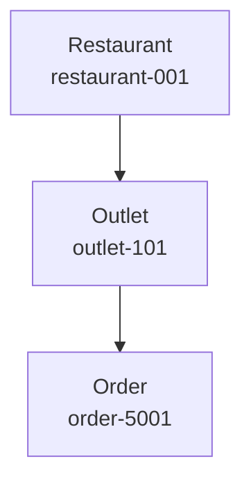

# 03 — Keys and Entities

> 🎯 **Goal:** Learn how Datastore identifies entities and how key design affects application behavior.

## Entity identity

A Datastore entity is identified by a **key**.


Two entities can have identical properties but still be different entities if their keys differ.

## Key components

A key can be thought of as containing:

- Kind.
- Identifier — numeric ID or string name.
- Optional parent key path.

Example:

```text
Restaurant / restaurant-001
```

Hierarchical example:

```text
Restaurant / restaurant-001 / Outlet / outlet-101
```

## Numeric IDs

Datastore can allocate numeric IDs automatically.

Conceptually:

```text
Restaurant / 1001
Restaurant / 1002
Restaurant / 1003
```

This is useful when the application does not need to determine the identifier itself.

## String names

Applications can provide a string identifier:

```text
Restaurant / rest-mumbai-001
```

This can be useful when the application already has a stable unique identifier.

### Important design question

Do not choose string keys merely because they “look nicer.” Ask:

> Does the application already have a deterministic identifier that is safe and stable to use as the entity key?

If not, an allocated ID may be simpler.

## Parent keys

A child entity can have a parent in its key path.



The resulting key path identifies the complete hierarchy.

```text
Restaurant/restaurant-001/Outlet/outlet-101/Order/order-5001
```

## Why hierarchy matters

A hierarchy is not just visual organization. It can affect how the application addresses entities and how ancestor-related queries and consistency behavior work.

That makes key hierarchy a modeling decision rather than merely a naming convention.

## Entity properties

An entity can contain multiple properties:

```text
Kind: Outlet
Key: outlet-101

name       = "Bandra Outlet"
city       = "Mumbai"
active     = true
monthlyFee = 15000
```

A property is data. The key is identity.

## Key vs application ID field

You could have:

```text
Key: outlet-101

id = "outlet-101"
name = "Bandra Outlet"
```

But the application does not necessarily need a duplicate `id` property if the key itself already provides the identity it needs.

On the other hand, storing a business identifier as a property can be useful when it needs to be queried independently or when the key and business identity are intentionally different.

## Parent hierarchy vs reference property

These are different designs.

### Hierarchical key

```text
Restaurant/restaurant-001/Outlet/outlet-101
```

### Reference/property relationship

```text
Outlet/outlet-101
restaurantId = "restaurant-001"
```

Use the model that matches the application's access patterns and consistency requirements.

## Common mistakes ⚠️

### Mistake 1: Treating keys as ordinary fields

Keys identify entities and have database-level semantics.

### Mistake 2: Creating unnecessary deep hierarchies

Hierarchy should solve a real access or consistency requirement. Do not create a deep parent-child structure simply because the business entities are related.

### Mistake 3: Assuming a key is automatically a security boundary

A predictable key does not make an entity secure. Authorization must still be enforced.

## Interview checkpoint 💡

**Question:** What identifies a Datastore entity?

**Answer:** Its key. The key contains the kind and an identifier, and can include a parent hierarchy.

**Question:** What is the difference between a parent-child key and a property such as `restaurantId`?

**Answer:** A parent-child key creates a hierarchical entity key path with Datastore-specific semantics. A `restaurantId` property is simply stored data that can be used by application logic and queries.

## What you should understand before moving on

You should be able to:

- Explain Datastore entity identity.
- Explain numeric vs string identifiers.
- Read a hierarchical key path.
- Explain parent-child entities.
- Distinguish keys from properties.
- Explain hierarchy vs a simple ID property.

Next: **CRUD operations and the Datastore CLI workflow.**