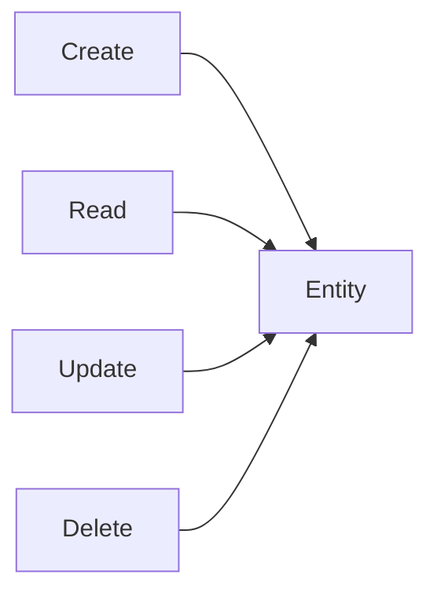
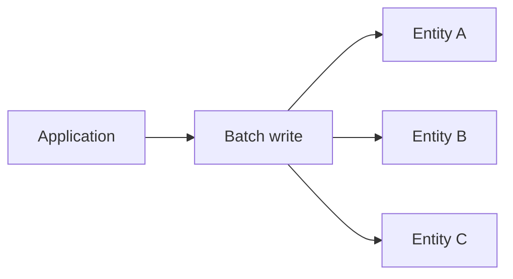
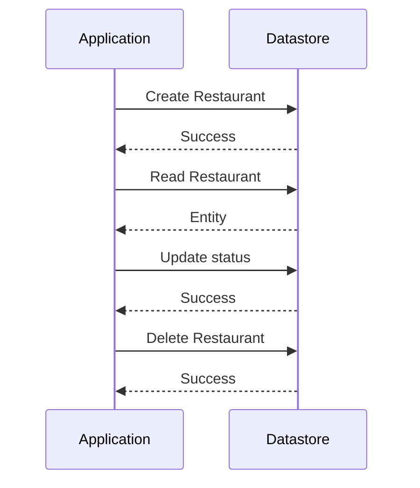

# 04 — CRUD Operations

> 🎯 **Goal:** Practice creating, reading, updating, and deleting Datastore entities and understand what each operation means.

## CRUD mental model



The operations are straightforward, but interviews often test whether you understand **keys, idempotency, batching, and application behavior around failures**.

## Create

Creating an entity means writing a new entity to a kind with a key and properties.

Conceptual entity:

```text
Kind: Restaurant
Key: restaurant-001

name   = "Floci Foods"
city   = "Mumbai"
status = "active"
```

With the Google Cloud CLI, Datastore commands are available through the `gcloud datastore` command group when supported by the environment.

Check the available commands first:

```powershell
gcloud datastore --help
```

> ⚠️ CLI availability and exact flags can differ between `gcloud` versions and Floci. Use `--help` in the environment you are actually running.

## Read

A read retrieves an entity by key.

The key is important because it provides direct identity:

```text
Restaurant / restaurant-001
```

A direct key lookup is conceptually different from a query such as:

```text
Find Restaurants where city == "Mumbai"
```

The first asks for a known entity. The second asks Datastore to search indexed data.

## Update

An update changes properties on an existing entity.

For example:

```text
status = "inactive"
```

When updating, decide whether the operation should replace the entity or modify only selected properties. Your client library and API operation determine the exact semantics.

## Delete

Deleting removes an entity identified by its key.

```text
Restaurant / restaurant-001
```

After deletion, a normal read using that key should no longer return the entity.

## Upsert-style thinking

Many application workflows naturally want:

> “Create this entity if it does not exist; otherwise update it.”

That is an **upsert-style** operation.

Be careful with concurrent writers. If two workers can modify the same entity, simple read-then-write logic may produce lost updates. Transactions or conditional patterns may be needed depending on the workload.

## Batch operations

Applications often need to modify multiple entities.



Batch APIs can reduce round trips and group multiple operations. Do not assume that every batch operation provides the same transactional guarantees as a transaction; understand the API semantics being used.

## CRUD lifecycle example

Imagine a restaurant onboarding workflow:



## CLI-first learning workflow

Before memorizing commands:

```powershell
gcloud datastore --help
```

Then inspect command-specific help:

```powershell
gcloud datastore <command> --help
```

This approach is especially useful with Floci because emulator support can differ from real GCP.

## Application CRUD design

A typical REST application might map operations like this:

| Application action | Datastore concept |
|---|---|
| `POST /restaurants` | Create entity |
| `GET /restaurants/{id}` | Get by key |
| `PATCH /restaurants/{id}` | Update entity |
| `DELETE /restaurants/{id}` | Delete entity |
| `GET /restaurants?city=Mumbai` | Query entities |

The API layer and Datastore layer are separate concerns.

## Common mistakes ⚠️

### Mistake 1: Using a query when you already know the key

If you have the exact entity key, a direct lookup is conceptually simpler than searching by a property.

### Mistake 2: Assuming update operations are automatically safe under concurrency

Concurrent writes can cause lost updates if the workflow is not designed correctly.

### Mistake 3: Treating batch and transaction as synonyms

A batch groups operations, while a transaction provides atomicity and concurrency semantics defined by the datastore API.

## Interview checkpoint 💡

**Question:** What is the difference between a key lookup and a query?

**Answer:** A key lookup retrieves a known entity by identity. A query searches entities using indexed properties, keys, ordering, or other supported query constraints.

**Question:** Why might an application use a batch write?

**Answer:** To efficiently send multiple writes together and reduce client/server round trips. Whether those writes are atomic depends on the specific batch mechanism.

## What you should understand before moving on

You should be able to:

- Explain create/read/update/delete.
- Explain direct key lookup vs query.
- Explain why batch operations exist.
- Explain why concurrency changes update design.
- Use `gcloud datastore --help` to discover environment-specific commands.

Next: **Datastore queries and how indexed properties affect what you can search.**