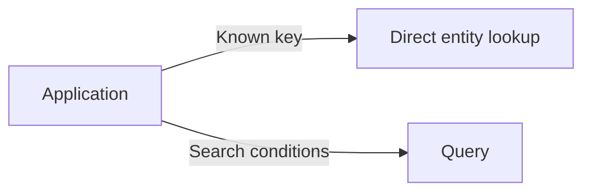
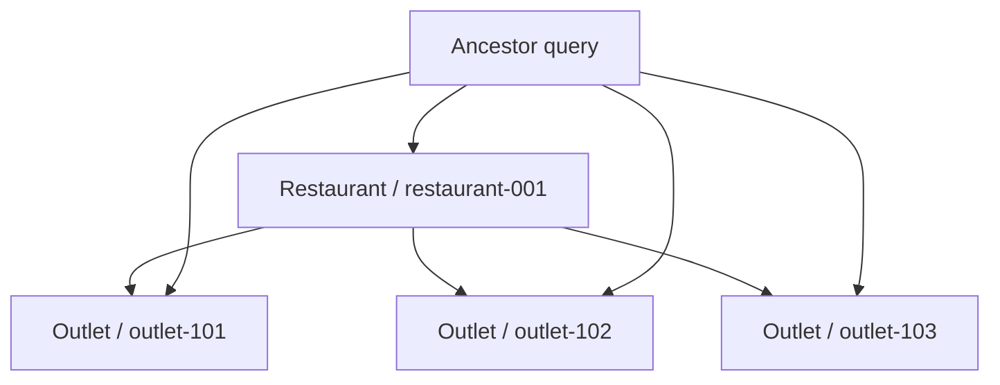
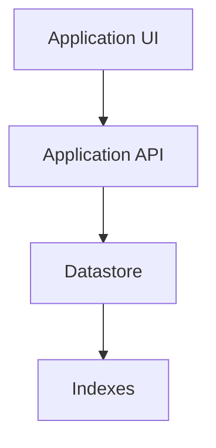

# 05 — Queries

> 🎯 **Goal:** Understand how Datastore finds entities and why query design and indexes are tightly connected.

## Key lookup vs query

There are two fundamentally different ways to retrieve data.



Example direct lookup:

```text
Restaurant / restaurant-001
```

Example query:

```text
Restaurant where city = "Mumbai"
```

## Querying a kind

A query usually starts with a kind:

```text
Restaurant
```

Then it can apply supported filters and ordering.

Conceptually:

```text
Restaurant
    ↓
city == "Mumbai"
    ↓
status == "active"
    ↓
order by name
```

## Property filters

A query can filter using properties such as:

```text
city = "Mumbai"
status = "active"
monthlyFee > 10000
```

The exact operators and combinations supported depend on the Datastore query model and API.

## Ordering

You can request results ordered by a property where the query supports it.

Example:

```text
Restaurant
where status = "active"
order by name
```

Ordering and filtering together can affect index requirements.

## Limits

Applications often should not retrieve unlimited result sets.

Conceptually:

```text
Query
  ↓
Filter
  ↓
Order
  ↓
Limit 20
```

For production systems, pagination is usually more appropriate than arbitrarily returning a huge result set.

## Ancestor queries

When using hierarchical keys, an application can query within an ancestor scope.



This is one reason hierarchy is a meaningful Datastore modeling decision rather than just a visual grouping mechanism.

## Query planning mindset

Before creating a query, ask:

1. What kind of entity am I searching?
2. Which properties filter the result?
3. Do I need ordering?
4. Do I need a limit?
5. Does the query require an index?
6. How will the application paginate results?

This habit is more valuable than memorizing individual commands.

## Example: restaurant SaaS

Suppose we have:

```text
Kind: Outlet

restaurantId = "restaurant-001"
city = "Mumbai"
active = true
monthlyFee = 15000
```

A business query might be:

> Find active outlets for a restaurant in Mumbai with a monthly fee greater than ₹10,000.

Conceptually:


Whether this exact combination is efficient or requires a particular index depends on the datastore's indexing model.

## Query limitations matter

NoSQL systems intentionally do not behave like relational SQL databases.

You should not assume you can:

- Join arbitrary kinds like SQL tables.
- Run every possible ad-hoc query without indexes.
- Treat every property combination as equally cheap.

Instead, design entities and indexes around the access patterns your application actually needs.

## Query and application architecture



The UI should not need to know how Datastore executes the query. The application layer defines the business access pattern.

## Interview checkpoint 💡

**Question:** What is the difference between a key lookup and a Datastore query?

**Answer:** A key lookup addresses one known entity directly. A query searches a set of entities using supported filters, ordering, ancestor scope, and limits.

**Question:** Why do Datastore queries depend on indexes?

**Answer:** Datastore is designed around indexed access to properties. Certain combinations of filters and ordering require appropriate indexes so the datastore can efficiently execute the query.

## What you should understand before moving on

You should be able to explain:

- Key lookup vs query.
- Kind queries.
- Property filters.
- Ordering.
- Limits and pagination.
- Ancestor queries.
- Why query design affects index design.

Next: **indexes and how to reason about them in interviews.**