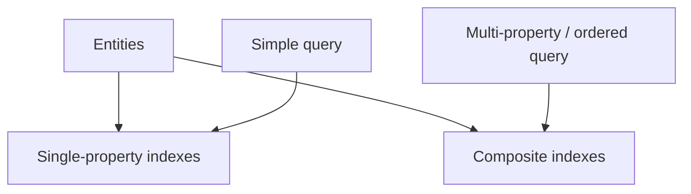
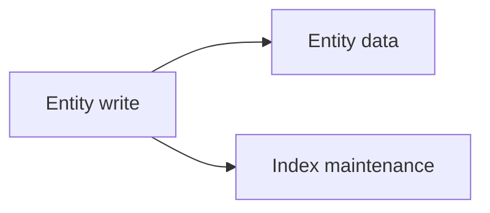
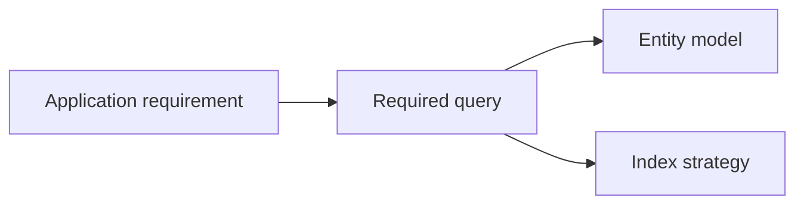

# 06 — Indexes

> 🎯 **Goal:** Understand why Datastore indexes exist, how queries depend on them, and how index design affects application behavior.

## Why indexes exist

Datastore is built for scalable indexed queries. An index allows the service to locate matching entities without scanning every entity for every query.


The key interview idea is:

> **Your query patterns and your index strategy are connected.**

## Automatic and composite indexes

Datastore can maintain indexes for individual properties and requires composite indexes for certain combinations of properties and ordering.

Conceptually:



The exact automatically indexed properties and index configuration depend on the Datastore mode and current platform behavior.

## Example

Suppose entities contain:

```text
restaurantId
status
city
monthlyFee
createdAt
```

A query might ask for:

```text
restaurantId = restaurant-001
status = active
order by createdAt descending
```

A multi-property query like this may require an appropriate composite index.

## Missing index

A common Datastore development experience is that a query works conceptually but the datastore reports that an index is required.

The correct response is not to randomly add indexes.

Instead:

1. Identify the exact query.
2. Understand which properties participate.
3. Determine the required index.
4. Create/configure it using the supported environment.
5. Re-run the query.

## Indexes are not free

Indexes consume storage and have write-maintenance costs.

Every time an indexed property changes, relevant index entries may also need to change.

Therefore:



The interview-level insight is:

> More indexes can make more queries possible, but they also increase storage and write overhead.

## Query-first design

Instead of:

```text
1. Create entities
2. Add random indexes
3. Hope queries work
```

prefer:



This is an example of **access-pattern-driven NoSQL design**.

## Indexing and properties

If a property is never used for supported query filtering or ordering, you should question whether it needs indexing.

For large applications, unnecessary indexes can increase operational cost.

The exact index controls and exemption mechanisms should be checked against the current Google Cloud documentation and the datastore mode being used.

## Datastore vs SQL indexes

The word “index” exists in both relational and NoSQL systems, but the design context differs.

| Relational database | Datastore |
|---|---|
| Indexes support SQL query plans | Indexes support Datastore query patterns |
| JOINs are common | Query capabilities are intentionally different |
| Schema is usually relational | Entity model is document/entity oriented |
| Composite indexes are possible | Composite indexes are important for supported multi-property queries |

Do not assume an SQL indexing strategy can be copied directly to Datastore.

## Interview checkpoint 💡

**Question:** Why does Datastore need indexes?

**Answer:** Datastore uses indexed access to efficiently find entities matching supported query patterns. Some simple queries can use existing indexes, while certain combinations require composite indexes.

**Question:** Should you create an index for every property?

**Answer:** No. Indexes have storage and write-maintenance costs. Index design should follow actual query and ordering requirements.

**Question:** What would you do when Datastore says a query needs an index?

**Answer:** Inspect the query, identify the required property/filter/order combination, configure the required index, and test the query again.

## What you should understand before moving on

You should be able to explain:

- Why indexes exist.
- Single-property vs composite indexing at a high level.
- Why a query may require a composite index.
- Why indexes have write/storage costs.
- Why indexes should follow query patterns.

Next: **designing Datastore entities around real application access patterns.**