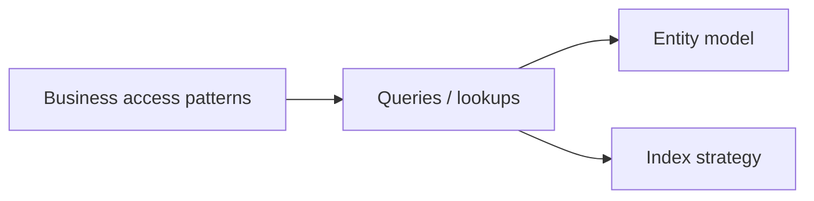
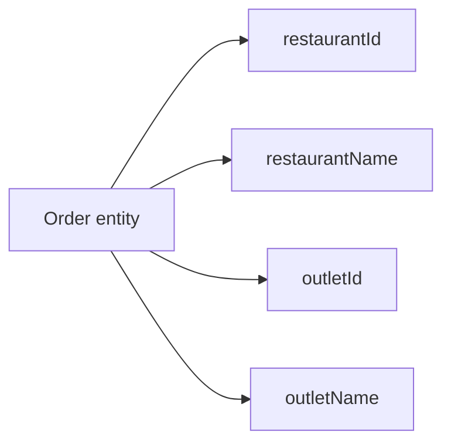
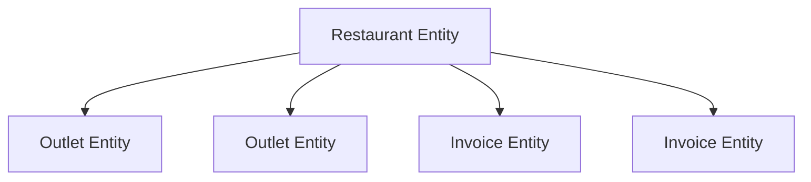
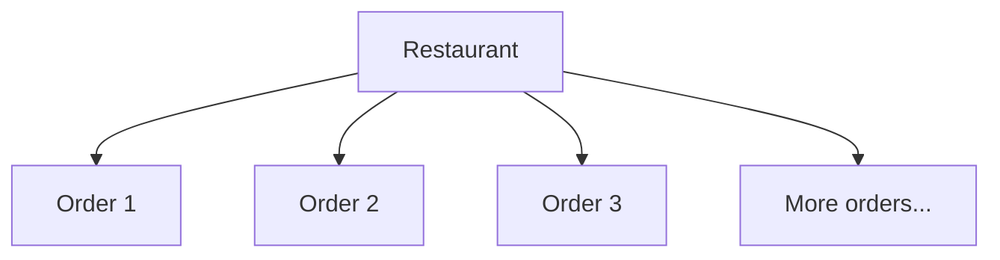

# 07 — Data Modeling

> 🎯 **Goal:** Learn how to design Datastore entities from application access patterns instead of copying a relational schema blindly.

## Start with access patterns

For NoSQL databases, begin with the questions the application needs to answer.

For a restaurant platform, ask:

- Find a restaurant by ID.
- Find all active outlets for a restaurant.
- Find orders for an outlet.
- Find recent orders.
- Find customers by email.

Then design entities and indexes around those operations.



## A relational mindset can mislead you

Suppose a SQL design has:

```text
restaurants
outlets
orders
order_items
customers
```

It may be tempting to reproduce that structure exactly in Datastore.

That can work in some situations, but it ignores a central NoSQL design principle:

> **Model for the reads and writes your application actually performs.**

## Denormalization

Datastore applications may intentionally duplicate small pieces of data to make common reads simpler.

For example, an order could contain:

```text
restaurantId
restaurantName
outletId
outletName
orderTotal
createdAt
```

The duplicated names may avoid an additional lookup when displaying an order list.



The trade-off is consistency: if an outlet name changes, duplicated values may need to be updated.

## Embedding vs separate entities

Small, tightly coupled data can sometimes be stored together.

```text
Restaurant
  name
  address
  billingContact
```

If data is independently queried, updated, or grows without a predictable bound, separate entities may be more appropriate.

The decision should be driven by:

- Query patterns.
- Update frequency.
- Data size.
- Ownership.
- Consistency requirements.
- Growth characteristics.

## Restaurant example

One conceptual design:



Another design might use parent-child key paths for outlet entities.

Neither is automatically correct. Ask what the application needs to query and update.

## Avoid unbounded entity growth

A common modeling mistake is putting an ever-growing list inside one entity.

Bad conceptual example:

```text
Restaurant
  orders = [order1, order2, order3, ...]
```

If orders grow continuously, the entity becomes difficult to maintain and may hit platform limits.

Instead, represent orders as independently addressable entities.



## Choose identifiers carefully

Business identifiers can be useful, but they should be stable and unique.

Examples:

```text
restaurant-001
outlet-mumbai-001
invoice-2026-0001
```

Do not expose sensitive information simply because it happens to be used as an identifier.

## Modeling checklist

For every entity, ask:

| Question | Why it matters |
|---|---|
| How is it identified? | Key design |
| How is it queried? | Query/index design |
| How often is it updated? | Consistency cost |
| Can it grow without bound? | Entity-size risk |
| Is data duplicated? | Denormalization trade-off |
| Does it need hierarchy? | Key-path design |
| Who can access it? | Security design |

## Interview checkpoint 💡

**Question:** Why is denormalization common in NoSQL databases?

**Answer:** Denormalization can make common reads faster and simpler by storing data in the shape required by application access patterns. The trade-off is duplicated data and more complicated updates.

**Question:** What is the first thing you should understand before designing a Datastore schema?

**Answer:** The application's access patterns: what entities it needs to read, filter, order, create, update, and delete.

## What you should understand before moving on

You should be able to:

- Explain access-pattern-driven modeling.
- Explain denormalization and its trade-offs.
- Decide when data should be separate entities.
- Identify unbounded data structures.
- Explain why key design matters.

Next: **Datastore and Firestore — how to compare the two GCP NoSQL models.**