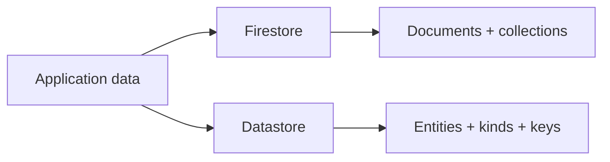
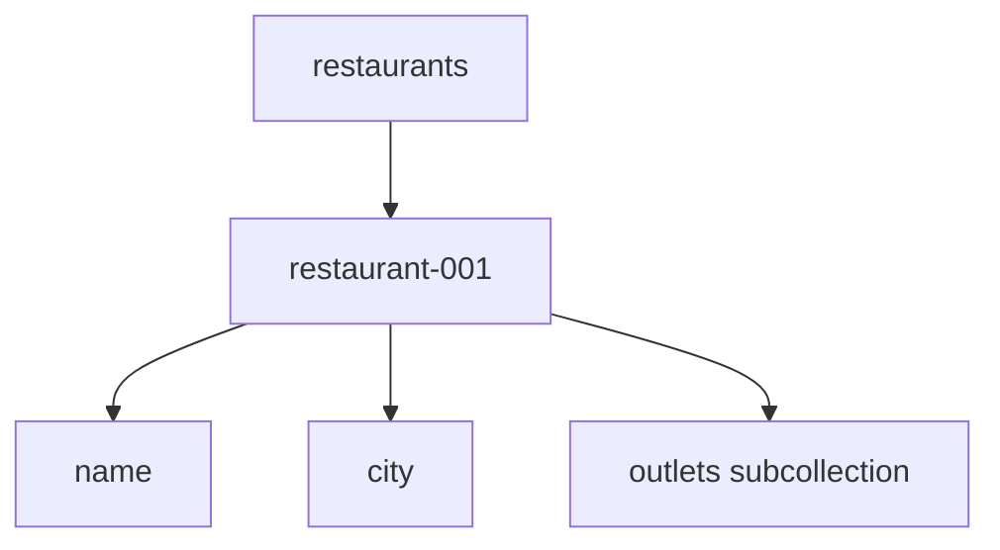
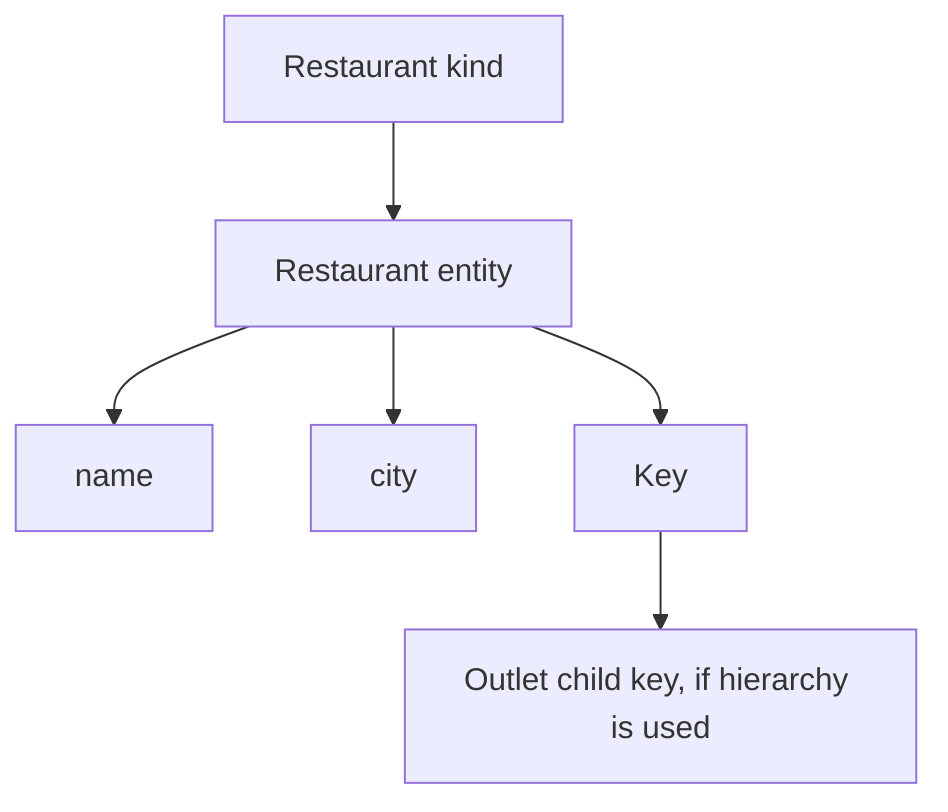

# 08 — Datastore vs Firestore

> 🎯 **Goal:** Be able to clearly explain the relationship and differences between Datastore and Firestore without treating them as interchangeable labels.

## Why compare them?

Chapter 5 introduced Firestore as a document database. Datastore is another GCP NoSQL data service with a different model and vocabulary.

This comparison is a common interview topic because both can store structured application data.

## Vocabulary

| Firestore | Datastore |
|---|---|
| Collection | Kind |
| Document | Entity |
| Field | Property |
| Document ID/path | Key |
| Subcollection | Key hierarchy / separate kinds, depending on design |
| Firestore query APIs | Datastore query APIs |

## Conceptual difference



The two services should be learned according to their own APIs and data models.

## When you encounter Firestore

Firestore is commonly used as a modern document database for application data and has strong integration with Firebase and application development workflows.

Think:

```text
Collection
  └── Document
       ├── field
       ├── field
       └── subcollection
```

## When you encounter Datastore

Datastore is especially relevant when working with existing applications or workloads designed around its entity/key model.

Think:

```text
Kind
  └── Entity
       ├── Property
       ├── Property
       └── Key
```

## Data modeling comparison

### Firestore



### Datastore



These are different modeling primitives.

## Query comparison

Both services support indexed queries, but their query APIs and supported semantics differ.

Do not answer an interview question with:

> “Firestore and Datastore use the same queries.”

Instead say:

> “Both are indexed NoSQL databases, but they expose different APIs and data models, so query behavior and modeling decisions need to be evaluated separately.”

## Should you migrate Datastore to Firestore?

Do not assume migration is automatically beneficial or necessary.

A migration requires evaluating:

- Current application dependencies.
- Query behavior.
- Data model.
- Index configuration.
- Consistency requirements.
- Client libraries.
- Operational behavior.
- Cost and performance characteristics.
- Migration tooling and downtime requirements.

The correct migration strategy depends on the actual workload.

## Interview scenario

**Interviewer:** “We have an old GCP application using Datastore. Should we immediately move it to Firestore?”

A strong answer starts with questions:

1. What does the application currently use Datastore for?
2. Which queries and key hierarchies exist?
3. What client libraries and integrations depend on it?
4. What benefits are expected from migration?
5. What compatibility and migration risks exist?
6. Can the application tolerate a migration period or dual-write strategy?

This demonstrates engineering judgment without assuming a migration is always the right answer.

## Quick comparison

| Area | Firestore | Datastore |
|---|---|---|
| Primary model | Documents | Entities |
| Grouping | Collections | Kinds |
| Identity | Document path/ID | Key |
| Hierarchy | Document/subcollection paths | Key hierarchy |
| Query model | Firestore queries | Datastore queries |
| Typical interview discussion | Modern document application | Existing/entity-oriented GCP workloads |

## Interview checkpoint 💡

**Question:** Are Firestore and Datastore the same thing?

**Answer:** No. They are related GCP NoSQL data services with different APIs, terminology, data models, and feature behavior. They should be evaluated according to the application's requirements.

**Question:** What is the biggest conceptual difference in terminology?

**Answer:** Firestore organizes data as collections and documents, while Datastore organizes data as kinds and entities identified by keys.

## What you should understand before moving on

You should be able to:

- Translate basic Firestore terminology into Datastore terminology.
- Explain key differences in data modeling.
- Explain why queries cannot be assumed to work identically.
- Discuss migration as an engineering decision rather than an automatic upgrade.

Next: **using Datastore as part of an application architecture.**