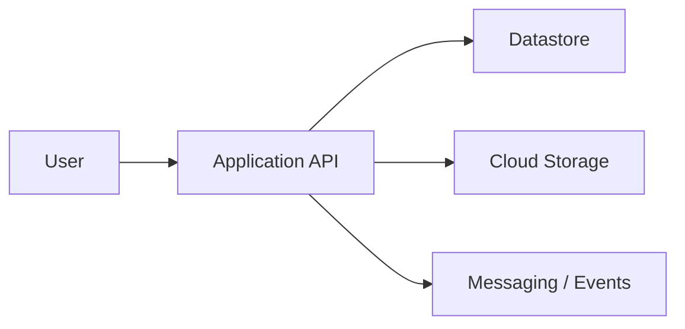
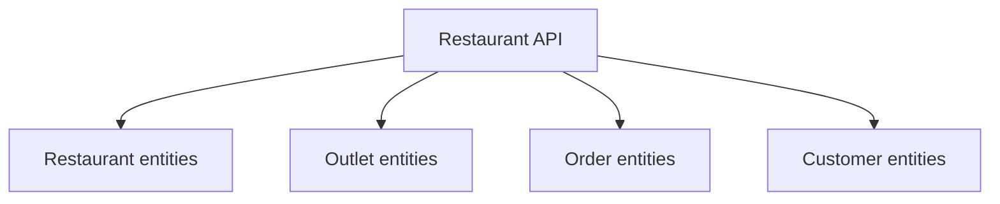
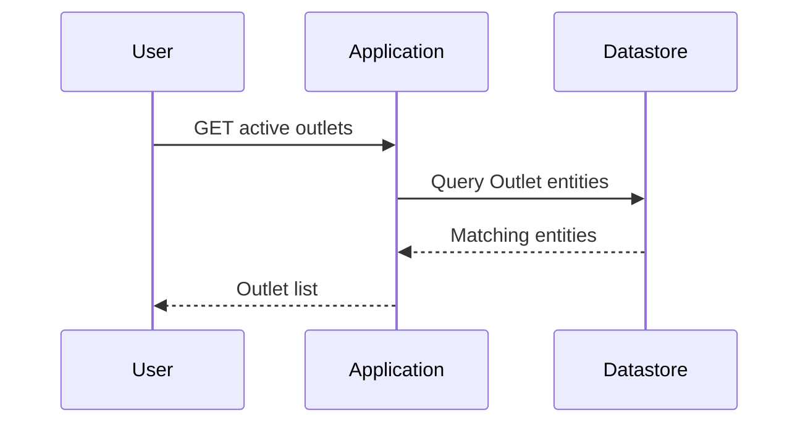
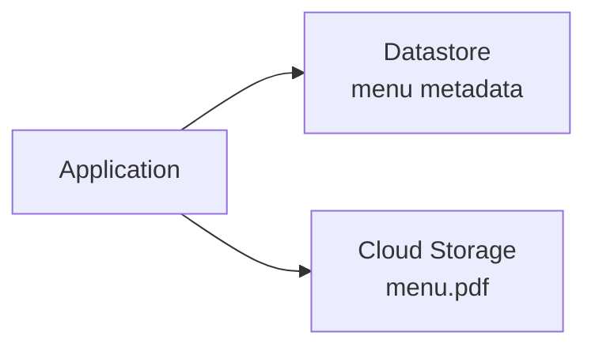
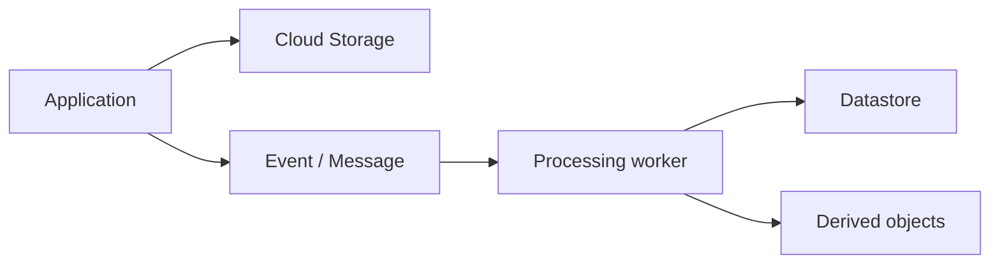
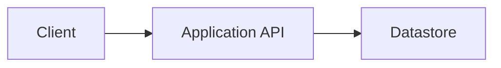

# 09 — Datastore in an Application

> 🎯 **Goal:** Connect Datastore concepts to a real application and understand where the database belongs in an overall GCP architecture.

## Application architecture

A typical application might look like:



Datastore should own structured application entities. Cloud Storage should own files and objects. Messaging services can handle asynchronous work.

## Restaurant SaaS example

Suppose our application manages restaurants and outlets.



The API translates business operations into Datastore reads, writes, and queries.

## Example request flow

User asks:

> “Show all active outlets for restaurant-001.”



The application should define the business operation. Datastore provides the persistence and query layer.

## Datastore + Cloud Storage

Suppose an outlet has a menu PDF.

Datastore can store:

```text
Outlet
  name = "Bandra"
  menuObject = "menus/outlet-101/menu.pdf"
```

Cloud Storage stores:

```text
menus/outlet-101/menu.pdf
```



This follows the same application/storage separation established in Chapter 4.

## Datastore + asynchronous processing

A file upload may need background processing.



For example, a worker could process a menu document and update Datastore with its processing status.

## Multi-tenant modeling

For a SaaS platform, entities should carry enough tenant context to support the application's authorization and query patterns.

Example:

```text
Outlet
  restaurantId = "restaurant-001"
  name = "Bandra"
  status = "active"
```

The database model alone is not sufficient for security. The application must enforce who is allowed to access that restaurant's data.

## Service boundaries

Do not expose the database as the application's public API.

Prefer:



rather than allowing arbitrary clients to construct database operations directly unless the architecture intentionally uses a supported client-side access model with appropriate security controls.

## Failure thinking

When Datastore is unavailable or an operation fails, the application needs a defined response.

Possible strategies include:

- Retry transient failures where appropriate.
- Return an appropriate error to the client.
- Avoid duplicate writes through idempotent operations.
- Use transactions when multiple related changes need atomicity.
- Use asynchronous processing for work that does not need to block the request.

## Interview scenario

**Question:** “Design an API that creates a restaurant and several outlets.”

A good discussion should cover:

1. Entity/key design.
2. Whether the operation needs atomicity.
3. Batch vs transaction semantics.
4. Validation.
5. Idempotency.
6. Authorization and tenant boundaries.
7. Error handling.
8. How the application exposes the operation.

## Floci vs real GCP ⚠️

Floci is useful for practicing local commands and concepts. It does not reproduce every production characteristic of Google Cloud.

Do not use a successful local operation as proof of:

- Production-scale performance.
- Production IAM behavior.
- Real quotas and limits.
- Regional availability.
- Production networking.
- Real reliability characteristics.

Those need to be evaluated in real GCP.

## Interview checkpoint 💡

**Question:** Where should Datastore sit in a typical application architecture?

**Answer:** Behind the application/service layer as the persistence system for structured application entities. The application controls business logic, authorization, validation, and error handling.

**Question:** How would you store a restaurant's menu PDF?

**Answer:** Store the PDF in Cloud Storage and keep metadata or the object path in Datastore.

## What you should understand before moving on

You should be able to:

- Place Datastore in an application architecture.
- Explain Datastore + Cloud Storage separation.
- Explain tenant-aware data modeling.
- Discuss transactions, batches, retries, and idempotency at a high level.
- Explain why Floci behavior should not be treated as production GCP behavior.

Next: **hands-on labs that combine Datastore entities, queries, and modeling decisions.**