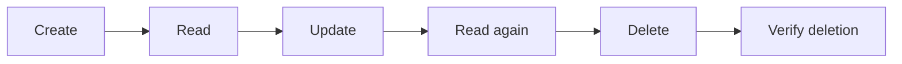
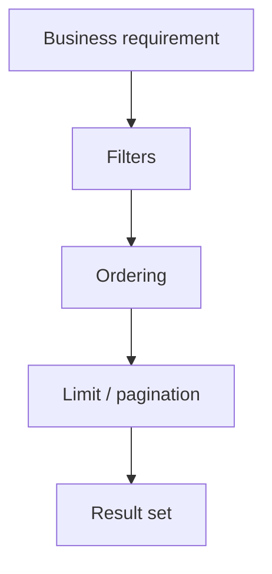
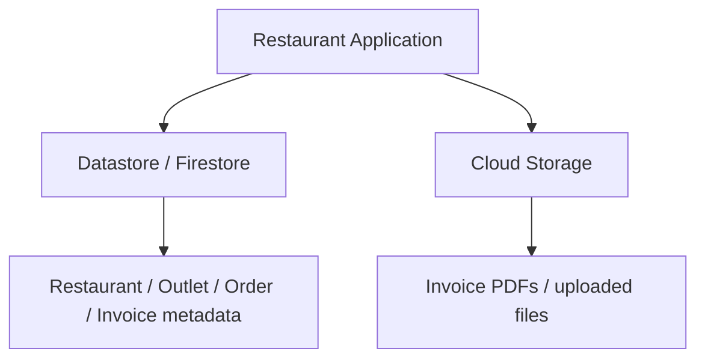

# 10 — Hands-On Labs

> 🧪 **Goal:** Practice Datastore with the Floci local environment and turn the concepts from this chapter into working data models and queries.

> ⚠️ **Important:** Floci is an emulator. Exact command support can vary by version. Before running a command, use `gcloud datastore --help` and the relevant subcommand's `--help` output.

## Lab 0 — Environment Check

Before starting:

```powershell
gcloud config get-value project
gcloud datastore --help
```

Confirm that your local environment is configured for the Floci project you have been using throughout the tutorial.

### Success criteria

- `gcloud` is available.
- The expected local project is configured.
- The Datastore command group is available in your environment.

---

# 🧪 Lab 1 — Restaurant Entity Workflow

## Objective

Create a small restaurant dataset and practice the basic entity lifecycle.

## Data model

Use a `Restaurant` kind with fields such as:

```text
name
city
status
outletCount
```

Create at least three restaurants:

```text
restaurant-001
restaurant-002
restaurant-003
```

Example data:

| Key | Name | City | Status | Outlets |
|---|---|---|---|---:|
| restaurant-001 | Floci Foods | Mumbai | active | 12 |
| restaurant-002 | Cloud Kitchen | Pune | active | 7 |
| restaurant-003 | Demo Bistro | Delhi | inactive | 3 |

## Tasks

1. Create the entities.
2. Read one restaurant by key.
3. Update its status.
4. Read it again.
5. Delete one restaurant.
6. Verify that the deleted entity is no longer returned by a direct lookup.

Use the CLI help to identify the exact commands supported by your Floci version.

```powershell
gcloud datastore --help
```

## Questions to answer

Before moving on, answer:

- What is the kind?
- What is the entity?
- What is the key?
- Which values are properties?
- Why is direct key lookup different from a query?

### Expected outcome

You should be comfortable describing the full entity lifecycle:



---

# 🧪 Lab 2 — Restaurant + Outlet Queries

## Objective

Model outlets and answer business questions using Datastore queries.

## Data model

Create an `Outlet` kind with properties such as:

```text
restaurantId
name
city
active
monthlyFee
```

Create at least six outlets across three restaurants.

Example:

| Key | Restaurant | City | Active | Monthly Fee |
|---|---|---|---|---:|
| outlet-101 | restaurant-001 | Mumbai | true | 15000 |
| outlet-102 | restaurant-001 | Pune | true | 18000 |
| outlet-103 | restaurant-001 | Mumbai | false | 12000 |
| outlet-201 | restaurant-002 | Pune | true | 10000 |
| outlet-202 | restaurant-002 | Mumbai | true | 16000 |
| outlet-301 | restaurant-003 | Delhi | false | 9000 |

## Queries to design

Try to answer:

### Query 1

> Find all active outlets.

```text
active = true
```

### Query 2

> Find outlets belonging to restaurant-001.

```text
restaurantId = restaurant-001
```

### Query 3

> Find active outlets with monthly fee greater than ₹10,000.

```text
active = true
monthlyFee > 10000
```

### Query 4

> Order matching outlets by monthly fee.

### Query 5

> Limit the result set.

Use the Datastore help output to discover the exact query syntax supported by your environment.

## Expected outcome

You should be able to translate a business requirement into a database access pattern:



## Questions to answer

- Which properties are being queried?
- Which queries could require composite indexes?
- Would you use a direct key lookup if the outlet key is already known?
- What happens if the result set becomes very large?

---

# 🧪 Final Lab — Firestore vs Datastore Modeling Challenge

## Objective

Take a small restaurant platform and design it twice: once using Firestore concepts and once using Datastore concepts.

## Requirements

The system manages:

- Restaurants.
- Outlets.
- Customers.
- Orders.
- Invoices.

The application needs to:

1. Find a restaurant by ID.
2. List active outlets for a restaurant.
3. Find recent orders for an outlet.
4. Find invoices for a restaurant.
5. Store invoice PDF metadata.
6. Support multiple restaurants as tenants.

## Part A — Firestore model

Draw the conceptual model using:

```text
collections
  ↓
documents
  ↓
fields / subcollections
```

## Part B — Datastore model

Draw the conceptual model using:

```text
kinds
  ↓
entities
  ↓
properties / keys
```

Consider whether parent-child key hierarchies are appropriate.

## Part C — Compare

Create a table:

| Requirement | Firestore design | Datastore design |
|---|---|---|
| Restaurant lookup | | |
| Active outlet query | | |
| Recent orders | | |
| Invoice query | | |
| Tenant boundary | | |
| Invoice PDF metadata | | |

## Part D — Architecture

Connect the database to the storage architecture from Chapter 4.



## Part E — Interview explanation

Explain your design aloud as if an interviewer asked:

> “Why did you choose this data model?”

Your explanation should cover:

- Access patterns.
- Entity/document identity.
- Query requirements.
- Index requirements.
- Data duplication.
- Consistency requirements.
- Tenant isolation.
- Storage vs database responsibilities.

---

# 🏁 Lab Completion Checklist

- [ ] I can create a Datastore entity.
- [ ] I can identify a kind, entity, property, and key.
- [ ] I can retrieve an entity by key.
- [ ] I can update an entity.
- [ ] I can delete an entity.
- [ ] I can build a property-based query.
- [ ] I understand ordering and limits.
- [ ] I understand why indexes matter.
- [ ] I can explain parent-child key hierarchy.
- [ ] I can explain Datastore vs Firestore.
- [ ] I can design a tenant-aware application model.
- [ ] I can explain why PDFs belong in Cloud Storage rather than Datastore.

## Final challenge

If you can complete the final modeling challenge **without looking back at the previous chapters**, you are ready to move to Chapter 7 — BigQuery.