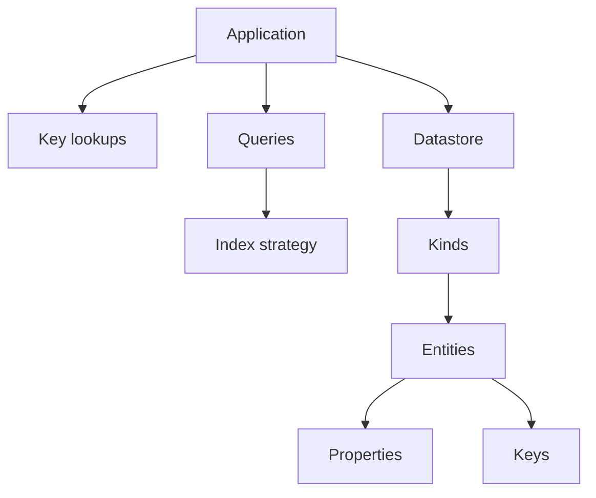
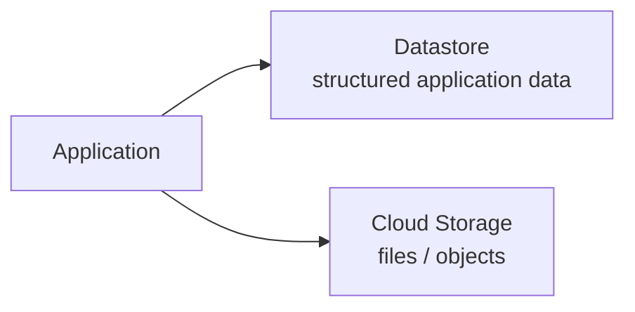

# 11 — Learning Checklist

> 🎯 **Goal:** Use this file as the final revision sheet before moving from Datastore to BigQuery.

## 1. Core concepts

- [ ] I can explain what Datastore is.
- [ ] I can explain why it is a NoSQL database.
- [ ] I can explain what a kind is.
- [ ] I can explain what an entity is.
- [ ] I can explain what a property is.
- [ ] I can explain what a key is.
- [ ] I can explain numeric IDs vs string names.
- [ ] I can explain parent-child key hierarchy.
- [ ] I understand namespaces at a conceptual level.

## 2. CRUD

- [ ] I can create an entity.
- [ ] I can read an entity by key.
- [ ] I can update an entity.
- [ ] I can delete an entity.
- [ ] I understand batch operations at a high level.
- [ ] I understand why concurrent updates can require stronger coordination.

## 3. Queries

- [ ] I understand direct key lookup vs query.
- [ ] I can describe a kind query.
- [ ] I understand property filters.
- [ ] I understand ordering.
- [ ] I understand limits.
- [ ] I understand pagination conceptually.
- [ ] I understand ancestor queries conceptually.

## 4. Indexes

- [ ] I know why Datastore uses indexes.
- [ ] I understand the purpose of composite indexes.
- [ ] I know that some queries require additional index configuration.
- [ ] I understand that indexes have storage/write-maintenance costs.
- [ ] I can derive index requirements from application queries.

## 5. Data modeling

- [ ] I can design entities from access patterns.
- [ ] I understand denormalization.
- [ ] I understand the consistency trade-off of duplicated data.
- [ ] I can identify unbounded data that should not be embedded into one entity.
- [ ] I can explain when a key hierarchy might be useful.
- [ ] I can distinguish a parent-child key from a simple ID property.

## 6. Firestore vs Datastore

| Question | Firestore | Datastore |
|---|---|---|
| Data unit | Document | Entity |
| Grouping | Collection | Kind |
| Attribute | Field | Property |
| Identity | Document ID/path | Key |
| Hierarchy | Document/subcollection paths | Key hierarchy |
| Query API | Firestore queries | Datastore queries |

I should be able to explain this table rather than simply memorize it.

## 7. Application architecture

- [ ] I can place Datastore behind an application/API layer.
- [ ] I know when to use Datastore for structured data.
- [ ] I know when Cloud Storage is more appropriate.
- [ ] I can store a Cloud Storage object path as application metadata.
- [ ] I understand tenant-aware modeling.
- [ ] I understand that the data model alone is not an authorization system.
- [ ] I can discuss retries and idempotency at a high level.

## 8. Floci vs real GCP

- [ ] I understand that Floci is an emulator.
- [ ] I verify commands with `gcloud ... --help` when emulator support varies.
- [ ] I do not assume emulator behavior equals production GCP.
- [ ] I understand that production IAM, networking, quotas, scaling, reliability, and infrastructure behavior require real GCP evaluation.

## 9. Interview readiness

Try answering these without notes.

### Fundamentals

1. What is Google Cloud Datastore?
2. What is a Datastore entity?
3. What is a kind?
4. What is a property?
5. What is a Datastore key?
6. What is the difference between a numeric ID and a string name?
7. What is a parent-child key hierarchy?
8. What is a namespace?

### Queries and indexes

9. What is the difference between a key lookup and a query?
10. Why does Datastore use indexes?
11. What is a composite index?
12. What would you do if a query requires an index?
13. Why shouldn't you create unnecessary indexes?
14. How do filters and ordering influence index requirements?
15. Why should large result sets be paginated?

### Data modeling

16. How do you design a Datastore model?
17. Why is access-pattern-driven design important?
18. What is denormalization?
19. What is the trade-off of denormalization?
20. Why can an unbounded list inside one entity be problematic?
21. When would you use a key hierarchy?
22. When would you keep entities in separate kinds?

### Firestore comparison

23. What is the difference between Firestore and Datastore?
24. Collection vs kind?
25. Document vs entity?
26. Field vs property?
27. Document ID vs Datastore key?
28. Would you automatically migrate an existing Datastore application to Firestore?

### Architecture

29. Where does Datastore fit in an application architecture?
30. Where would you store an invoice PDF?
31. How would you model multiple restaurant tenants?
32. How would you handle concurrent updates?
33. How would you design a restaurant/order system around Datastore?

## 10. Final mental model

Remember this:

And remember the architectural boundary:

## 🏁 Chapter completion rule

Do not move to Chapter 7 just because the labs worked.

You are ready when you can explain, in your own words:

> **What problem does Datastore solve, how is its entity/key model different from Firestore, how do queries and indexes work, how would you model a real application, and where does Datastore fit relative to Cloud Storage?**

Next chapter: **Chapter 7 — BigQuery**.