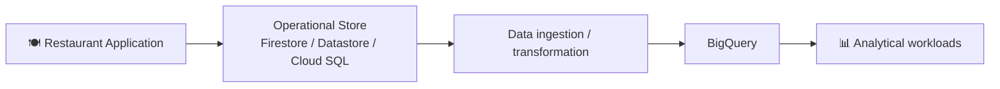

# Chapter 7 — BigQuery

## 01 — Introduction to BigQuery

> 🎯 **Goal:** Understand BigQuery as an analytical data warehouse and learn why it belongs beside, rather than inside, the transactional application database.

## What is BigQuery?

BigQuery is Google Cloud's managed, serverless data warehouse for large-scale analytics.

The easiest mental model is:

```text
Firestore / Datastore / Cloud SQL
        ↓
  Operational data
        ↓
      BigQuery
        ↓
 Analytics / reporting / insights
```

A restaurant application may need to create an order in milliseconds. A finance team may need to analyze millions of orders across months or years. These are different workloads.

## Why does a data warehouse exist?

Suppose a restaurant SaaS platform has:

- 10,000 restaurants
- 100,000 outlets
- Millions of orders
- Large order-item history

An operational application might ask:

> “Show order `ORD-1001`.”

Analytics might ask:

> “What was monthly revenue for every restaurant, broken down by outlet and city?”

The second question can require scanning, joining and aggregating a large amount of historical data. A data warehouse is designed for this kind of workload.

## OLTP → OLAP



**OLTP** generally focuses on application transactions: small reads/writes, current state and consistency around business operations.

**OLAP** focuses on analysis: large scans, aggregations, joins, historical trends and reporting.

## BigQuery mental model

Think:

```text
Project
  ↓
Dataset
  ↓
Table
  ↓
Rows + columns
  ↓
SQL queries
```

A BigQuery dataset can contain tables such as:

```text
restaurant_analytics
├── restaurants
├── outlets
├── orders
└── order_items
```

## What BigQuery is good at

- Large analytical queries.
- Aggregations such as `SUM`, `COUNT` and `AVG`.
- Joining analytical datasets.
- Historical reporting.
- Business intelligence workloads.
- SQL-based exploration.
- Scanning large datasets without managing database servers yourself.

## What BigQuery is not primarily for

BigQuery should not normally be the application's primary transactional store for operations such as:

```text
Create order
Update customer profile
Change invoice status
Read one user's current cart
```

Those operations generally belong in an operational data store selected for the application's access patterns.

## Restaurant example

Operational data:

```text
Order
  id = ORD-1001
  outletId = OUT-101
  status = COMPLETED
  total = 1250
```

Analytical data might be used to answer:

```text
Revenue by outlet
Revenue by restaurant
Revenue by day
Revenue by month
Average order value
Order volume
Top-selling items
Revenue trends
```

## Interview checkpoint 💡

**Q: What is BigQuery?**

**A:** BigQuery is a managed, serverless data warehouse designed for analytical workloads using SQL at large scale.

**Q: Why not use Firestore for all analytics?**

**A:** Firestore is designed around application/document access patterns. Large analytical scans, joins and aggregations across historical data are better suited to an analytical warehouse such as BigQuery.

**Q: Is BigQuery an OLTP database?**

**A:** No. Its primary purpose is OLAP/analytical workloads, not serving the application's transactional request path.

## Floci vs real GCP ⚠️

This tutorial uses Floci for local learning. Do not assume that a local emulator implements every BigQuery capability or production behavior.

Where a BigQuery feature is unavailable or behaves differently in Floci, the notes will identify the production GCP concept separately.

## What you should understand before moving on

You should be able to explain:

1. What BigQuery solves.
2. Why data warehouses exist.
3. OLTP vs OLAP.
4. Why Firestore/Datastore and BigQuery have different roles.
5. Why BigQuery is useful for restaurant analytics.

Next: **Data warehouses and OLTP vs OLAP in more detail.**
