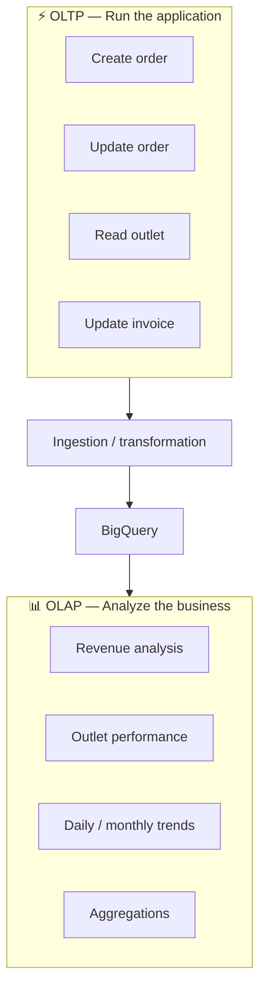
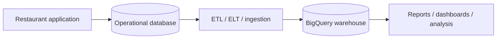

# 02 — Data Warehouse and OLTP vs OLAP 🏢📊

## 🎯 Learning Objective

Understand the workload difference between operational databases and analytical warehouses, and learn how to explain the distinction in an interview.

## OLTP: Online Transaction Processing

OLTP systems support the application's day-to-day transactions.

Restaurant examples:

- Create an order.
- Update an order status.
- Save an outlet.
- Update an invoice.
- Read a customer's current details.

Typical characteristics:

| Characteristic | OLTP |
|---|---|
| Query pattern | Small, predictable reads/writes |
| Data | Current operational state |
| Transactions | Important |
| Latency | Usually request-oriented |
| Example | Firestore, Datastore, Cloud SQL |

## OLAP: Online Analytical Processing

OLAP systems answer questions over large amounts of data.

Examples:

- What was revenue last month?
- Which outlets grew fastest?
- What is average order value by restaurant?
- How many orders were placed each day?
- Which products contribute most to revenue?

Typical characteristics:

| Characteristic | OLAP |
|---|---|
| Query pattern | Large scans and aggregations |
| Data | Historical/analytical |
| Transactions | Not the primary concern |
| Latency | Query-oriented |
| Example | BigQuery |

## Mental model



## Why not run analytics directly on the application database?

Imagine the application has millions of orders. An analyst runs a query that scans years of data while customers are placing orders.

Potential problems include:

- Resource contention.
- Increased operational query latency.
- Analytical queries competing with transactional traffic.
- Different optimization requirements.
- Poor separation between application and reporting workloads.

A warehouse creates a dedicated analytical environment.

## Data warehouse

A data warehouse stores data in a form optimized for analytical workloads.

A simplified restaurant pipeline looks like:



## ETL vs ELT — basic interview level

**ETL** means:

```text
Extract → Transform → Load
```

**ELT** means:

```text
Extract → Load → Transform
```

Modern analytical platforms often make ELT practical because substantial transformation can happen inside the warehouse.

You do not need to memorize a single universal architecture. The correct approach depends on data sources, transformation requirements and operational constraints.

## Restaurant SaaS example

A restaurant order service may write:

```text
orders
- order_id
- outlet_id
- order_date
- status
- total_amount
```

BigQuery can then support:

```sql
SELECT outlet_id, SUM(total_amount) AS revenue
FROM orders
WHERE status = 'COMPLETED'
GROUP BY outlet_id;
```

The first system is concerned with recording the order. BigQuery is concerned with understanding the accumulated order history.

## Interview checkpoints 🎤

**Q: What is the difference between OLTP and OLAP?**

OLTP serves transactional application operations; OLAP serves analytical queries over larger datasets, often involving scans, joins and aggregations.

**Q: Why separate them?**

Because the workloads have different access patterns, scaling characteristics and performance requirements.

**Q: Can the same data exist in both?**

Yes. An operational system can be the source of truth while a copy or transformed representation is maintained in BigQuery for analytics.

## Common mistake ⚠️

Do not describe BigQuery as simply “a faster database.” Its primary role and workload model are different from an operational database.

## What you should remember

> **OLTP runs the business. OLAP helps analyze the business.**

Next: **BigQuery architecture and the project → dataset → table mental model.**
