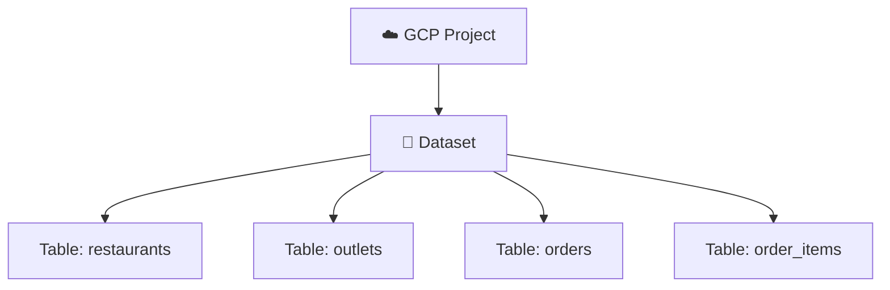
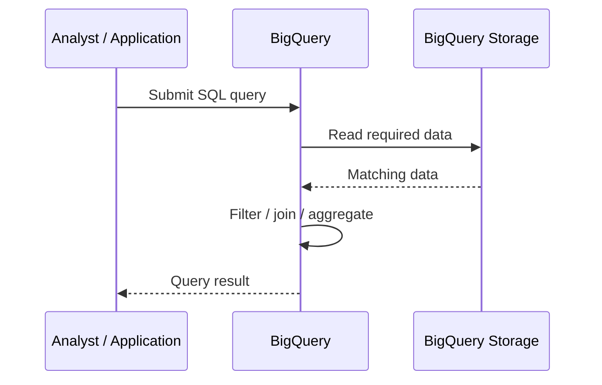
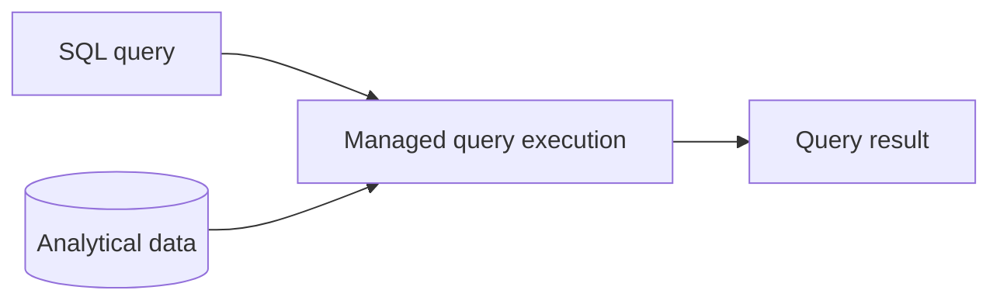

# 03 — BigQuery Architecture and Mental Model 🧠

## 🎯 Learning Objective

Understand the BigQuery resource hierarchy and the high-level flow of an analytical query.

## Resource hierarchy



A useful mental model is:

> **Project → Dataset → Table → Row / Column**

### Project

The project provides the broader GCP resource and billing context.

### Dataset

A dataset groups related BigQuery tables and other analytical resources.

Example:

```text
floci-local
└── restaurant_analytics
```

### Table

A table contains structured analytical data.

```text
restaurant_analytics.orders
```

### Row and column

Rows represent records and columns represent attributes defined by the schema.

## Query mental model

When you submit SQL, think of it as an analytical job rather than a normal application CRUD request.



The exact internal implementation is managed by Google Cloud. For interview preparation, focus on the separation between submitting a query and the underlying managed analytical execution.

## Serverless mental model

With BigQuery, you generally do not provision and manage a fleet of database servers before running an analytical query.

Think:

```text
You manage:
  • datasets
  • tables
  • schemas
  • queries
  • data

Google manages:
  • underlying infrastructure
  • query execution infrastructure
  • service scaling
```

The exact operational and pricing details belong to the current Google Cloud product model; always verify production-specific limits and pricing before deployment.

## Separation of storage and query execution

A useful conceptual model is:



This is one reason BigQuery should not be mentally modeled as a traditional single-server relational database.

## Restaurant SaaS organization

A project might contain an analytical dataset such as:

```text
Project: floci-local

Dataset: restaurant_analytics

Tables:
  restaurants
  outlets
  orders
  order_items
  invoices
```

A query can combine those tables to answer business questions.

## Dataset boundaries

Datasets are useful for organization and access-control boundaries. For example:

```text
restaurant_analytics
├── orders
├── order_items
└── invoices

operations_analytics
├── outlet_activity
└── onboarding_events
```

Do not create a dataset for every table without a reason. Use datasets to represent meaningful analytical groupings.

## Interview checkpoints 🎤

**Q: What is the BigQuery hierarchy?**

A common mental model is Project → Dataset → Table → Rows/Columns.

**Q: What does a dataset do?**

It groups related BigQuery resources, especially tables, and provides an important organizational and access-control boundary.

**Q: Is BigQuery serverless?**

Yes. BigQuery is a managed/serverless analytical service; users do not normally manage the underlying query-serving infrastructure.

## Floci note ⚠️

Use the local environment to practice the concepts and commands that Floci supports. Do not assume emulator behavior represents all production BigQuery architecture, limits or performance characteristics.

Next: **Datasets, tables, schemas and data types.**
