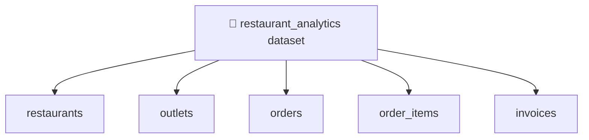
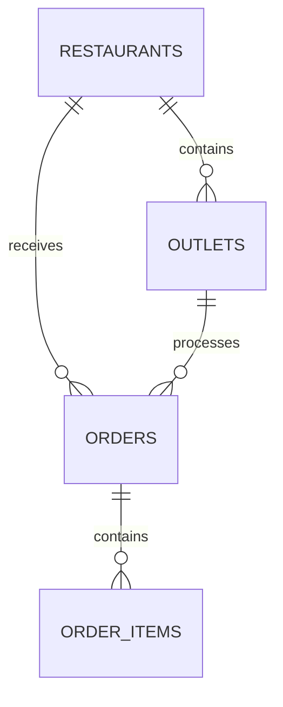

# 04 — Datasets, Tables, Schemas and Data Types 🧱

## 🎯 Learning Objective

Learn how analytical data is structured in BigQuery and design a simple restaurant analytics model.

## Dataset → tables

A dataset is a logical grouping. Tables contain the actual structured records.

## Restaurant analytics model

### `restaurants`

| Column | Type | Purpose |
|---|---|---|
| restaurant_id | STRING | Restaurant identifier |
| name | STRING | Restaurant name |
| city | STRING | City |

### `outlets`

| Column | Type | Purpose |
|---|---|---|
| outlet_id | STRING | Outlet identifier |
| restaurant_id | STRING | Parent restaurant |
| city | STRING | Outlet city |
| active | BOOL | Whether outlet is active |

### `orders`

| Column | Type | Purpose |
|---|---|---|
| order_id | STRING | Order identifier |
| restaurant_id | STRING | Restaurant identifier |
| outlet_id | STRING | Outlet identifier |
| order_date | DATE | Business date |
| order_timestamp | TIMESTAMP | Event timestamp |
| status | STRING | Order status |
| total_amount | NUMERIC | Order value |

### `order_items`

| Column | Type | Purpose |
|---|---|---|
| order_item_id | STRING | Item identifier |
| order_id | STRING | Parent order |
| item_name | STRING | Product name |
| quantity | INT64 | Quantity sold |
| unit_price | NUMERIC | Price per unit |
| line_amount | NUMERIC | Line total |

## Common BigQuery data types

| Type | Example |
|---|---|
| `STRING` | `"Mumbai"` |
| `INT64` | `12` |
| `NUMERIC` | `1250.50` |
| `BOOL` | `TRUE` |
| `DATE` | `2026-09-17` |
| `DATETIME` | `2026-09-17 19:30:00` |
| `TIMESTAMP` | `2026-09-17 14:00:00 UTC` |
| `ARRAY` | Multiple values |
| `STRUCT` | Nested fields |

For this chapter, focus on the common scalar types first. Nested and repeated data will be introduced only at a basic conceptual level.

## DATE vs DATETIME vs TIMESTAMP

This distinction is interview-relevant.

- **DATE** — calendar date without a time.
- **DATETIME** — date and time without a timezone interpretation.
- **TIMESTAMP** — an absolute point in time.

For restaurant analytics, `order_date` is useful for daily partitioning and reporting, while `order_timestamp` can preserve the exact event time.

## Relationships are still useful

BigQuery tables can be related logically even though BigQuery is not being used as the transactional system.

These relationships allow analytical joins.

## Analytical schema design

The goal is not to reproduce every application object blindly.

Ask:

1. What business questions will we answer?
2. Which fields are required for those questions?
3. Which fields are used for filtering?
4. Which fields are used for grouping and joins?
5. Which timestamp/date should drive time-based analysis?

## Interview checkpoint 🎤

**Q: Why might the BigQuery schema differ from the application schema?**

Because analytical workloads have different access patterns. Data may be flattened, denormalized, enriched or transformed to make reporting and analysis more efficient.

**Q: Why keep `order_date` if you already have a timestamp?**

A separate business date can simplify reporting and time-based partitioning, especially when business-day rules differ from raw event timestamps.

Next: **Loading and managing analytical data.**
