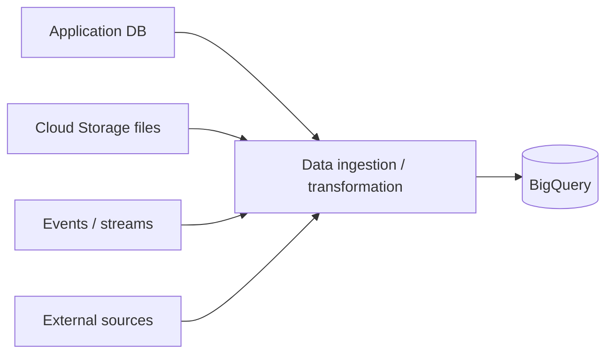
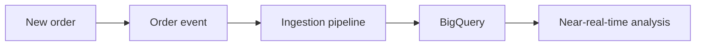

# 05 — Loading and Managing Data 📥

## 🎯 Learning Objective

Understand how analytical data reaches BigQuery and the difference between batch loading and ongoing ingestion.

## Where can analytical data come from?

A restaurant platform might receive data from:



Common approaches include batch loads, scheduled pipelines and streaming/incremental ingestion.

## Batch loading

Batch loading is appropriate when data can arrive in groups.

Example:

```text
Every night
    ↓
Export yesterday's completed orders
    ↓
Load into BigQuery
    ↓
Run transformations / validation
```

This is often easier to reason about than real-time ingestion.

## Incremental / streaming ingestion

Some systems need analytics data to become available quickly.

Example:



The exact service used for ingestion depends on the architecture. Pub/Sub and Dataflow become relevant in later chapters.

## Loading data: the important concepts

When loading data, understand:

- Source format.
- Schema.
- Append vs overwrite behavior.
- Validation.
- Transformation.
- Duplicate handling.
- Incremental boundaries.
- Failure and retry strategy.

Do not memorize only one command. Understand what the command is doing.

## Example sample CSV

```csv
order_id,restaurant_id,outlet_id,order_date,status,total_amount
ORD-1001,R-001,O-101,2026-09-15,COMPLETED,1250.00
ORD-1002,R-001,O-102,2026-09-15,COMPLETED,850.00
ORD-1003,R-002,O-201,2026-09-16,CANCELLED,500.00
```

This can be loaded into an `orders` table when the local environment supports the corresponding BigQuery workflow.

## CLI mental model

The exact commands supported by Floci can vary. Before using a command, inspect help in your environment:

```bash
gcloud --help
gcloud components --help
gcloud beta --help
```

If the environment exposes BigQuery commands, use the corresponding `bq` or `gcloud` workflow supported by that environment.

## Append vs overwrite

Suppose yesterday's data is already loaded.

### Append

```text
Existing rows
      +
New rows
      ↓
Larger table
```

Useful for incremental records when the incoming data is new.

### Overwrite

```text
Existing table
      ↓
Replace with new dataset
```

Useful when the incoming dataset is intended to become the complete replacement, but dangerous if used accidentally.

## Data quality questions

Before loading production data, ask:

- Are IDs unique?
- Are dates valid?
- Are amounts numeric?
- Can an order appear twice?
- What happens when an order is corrected?
- How are late-arriving records handled?
- How do we identify the source of a row?

## Restaurant example: late-arriving order

An order from September 15 may arrive in the analytics pipeline on September 17.

A robust pipeline should not assume that ingestion date and business date are always the same.

```text
order_date       = 2026-09-15
ingestion_date   = 2026-09-17
```

This distinction becomes important for incremental processing and partition-aware queries.

## Floci vs real GCP ⚠️

Floci is used for local learning. BigQuery loading modes, formats, authentication, limits and integration behavior may differ from production Google Cloud.

For every lab:

1. Run the supported local command.
2. Verify the actual result.
3. Treat unsupported production features as conceptual unless the emulator implements them.

## Interview checkpoints 🎤

**Q: What is a load job?**

Conceptually, it is a managed operation that takes data from a supported source and loads it into a BigQuery table according to the supplied configuration/schema.

**Q: Batch or streaming?**

Choose based on freshness requirements, complexity, cost and operational needs. Not every analytics workload needs real-time ingestion.

Next: **SQL fundamentals for analytical questions.**
