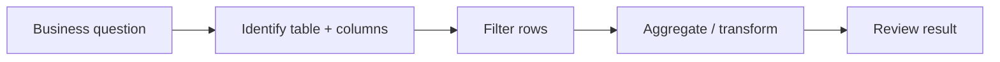

# 06 — SQL Fundamentals for Analytics 🔎

## 🎯 Learning Objective

Turn restaurant business questions into analytical SQL queries.

## Start with the business question

Do not start by memorizing SQL syntax. Start with the question.

Example:

> How much completed revenue did each outlet generate?

Translate it into:

```text
Source       → orders
Filter       → status = COMPLETED
Measure      → SUM(total_amount)
Group        → outlet_id
```

Then write SQL.

## SELECT

```sql
SELECT order_id, outlet_id, total_amount
FROM orders;
```

`SELECT` chooses the columns returned by the query.

## WHERE

```sql
SELECT order_id, outlet_id, total_amount
FROM orders
WHERE status = 'COMPLETED';
```

`WHERE` filters rows before the analytical result is produced.

## ORDER BY

```sql
SELECT order_id, total_amount
FROM orders
WHERE status = 'COMPLETED'
ORDER BY total_amount DESC;
```

This sorts the result.

## LIMIT

```sql
SELECT order_id, total_amount
FROM orders
ORDER BY total_amount DESC
LIMIT 10;
```

Useful for exploration and limiting returned results.

## Date filtering

```sql
SELECT order_id, total_amount
FROM orders
WHERE order_date >= DATE '2026-09-01'
  AND order_date < DATE '2026-10-01';
```

Using a half-open range (`>= start` and `< end`) is often easier to reason about than inclusive end-date logic.

## Selecting only required columns

Prefer:

```sql
SELECT outlet_id, total_amount
FROM orders;
```

over:

```sql
SELECT *
FROM orders;
```

For large analytical tables, selecting unnecessary columns can increase the amount of data read and therefore affect performance/cost depending on the query and table design.

## Business-question workflow



## Example: completed orders in Mumbai

```sql
SELECT order_id, outlet_id, total_amount
FROM orders
WHERE status = 'COMPLETED'
  AND outlet_id IN (
    SELECT outlet_id
    FROM outlets
    WHERE city = 'Mumbai'
  );
```

This introduces a subquery. In later exercises, you will often solve the same business question with a `JOIN`.

## Interview checkpoints 🎤

**Q: What is the difference between WHERE and HAVING?**

`WHERE` filters rows before grouping; `HAVING` filters grouped/aggregated results.

**Q: Why avoid SELECT * in large analytical queries?**

Because you may read columns that are not needed, increasing unnecessary data processing and potentially query cost.

**Q: How do you approach an unfamiliar analytics query?**

Start from the business question, identify dimensions/measures, identify filters and grouping, then build and validate the SQL incrementally.

Next: **Aggregations, joins and window functions.**
