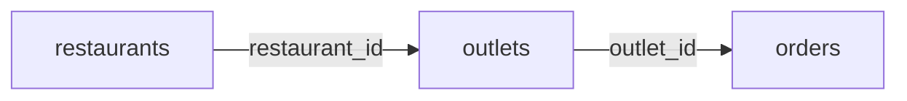

# 07 — Aggregations, JOINs and Window Functions 📊

## 🎯 Learning Objective

Use the SQL patterns that appear frequently in business analytics and interviews.

## Aggregations

Common aggregate functions:

| Function | Purpose |
|---|---|
| `COUNT` | Count rows/values |
| `SUM` | Add numeric values |
| `AVG` | Calculate average |
| `MIN` | Smallest value |
| `MAX` | Largest value |

Example:

```sql
SELECT
  COUNT(*) AS order_count,
  SUM(total_amount) AS revenue,
  AVG(total_amount) AS average_order_value
FROM orders
WHERE status = 'COMPLETED';
```

## GROUP BY

To calculate revenue by outlet:

```sql
SELECT
  outlet_id,
  SUM(total_amount) AS revenue
FROM orders
WHERE status = 'COMPLETED'
GROUP BY outlet_id
ORDER BY revenue DESC;
```

Mental model:

```text
Rows
 ↓
Filter
 ↓
Group by dimension
 ↓
Aggregate measures
 ↓
Result
```

## HAVING

Use `HAVING` to filter groups after aggregation.

```sql
SELECT
  outlet_id,
  SUM(total_amount) AS revenue
FROM orders
WHERE status = 'COMPLETED'
GROUP BY outlet_id
HAVING SUM(total_amount) > 100000;
```

## JOINs

Analytical questions often require data from multiple tables.

Example:

> Show restaurant name, outlet city and revenue.



Query:

```sql
SELECT
  r.name AS restaurant_name,
  o.city,
  SUM(ord.total_amount) AS revenue
FROM orders ord
JOIN outlets o
  ON ord.outlet_id = o.outlet_id
JOIN restaurants r
  ON o.restaurant_id = r.restaurant_id
WHERE ord.status = 'COMPLETED'
GROUP BY r.name, o.city
ORDER BY revenue DESC;
```

## INNER JOIN vs LEFT JOIN

### INNER JOIN

Returns rows where the join condition matches on both sides.

### LEFT JOIN

Keeps every row from the left table and adds matching data from the right table when available.

Restaurant example:

> Show every outlet, including outlets with no completed orders.

```sql
SELECT
  o.outlet_id,
  o.city,
  COALESCE(SUM(ord.total_amount), 0) AS revenue
FROM outlets o
LEFT JOIN orders ord
  ON o.outlet_id = ord.outlet_id
 AND ord.status = 'COMPLETED'
GROUP BY o.outlet_id, o.city;
```

Notice that the order filter is part of the join condition. Moving it blindly into `WHERE` can change the behavior of a `LEFT JOIN`.

## Window functions

Window functions calculate values across related rows without collapsing them into one row per group.

Example: rank outlets by revenue.

```sql
SELECT
  outlet_id,
  revenue,
  RANK() OVER (ORDER BY revenue DESC) AS revenue_rank
FROM outlet_revenue;
```

Example: running revenue by date:

```sql
SELECT
  order_date,
  daily_revenue,
  SUM(daily_revenue) OVER (
    ORDER BY order_date
  ) AS cumulative_revenue
FROM daily_revenue;
```

Useful functions to recognize:

- `ROW_NUMBER()`
- `RANK()`
- `DENSE_RANK()`
- `SUM() OVER (...)`
- `AVG() OVER (...)`

## GROUP BY vs window function

`GROUP BY` reduces multiple rows into grouped output.

A window function generally keeps the original row-level detail while adding an analytical value.

```text
GROUP BY
100 orders → 10 outlet rows

WINDOW FUNCTION
100 orders → 100 rows + analytical calculation
```

## Restaurant analytics example

Average order value (AOV):

```sql
SELECT
  outlet_id,
  SUM(total_amount) / COUNT(*) AS aov
FROM orders
WHERE status = 'COMPLETED'
GROUP BY outlet_id;
```

In production, define exactly what counts as an order and how refunds, cancellations, taxes and discounts affect the business metric before trusting the result.

## Interview checkpoints 🎤

**Q: GROUP BY vs window functions?**

`GROUP BY` collapses rows into groups. Window functions calculate across a window while normally retaining individual rows.

**Q: INNER JOIN vs LEFT JOIN?**

INNER JOIN returns matching rows. LEFT JOIN preserves all rows from the left side even when there is no match.

**Q: What is HAVING?**

A filter applied to grouped/aggregated results.

Next: **Partitioning, clustering and query performance.**
