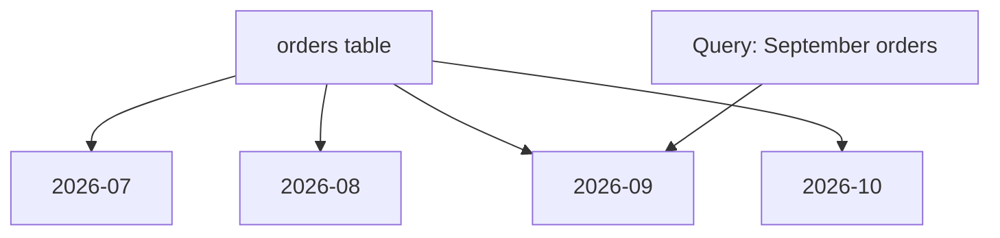

# 08 — Partitioning, Clustering and Query Performance ⚡

## 🎯 Learning Objective

Understand the BigQuery concepts that help analytical tables scale efficiently and how query design can affect performance and cost.

## Why partition a table?

Imagine an `orders` table containing several years of data.

If a query only needs September 2026, we want the system to avoid unnecessary work where possible.

Partitioning divides table data into partitions, commonly by a date/time column.



The exact physical execution is managed by BigQuery; the key interview concept is that a well-designed partition filter can reduce unnecessary data scanned.

## Partition pruning

A query such as:

```sql
SELECT
  outlet_id,
  SUM(total_amount) AS revenue
FROM orders
WHERE order_date >= DATE '2026-09-01'
  AND order_date < DATE '2026-10-01'
GROUP BY outlet_id;
```

provides a clear date restriction when `order_date` is the partitioning column.

This can enable partition pruning.

## Choosing a partition column

Common candidates are:

- Event date.
- Order date.
- Ingestion date.
- Timestamp-derived date.

For restaurant order analytics, a business date or event date is often a natural candidate, but the choice should follow query patterns and data semantics.

## Clustering

Clustering organizes data based on selected columns within the table/partitioning structure.

For example:

```text
PARTITION BY order_date
CLUSTER BY restaurant_id, outlet_id
```

The idea is to make queries that frequently filter or group on those fields more efficient.


## Partitioning vs clustering

| Concept | Main idea |
|---|---|
| Partitioning | Divides table data into larger logical partitions |
| Clustering | Organizes data based on selected columns within the table/partitions |
| Partition filter | Can eliminate irrelevant partitions |
| Cluster-aware filtering | Can reduce unnecessary work within relevant data |

## Query performance habits

### 1. Avoid unnecessary columns

Prefer:

```sql
SELECT outlet_id, total_amount
FROM orders;
```

over:

```sql
SELECT *
FROM orders;
```

### 2. Filter early

Use selective filters that match the analytical question.

### 3. Use partition filters

When a table is partitioned by date, use the partitioning column in time-bounded analytics queries where appropriate.

### 4. Join intentionally

Understand which tables are being joined and whether the join can multiply rows unexpectedly.

### 5. Aggregate at the right level

Do not calculate outlet-level metrics from an incorrectly joined order-item table without considering row multiplication.

## The order-item multiplication problem

Suppose:

```text
Order ORD-1 = ₹1,000
Order items = 4 rows
```

If you join orders to order_items and then sum `order.total_amount`, you may accidentally count ₹1,000 four times.

Safer patterns may require aggregating the child table first or choosing the correct grain for the metric.

This is an important analytics interview concept: **always know the grain of your data.**

## Query cost concepts

BigQuery pricing can depend on the amount of data processed for the query and the selected billing model. Pricing details change over time, so use current Google Cloud pricing documentation for production decisions.

For interview purposes, remember:

```text
More unnecessary data read
        ↓
Potentially more processing
        ↓
Potentially higher query cost
```

Performance and cost are related, but they are not identical concepts.

## Query design checklist

Before running an expensive analytical query, ask:

- Do I need all columns?
- Do I have a useful date filter?
- Is the table partitioned?
- Am I filtering the partition column?
- Would clustering help the common access pattern?
- Can a join multiply rows?
- Am I aggregating at the correct grain?
- Do I really need the entire historical range?

## Interview checkpoints 🎤

**Q: What is partitioning?**

Partitioning divides table data into partitions, commonly based on a date/time column, allowing queries to avoid irrelevant partitions when appropriate.

**Q: What is clustering?**

Clustering organizes table data around selected columns to improve access for common filtering/grouping patterns.

**Q: Partitioning vs clustering?**

Partitioning provides a larger division of the table; clustering further organizes data based on selected columns.

Next: **BigQuery vs operational databases.**
