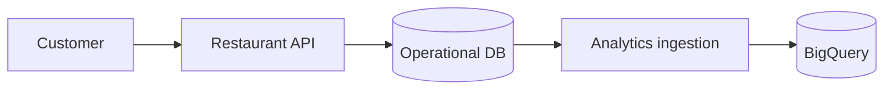

# 09 — BigQuery vs Operational Databases ⚖️

## 🎯 Learning Objective

Choose a data service based on workload and understand why a restaurant platform may use more than one database.

## Workload-based comparison

| Service | Data model | Typical workload | Restaurant example |
|---|---|---|---|
| Firestore | Documents / collections | Application reads/writes | Current customer/order state |
| Datastore | Entities / kinds | Structured application entities | Outlet and operational records |
| Cloud SQL | Relational | Transactional SQL workloads | Relational operational data |
| BigQuery | Analytical tables | OLAP / analytics | Historical revenue and reporting |

This is a workload comparison, not a universal “best database” ranking.

## Firestore vs BigQuery

**Firestore** is useful when the application needs document-oriented operational access.

**BigQuery** is useful when the business needs large-scale SQL analysis.

Example:

```text
Firestore
→ “Get this outlet's current configuration.”

BigQuery
→ “Compare revenue for all outlets over the last 12 months.”
```

## Datastore vs BigQuery

Datastore is an operational entity store. BigQuery is an analytical warehouse.

```text
Datastore
  ↓
Application state

BigQuery
  ↓
Historical analysis
```

The same business entity can therefore have representations in both systems.

## Cloud SQL vs BigQuery

Cloud SQL provides managed relational databases suitable for transactional applications that need relational SQL semantics.

BigQuery is designed primarily for analytical workloads at large scale.

A restaurant platform might use Cloud SQL for:

- Orders requiring transactional application behavior.
- Relational application data.
- Operational workflows.

And BigQuery for:

- Revenue analysis.
- Historical reporting.
- Large aggregations.
- Cross-period analysis.

## Do not use BigQuery as a default application database

Consider this request:

> Customer clicks “Place Order”.

The application needs predictable transactional behavior and low-latency request handling.

That does not automatically make BigQuery the correct system for the write path.

Instead:



## When BigQuery makes sense

Use BigQuery when the requirement looks like:

- Large-scale analytical SQL.
- Historical analysis.
- Aggregations across many records.
- Reporting and business intelligence.
- Cross-entity analysis.

## When an operational store makes more sense

Use an operational database when the requirement is dominated by:

- Frequent application writes.
- Point reads.
- Current state.
- Transactional workflows.
- User-facing request/response operations.

## Interview decision framework 🎤

When asked “Which database should you use?”, do not immediately name a product.

Ask:

1. What is the workload?
2. What is the data model?
3. What are the read/write patterns?
4. What latency is required?
5. Is the workload transactional or analytical?
6. How large is the historical dataset?
7. What consistency/transaction requirements exist?
8. What operational complexity is acceptable?

Then choose the service that fits those requirements.

## Common mistake ⚠️

Do not say:

> “BigQuery replaces Firestore/Datastore/Cloud SQL.”

A better mental model is:

> **BigQuery complements operational databases by providing an analytical workload environment.**

Next: **BigQuery in a restaurant application architecture.**
