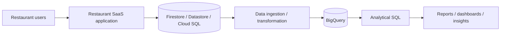
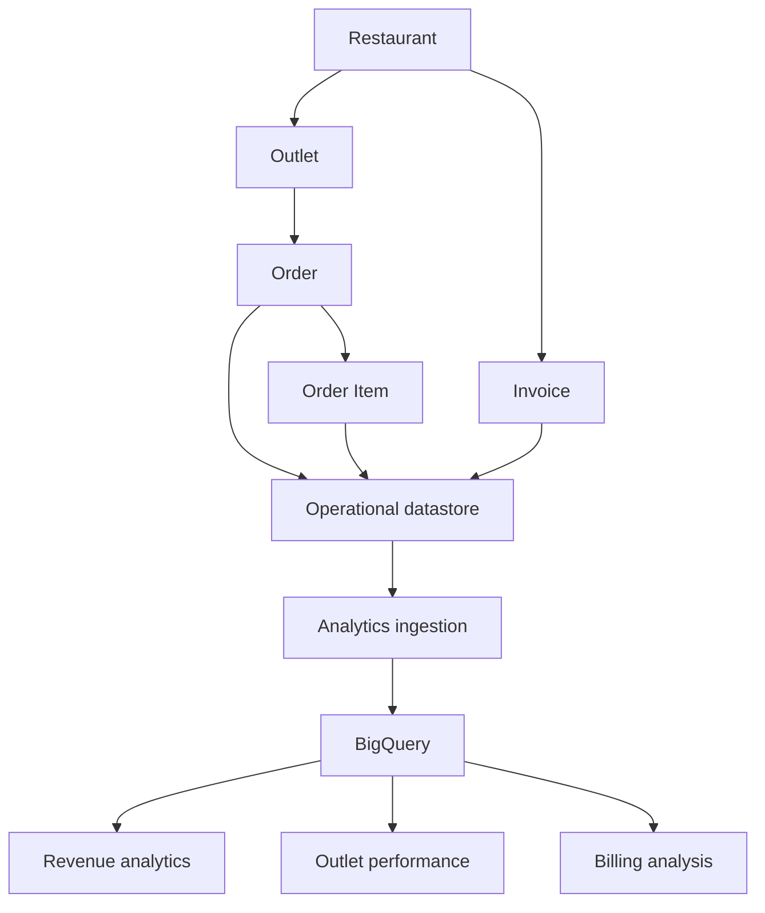
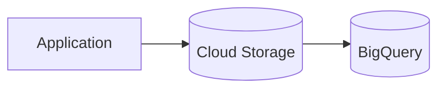
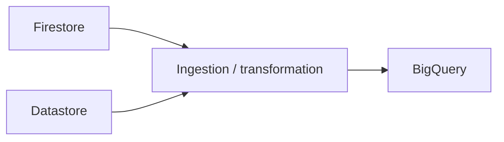
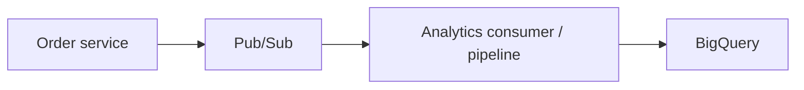

# 10 — BigQuery in a Restaurant Application Architecture 🍽️☁️

## 🎯 Learning Objective

Connect the data services from Chapters 3–6 to BigQuery and understand the analytical side of a restaurant SaaS architecture.

## From application data to analytics

The application records operational events first. Analytics consumes data from that operational world.



## Why not query the application store for every report?

The application database is optimized for application access patterns.

The analytics warehouse is designed for questions such as:

```text
Revenue by restaurant
Revenue by outlet
Daily order volume
Monthly revenue
Average order value
Item-level sales
Growth over time
```

Separating workloads can reduce contention and lets each system be designed for its own purpose.

## Restaurant SaaS data flow



## Example analytical model

A simple dataset might contain:

```text
restaurant_analytics
├── restaurants
├── outlets
├── orders
├── order_items
└── invoices
```

Example query:

```sql
SELECT
  restaurant_id,
  SUM(total_amount) AS monthly_revenue
FROM orders
WHERE status = 'COMPLETED'
  AND order_date >= DATE '2026-09-01'
  AND order_date < DATE '2026-10-01'
GROUP BY restaurant_id
ORDER BY monthly_revenue DESC;
```

## BigQuery + Cloud Storage

Cloud Storage can act as a file/object source for analytical ingestion.



For example, a batch export could produce CSV files in Cloud Storage before they are loaded into BigQuery.

## BigQuery + Firestore / Datastore

Conceptually:



The actual production pipeline may use additional Google Cloud services and transformations. Do not assume a direct built-in synchronization exists for every application scenario.

## Future connection: Pub/Sub

Later chapters introduce event-driven architecture.

A future restaurant platform could use:



This allows order events to become inputs to an analytics pipeline without making the application request wait for the entire analytical workflow.

## Multi-tenant analytics

A restaurant SaaS platform must keep tenant identity in analytical data.

For example:

```text
restaurant_id
outlet_id
order_id
```

These dimensions allow queries to be scoped to the correct restaurant/outlet.

A production architecture must also address authorization and tenant isolation for analytical consumers.

## Interview scenario 🎤

**Question:** Design analytics for a restaurant order platform.

A strong answer should cover:

1. Keep operational writes in the operational datastore.
2. Define an analytics model around business questions.
3. Ingest operational data into BigQuery.
4. Use SQL for aggregations and reporting.
5. Partition time-based large tables appropriately.
6. Consider clustering for common access patterns.
7. Prevent analytical queries from unnecessarily impacting the transactional workload.
8. Address tenant isolation and access control.
9. Plan for late-arriving, duplicate and corrected records.

## Floci vs real GCP ⚠️

The local Floci environment is for practicing supported concepts and workflows. Full production integration between Firestore, Datastore, Cloud Storage, Pub/Sub and BigQuery may require real GCP services and additional pipeline infrastructure.

Next: **Hands-on BigQuery labs.**
