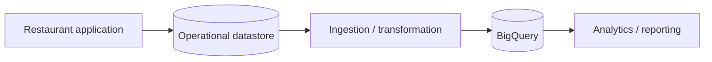

# 11 — Hands-On Labs 🧪🚀

## 🎯 Lab philosophy

These labs are designed for interview preparation as well as practical understanding.

The goal is not to memorize commands. You should be able to explain:

> **What data am I storing, what question am I asking, why is BigQuery appropriate, and how would this architecture change on real GCP?**

> ⚠️ **Floci note:** BigQuery support can differ from real Google Cloud. Run only the commands/features supported by your local environment and verify the actual result.

---

# Lab 0 — Environment Check 🔧

Verify that your local environment is ready.

```bash
gcloud --version
gcloud config list
```

If BigQuery-specific commands are exposed by your environment, inspect them using the available CLI help before continuing.

```bash
gcloud --help
```

Do not treat a missing command as a mistake in your SQL knowledge. It may be a local emulator limitation.

---

# Lab 1 — BigQuery Fundamentals 🧱

## Goal

Create a small analytical dataset, define a restaurant order schema, load sample data where supported, and run basic SQL.

## Step 1 — Create sample data

Create `orders.csv`:

```csv
order_id,restaurant_id,outlet_id,order_date,status,total_amount
ORD-1001,R-001,O-101,2026-09-15,COMPLETED,1250.00
ORD-1002,R-001,O-102,2026-09-15,COMPLETED,850.00
ORD-1003,R-002,O-201,2026-09-15,CANCELLED,500.00
ORD-1004,R-002,O-201,2026-09-16,COMPLETED,1750.00
ORD-1005,R-001,O-101,2026-09-16,COMPLETED,950.00
```

## Step 2 — Create the analytical structure

Create a dataset and `orders` table using the BigQuery workflow supported by your Floci environment.

Conceptually:

```text
Project
└── restaurant_analytics
    └── orders
```

Schema:

| Field | Type |
|---|---|
| order_id | STRING |
| restaurant_id | STRING |
| outlet_id | STRING |
| order_date | DATE |
| status | STRING |
| total_amount | NUMERIC |

## Step 3 — Load the data

Use the supported local load workflow. If a specific BigQuery load command is not implemented by Floci, document the limitation rather than replacing it with an invented command.

## Step 4 — Run a basic query

```sql
SELECT *
FROM orders;
```

Then:

```sql
SELECT order_id, outlet_id, total_amount
FROM orders
WHERE status = 'COMPLETED';
```

## Expected result

The second query should exclude `ORD-1003` because it is cancelled.

## Interview challenge 🎤

Explain:

- Why this table belongs in an analytics dataset.
- Why `total_amount` should be numeric.
- Why `order_date` is useful for time-based analysis.
- Why the application should not automatically use this table as its transactional order store.

---

# Lab 2 — Restaurant Analytics 📊

## Goal

Use SQL to answer realistic restaurant business questions.

Use the dataset from Lab 1.

## Exercise 1 — Total completed revenue

```sql
SELECT
  SUM(total_amount) AS total_revenue
FROM orders
WHERE status = 'COMPLETED';
```

## Exercise 2 — Revenue by outlet

```sql
SELECT
  outlet_id,
  SUM(total_amount) AS revenue
FROM orders
WHERE status = 'COMPLETED'
GROUP BY outlet_id
ORDER BY revenue DESC;
```

## Exercise 3 — Order count by outlet

```sql
SELECT
  outlet_id,
  COUNT(*) AS order_count
FROM orders
WHERE status = 'COMPLETED'
GROUP BY outlet_id
ORDER BY order_count DESC;
```

## Exercise 4 — Average order value

```sql
SELECT
  outlet_id,
  AVG(total_amount) AS average_order_value
FROM orders
WHERE status = 'COMPLETED'
GROUP BY outlet_id;
```

## Exercise 5 — Daily revenue

```sql
SELECT
  order_date,
  SUM(total_amount) AS daily_revenue
FROM orders
WHERE status = 'COMPLETED'
GROUP BY order_date
ORDER BY order_date;
```

## Exercise 6 — Add outlet and restaurant information

Create small `restaurants` and `outlets` tables, then answer:

> What is revenue by restaurant and outlet city?

Expected pattern:

```sql
SELECT
  r.name AS restaurant_name,
  o.city,
  SUM(ord.total_amount) AS revenue
FROM orders ord
JOIN outlets o
  ON ord.outlet_id = o.outlet_id
JOIN restaurants r
  ON o.restaurant_id = r.restaurant_id
WHERE ord.status = 'COMPLETED'
GROUP BY r.name, o.city
ORDER BY revenue DESC;
```

## Exercise 7 — Window function

Using a derived `outlet_revenue` result, rank outlets by revenue:

```sql
SELECT
  outlet_id,
  revenue,
  RANK() OVER (ORDER BY revenue DESC) AS revenue_rank
FROM outlet_revenue;
```

## Interview challenge

For each query, explain:

1. The table grain.
2. Which rows are filtered.
3. Which dimensions are grouped.
4. Which measures are aggregated.
5. Whether a join could multiply rows.

---

# Final Lab — Restaurant Analytics Design Challenge 🏆

## Scenario

You are designing analytics for a multi-tenant restaurant SaaS platform.

The operational system stores:

```text
Restaurants
Outlets
Orders
Order Items
Invoices
```

The business wants:

- Daily revenue.
- Monthly revenue.
- Revenue by restaurant.
- Revenue by outlet.
- Order count.
- Average order value.
- Item-level sales analysis.

## Your task

Design the analytical side of the system.

### Deliverable 1 — BigQuery model

Define the tables and important fields.

### Deliverable 2 — Grain

For every table, write one sentence answering:

> “One row represents what?”

### Deliverable 3 — Partitioning

Choose a partition strategy for the large order table and explain why.

### Deliverable 4 — Clustering

Choose likely clustering columns and explain which query patterns they support.

### Deliverable 5 — SQL

Write queries for:

1. Monthly revenue.
2. Revenue by outlet.
3. Daily order volume.
4. Average order value.
5. Top-selling items.

### Deliverable 6 — Ingestion architecture

Draw the flow using Mermaid:



### Deliverable 7 — Failure scenarios

Explain what happens when:

- An order arrives twice.
- An order is corrected later.
- An event arrives late.
- An outlet is deleted from the operational system.
- A tenant tries to access another tenant's analytics.

## Final interview questions 🎤

1. Why BigQuery instead of Firestore?
2. Why BigQuery instead of Datastore?
3. Why not put analytics directly on Cloud SQL?
4. What is OLTP vs OLAP?
5. What is partitioning?
6. What is clustering?
7. What is partition pruning?
8. Why can `SELECT *` be undesirable in large analytical queries?
9. What is the difference between `GROUP BY` and a window function?
10. How would you move data from an operational system into BigQuery?
11. How would Pub/Sub fit into a future version of this architecture?
12. How would you prevent duplicate analytical records?
13. How would you handle late-arriving data?
14. How would you design tenant isolation for analytics?

## Completion checklist ✅

- [ ] I understand OLTP vs OLAP.
- [ ] I understand Project → Dataset → Table.
- [ ] I can define an analytical schema.
- [ ] I can load sample data using the supported local workflow.
- [ ] I can write `SELECT`, `WHERE`, `ORDER BY` and `LIMIT` queries.
- [ ] I can use `GROUP BY`, aggregates and `HAVING`.
- [ ] I understand `JOIN` behavior.
- [ ] I understand basic window functions.
- [ ] I understand partitioning and clustering.
- [ ] I can explain BigQuery vs Firestore/Datastore/Cloud SQL by workload.
- [ ] I can design a restaurant analytics pipeline.
- [ ] I can identify important Floci vs real GCP differences.
