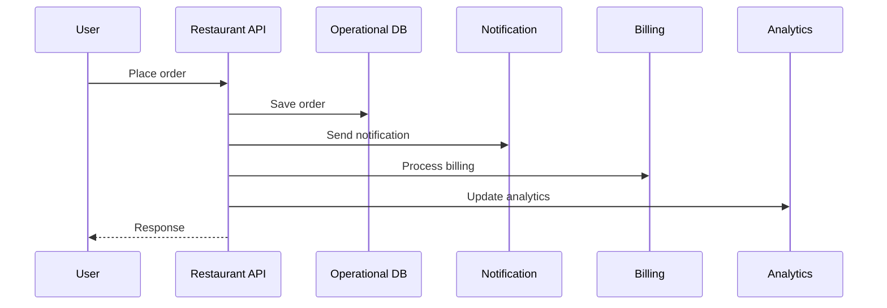
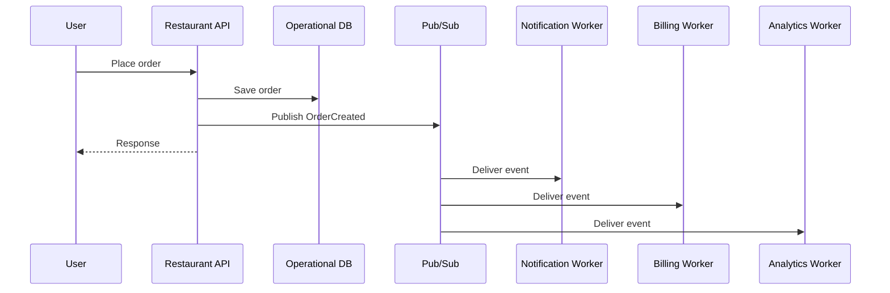
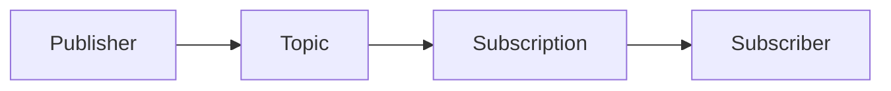

# Chapter 8 — Pub/Sub

## 01 — Introduction to Pub/Sub 📨

## 🎯 Learning Objective

Understand why Google Cloud Pub/Sub exists, what problem asynchronous messaging solves, and where Pub/Sub fits between an application and its downstream services.

## The problem

A restaurant application may need to perform several actions after an order is created:

- Save the order.
- Send a notification.
- Update analytics.
- Start billing work.
- Trigger other background processing.

A tightly coupled approach makes the request wait for every operation.



Pub/Sub allows the application to publish an event and let independent consumers process it asynchronously.



## What is Pub/Sub?

**Pub/Sub (Publisher/Subscriber)** is a managed messaging service for asynchronously exchanging messages between producers and consumers.

The basic model is:



The publisher does not need to know which service will consume the message.

## Why use Pub/Sub?

| Problem | Pub/Sub concept |
|---|---|
| Services are tightly coupled | Decoupled messaging |
| Work should happen later | Asynchronous processing |
| Multiple services need the same event | Multiple subscriptions / fan-out |
| Consumer is temporarily unavailable | Message retention and redelivery concepts |
| Producer and consumer operate at different speeds | Buffering |

## Pub/Sub vs direct API calls

A direct API call is useful when the caller needs an immediate response.

Pub/Sub is useful when the producer can publish an event and downstream work can happen independently.

This is not an absolute replacement rule. The communication style should follow the business requirement.

## Restaurant example

When `ORD-1001` is created:

```json
{
  "eventType": "OrderCreated",
  "orderId": "ORD-1001",
  "restaurantId": "REST-101",
  "outletId": "OUT-501",
  "amount": 1250
}
```

Potential consumers include notification, billing and analytics services.

## Interview checkpoint 💡

**Q: What is Pub/Sub?**

Pub/Sub is a managed messaging service that decouples message producers from consumers and supports asynchronous event processing.

**Q: Why not directly call every downstream service?**

Direct calls create tighter runtime coupling. Pub/Sub can decouple producers from consumers and allow independent processing.

**Q: Is Pub/Sub a database?**

No. It is a messaging service. A message may be retained for delivery, but Pub/Sub is not the application's primary system of record.

## Floci vs real GCP ⚠️

This tutorial uses Floci for local learning. Pub/Sub capabilities, commands and delivery behavior supported by the local environment may differ from production Google Cloud. Verify commands against the actual Floci setup before relying on them.

## What you should remember

1. Pub/Sub is for messaging, not primary data storage.
2. Publishers send messages to topics.
3. Subscribers consume messages through subscriptions.
4. Pub/Sub enables asynchronous, decoupled workflows.
5. Delivery failure must be considered when designing consumers.
